# 系统安装

## 安装前准备

1. 系统光盘，准备一张64位的CENTOS 6.8版本的系统光盘，因为只有64位的系统才能支持大于4G的内存。刻录的ISO源文件名为CentOS-6.8-x86_64-bin-DVD1.iso。
2. 光驱，安装系统的服务器需要具备光驱，如果没有配备光驱的，需要外接USB接口的光驱。
3. 服务器已经具备访问外网的网络环境

## 安装CENTOS

* 把光盘放到光驱内，然后在BIOS里面设置光盘启动，保存退出BIOS后，电脑重启，然后就会进入如下界面，如果服务器是集成显卡，则选择第一个选项进行系统安装；如果服务器是独立显卡，则选择第二个选项进行系统安装。    
  
* 选择完后，系统自动加载一些必要组件，然后进入如下界面，这里选择第二个选项，跳过光盘检查：  

* 这里点击下一步：  
  
* 选择英文语言环境：  

* 选择“美国英语式”键盘布局：  

* 选择“基本存储设备”：  

* 如果本服务器是单独给我们的后台使用的话，则选择“是，忽略所有数据”；如果本服务器还兼有其他的系统或者服务，则选择“否，保留所有数据”：

* 8.录入主机名，如果是单独用于某个功能的主机，建议按如下规则命名：
  * 道路系统：road
  * 云平台：cloud
  * 数据库：database
  * 微信平台：wechat
  * 备用服务器：backup
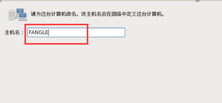
* 然后点击“网络配置”->“有线”->“编辑”，勾选“自动连接”，然后点击“IPv4设置”，选择“方法”为“手动”,然后点击“添加”，手工设置地址、子网掩码和网关：  
  * 地址：192.168.2.5（必须和路由器的网段保持一致，建议尽量不要采用192.168.1.X的网段，避免装了VPN之后与公司内网IP冲突，具体情况联系网络管理员）  
  * 子网掩码：255.255.255.0（具体情况联系网络管理员）  
  * 网关：192.168.2.1（这里一般为路由器的IP，不过也有例外情况，具体情况联系网络管理员）  
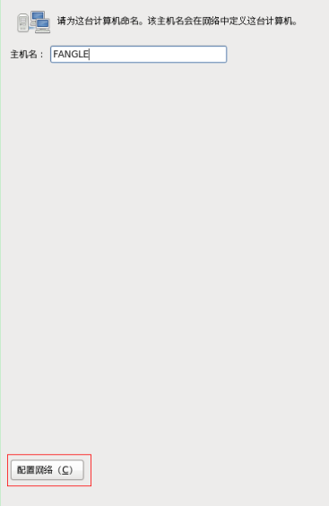  
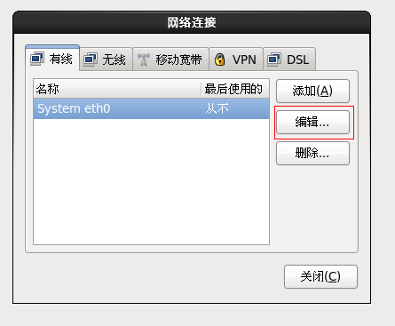  
  
  
* 点击“应用”，接着点击“关闭”，再点“下一步”：   
  


* 时区选择“亚洲/上海”，取消勾选“系统时间使用UTC时间”，然后点“下一步”（国内项目一般都是上海时间，如果是国外项目，则根据项目所在地选择对应的时区）：

* 录入root用户密码，注意密码长度需要超过12位，需要有特殊符号和大、小写字母以及数字组成，然后点“下一步”：

* 选择“创建自定义布局”，然后点“下一步”：   
  
* 选择“空闲”，点击“创建”：  
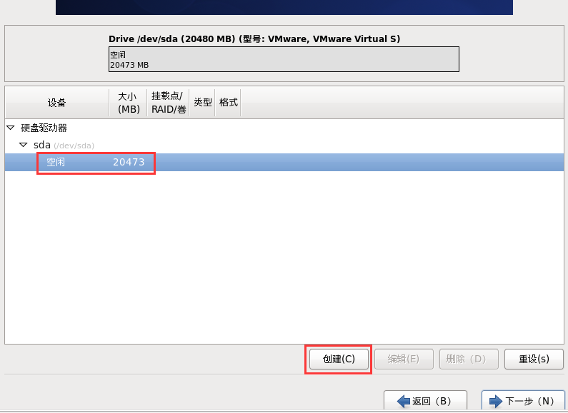
* 选择“标准分区”，点击创建：  

* 挂载点选择“/boot”，大小设置为300，然后点击“确定”：    

* 选择“空闲”，点击“创建”，然后文件系统类型选择“swap”,大小一般设置为物理内存的2倍，但是建议不要超过4G（这里1G=1024M），因为如果有超过4G的数据要通过swap分区来交换，会严重拖累系统的响应速度，这种情况应该要添加物理内存，而不是增大交换分区了：   

* 选择“空闲”，点击“创建”，挂载点选择“/”，大小设置为51200：   
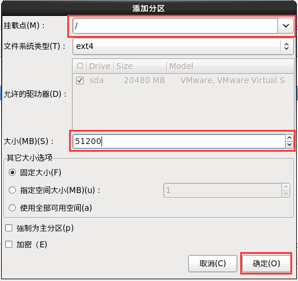
* 选择“空闲”，点击“创建”，挂载点选择“/var”，选择“使用全部可用空间”：  

* 然后点击“下一步”，提示要格式化，点击“格式化”，完成之后点击下一步  
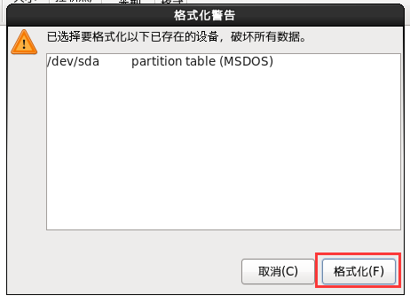
* 有“将存储配置写入磁盘”的提示，选择“将修改写入磁盘”：  

* 勾选“安装引导装载程序”，然后点击“下一步”：  
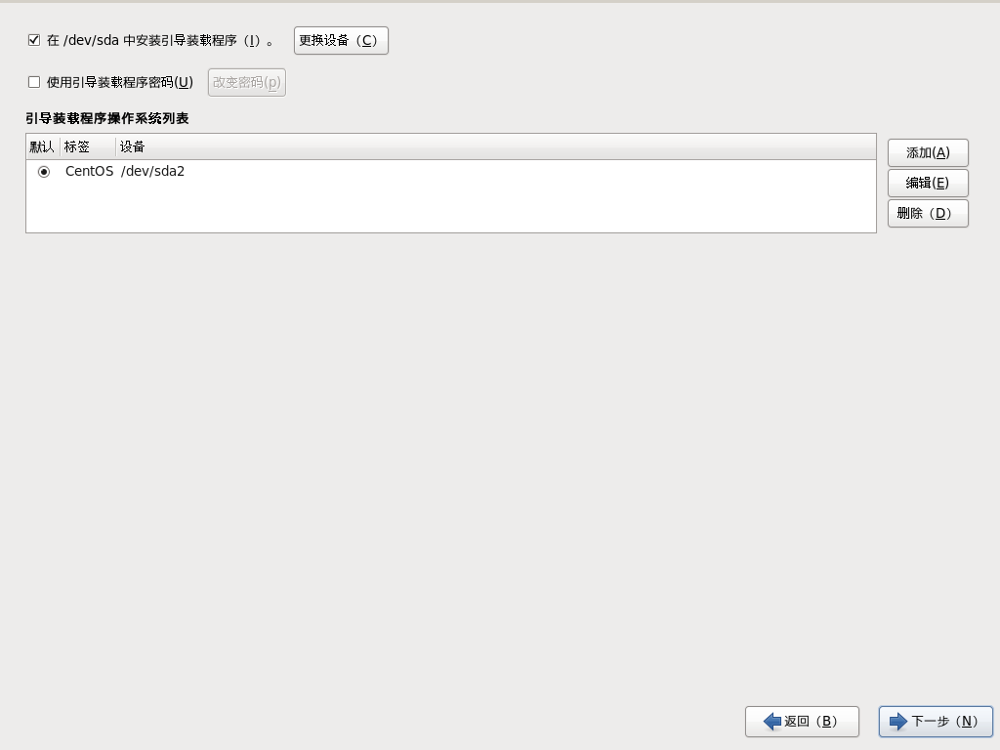
* 安装类型选择“Minimal”，然后点击“下一步”，进行安装：  
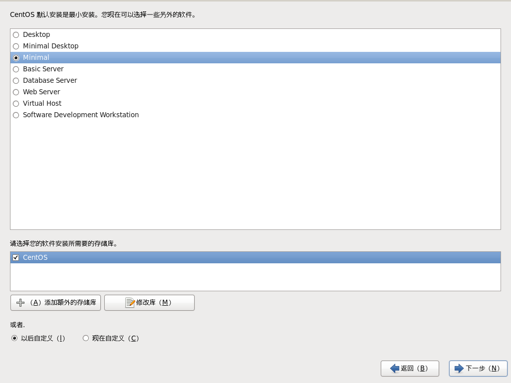  
  
* 系统安装完成之后，点击“重新引导”来重启系统：   
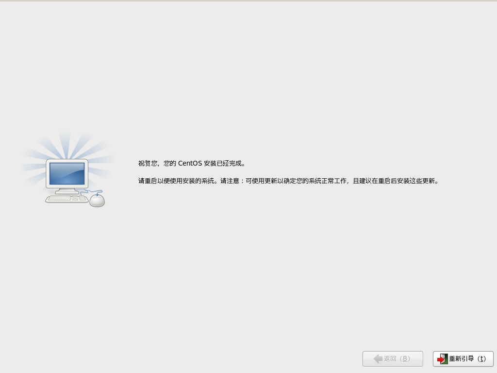

## 保存系统连接到WinSCP中

* 服务器重启后，将进入登录界面，在这里录入root用户名，然后录入密码，回车之后，如果出现“#”的提示符，表示成功登录到系统中了：  


* 在命令行录入ifconfig，查看服务器的局域网IP，例如这里的IP为192.168.92.130：  

* 把存储有安装包软件的Windows系统电脑接入到和服务器所在的同一个局域网，并设置IP为同一个网段内的。然后点击WINSCP软件，点击“New Site”,然后填写IP（服务器的内网IP）、用户名和（root）密码（root的密码），然后把设置保存下来，保存时可以勾选保存密码：  
  
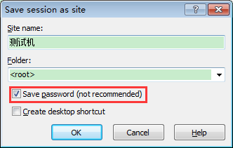
* 然后选择刚才保存连接，点击“Login”按钮，进行登录，第一次登陆时会提示需要信任该主机，点击“Yes”:  
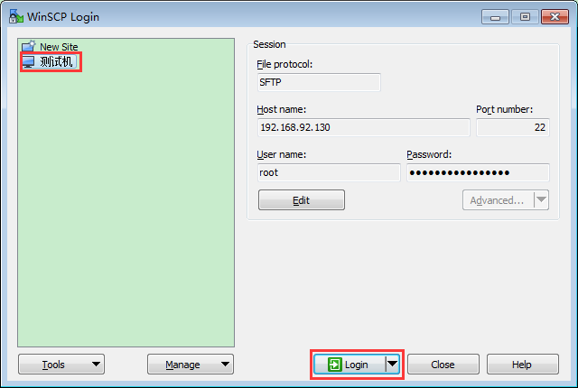

* 登录成功，会进入到如下界面：  

这里左边部分是本地电脑上存储的文件，右边部分是服务器电脑上存储的文件，最上面“..”的文件夹是返回上一层的意思，如果需要从本地往服务器复制文件，则在左边的框内按住鼠标左键，点击需要复制的文件，拖到右边的框内。  

## 保存系统连接到SecureCRT中

* 在本机电脑上，点击SecureCRT.exe，然后右键点击Session，选择New Session，选择“下一步”，录入服务器的IP、远程登录端口号以及用户名，然后点击“下一步”，给这个连接命名，然后点“完成”按钮进行保存。  
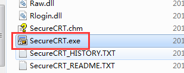    
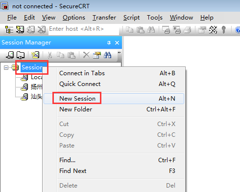    
  
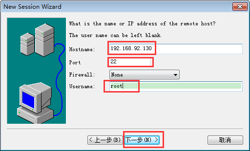    
  

* 双击刚才保存的连接，然后录入密码，勾选Save Password，再点击OK，同样的，第一次登陆，提示需要信任该主机，点击Accept & Save即可：    
     
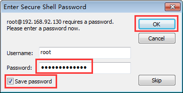    
    
* 进入到了#号提示符命令行，表示登录成功：  
  

## 设置系统连接参数

* 设置系统连接参数。用WinSCP软件双击打开``/etc/sysctl.conf``文件，在如图所示位置添加如下内容：  

```
net.ipv4.tcp_tw_reuse = 1
net.ipv4.tcp_tw_recycle = 1
net.ipv4.tcp_fin_timeout = 30
```

    
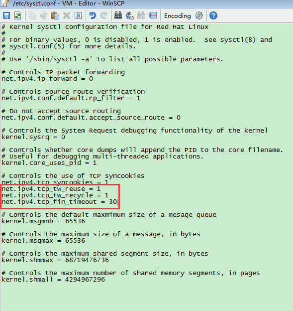  

* 点击保存按钮，再点击刷新按钮看是否保存成功。  
* 在SecureCRT软件中运行命令/sbin/sysctl -p 让参数生效。  


## 安装和设置NTP（网络时间协议）服务

安装前提说明：这里安装NTP服务的系统是必须直接安装在物理机上的CentOS系统。如果CentOS系统是安装在虚拟机上的话，时间同步的设置应该在虚拟机管理软件中去设置，例如XenServer的设置是在安装的时候就设置了。
* 安装NTP服务，命令：yum install -y ntp  
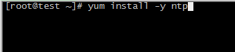
* 配置ntp.conf
  * 用WinSCP软件打开/etc/ntp.conf这个文件，删掉默认的时间服务器设置：  
  
  * 添加新的时间服务器（这里添加的是中国和亚洲地区的时间服务器，其他地区的时间服务器地址请自行百度，然后替换即可）：
  ```
  server cn.pool.ntp.org prefer
  server asia.pool.ntp.org
  ```
  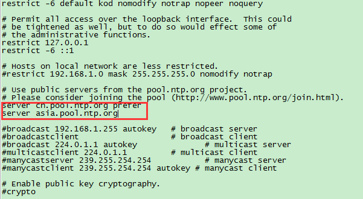  
  * 保存，等待数据上传后，再刷新页面，看数据是否更新。  
* 配置stpe-tickers  
  * 用WinSCP软件打开etc/ntp/stpe-tickers这个文件，添加新的时间服务器：  
  ```
  server cn.pool.ntp.org prefer
  server asia.pool.ntp.org
  ```

    
  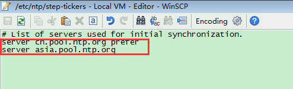
  * 保存，等待数据上传后，再刷新页面，看数据是否更新.
* 配置ntpd
  * 用WinSCP软件打开/etc/sysconfig/ntpd这个文件，在最后添加新的参数让NTP服务同步的时候同时写入硬件时钟：

  ```
  SYNC_HWCLOCK=yes
  ```

  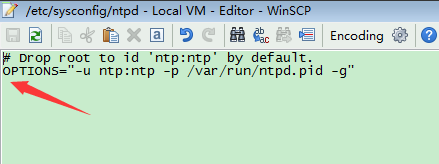  
    
  * 保存，等待数据上传后，再刷新页面，看数据是否更新.
* 添加NTP的防火墙规则，命令：  

```
# iptables -I INPUT -m state --state NEW -m udp -p udp --dport 123 -j ACCEPT&&/etc/init.d/iptables save&&service iptables restart
```
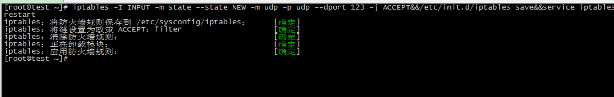

* 设置开机自启动并启动NTP，命令：chkconfig --level 345 ntpd on&&service ntpd start  

* 检查NTP是否正常  
  * 查看123端口服务是否启动，命令：netstat -tlunp | grep ntp，如果看到下图所示，则表示NTP服务启动正常：  
  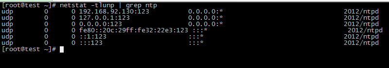  
  * 等待5-10分钟，查看本机是否与NTP服务器通讯成功，命令：``ntpstat``    
  i.未同步成功     
     
  Ii.同步成功   
  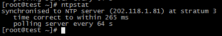  
