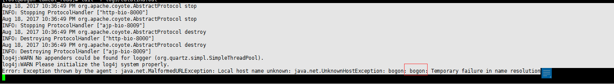

<!-- @import "[TOC]" {cmd="toc" depthFrom=1 depthTo=6 orderedList=false} -->
<!-- code_chunk_output -->

* [前言](#前言)
* [配置``catalina.sh``](#配置catalinash)
* [修改权限文件](#修改权限文件)
* [修改防火墙](#修改防火墙)
* [troubleshooting](#troubleshooting)
	* [tomcat报错``local host name unknow``](#tomcat报错local-host-name-unknow)

<!-- /code_chunk_output -->


## 前言
本问主要介绍如何安装配置jvisualvm，后续可用其监控远程tomcat项目

本文的测试环境是：
* 服务器：
   CENTOS 6.7
   tomcat 7
   java 1.7
* 客户端
   WINDOWS 10
   java 1.7

本文假设该环境已经搭建好。

## 配置``catalina.sh``
* 打开文件 vim {tomccat_home}/bin/catalina.sh
* 查找：`Execute The Requested Command`，在这行代码之前加入如下代码

```
CATALINA_OPTS="$CATALINA_OPTS -Djava.rmi.server.hostname=192.168.11.128 -Dcom.sun.management.jmxremote -Dcom.sun.management.jmxremote.port=9004 -Dcom.sun.management.jmxremote.ssl=false -Dcom.sun.management.jmxremote.authenticate=true"
```
注：hostname根据自己的实际情况配置；

## 修改权限文件
```
cd $JAVA_HOME/jre/lib/management
mv jmxremote.password.template jmxremote.password
vim jmxremote.password
```
如下所示，123是密码，根据自己的实际情况设置；
monitorRole 只有读权限
controlRole 有写权限
```
monitorRole  123
controlRole   123
```

## 修改防火墙
```
vim /etc/sysconfig/iptables
```
添加行：
```
-A INPUT -s 192.168.11.1 -p tcp -j ACCEPT
```
注：上面允许某个固定的IP访问服务器。

## troubleshooting

### tomcat报错``local host name unknow``



```
127.0.0.1  bogon localhost localhost.localdomain localhost4 localhost4.localdomain4
::1         localhost localhost.localdomain localhost6 localhost6.localdomain6
```
如上所属，加入``bogon``
