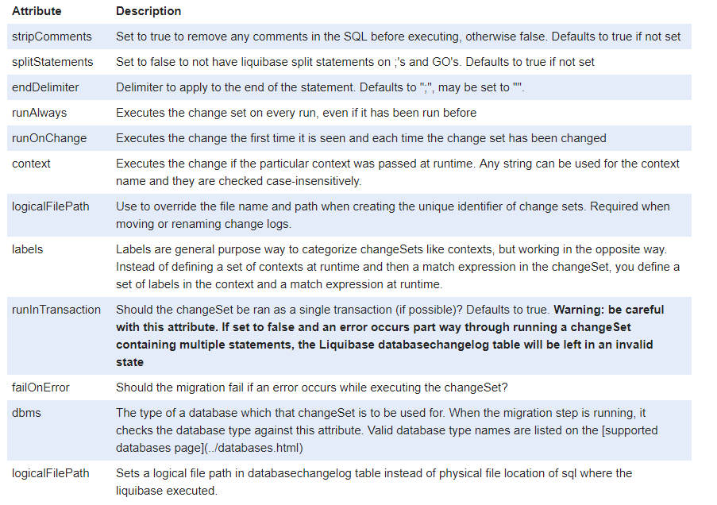

# 在这里详细介绍日志变更文件的使用
- [参考文章1](https://www.cnblogs.com/gao241/archive/2013/03/20/2971526.html)
- [参考文章2](http://www.liquibase.org/documentation/sql_format.html)
## 1.sql形式的变更文件
### 1.1sql格式的变更日志示例
```
--liquibase formatted sql
--changeset zhouyu:3 dbms:mysql
CREATE TABLE `sys_menu` (
  `menu_id` bigint NOT NULL AUTO_INCREMENT,
  `parent_id` bigint COMMENT '父菜单ID，一级菜单为0',
  `name` varchar(50) COMMENT '菜单名称',
  `url` varchar(200) COMMENT '菜单URL',
  `perms` varchar(500) COMMENT '授权(多个用逗号分隔，如：user:list,user:create)',
  `type` int COMMENT '类型   0：目录   1：菜单   2：按钮',
  `icon` varchar(50) COMMENT '菜单图标',
  `order_num` int COMMENT '排序',
  PRIMARY KEY (`menu_id`)
) ENGINE=InnoDB DEFAULT CHARSET=utf8 COMMENT='菜单管理';
--rollback drop table sys_menu;
```
### 1.2说明
- 注意事项1：'--liquibase formatted sql'注释是必须的
- 注意事项2：变更集后一个或多个SQL语句，以分号分隔
- 注意事项3：changeset注释详解如下
  * 格式：'--changeset author:id attribute1:value1 attribute2:value2 [...]'
  * 属性：
 
### 1.3在变更集中引入
```
<?xml version="1.0" encoding="UTF-8" standalone="no"?>
<databaseChangeLog xmlns="http://www.liquibase.org/xml/ns/dbchangelog"
                   xmlns:xsi="http://www.w3.org/2001/XMLSchema-instance"
                   xsi:schemaLocation="http://www.liquibase.org/xml/ns/dbchangelog
	http://www.liquibase.org/xml/ns/dbchangelog/dbchangelog-2.0.xsd">
    <!--xml格式的变更日志-->
    <include file="src/main/resources/db/changelog/2018-07-23-init-schema.xml"/>
    <!--sql格式的变更日志-->
    <include file="src/main/resources/db/changelog/2018-07-21-01.sql"/>

</databaseChangeLog>
```
### 1.4执行变更，更新数据库
```mvn liquibase:update
```

