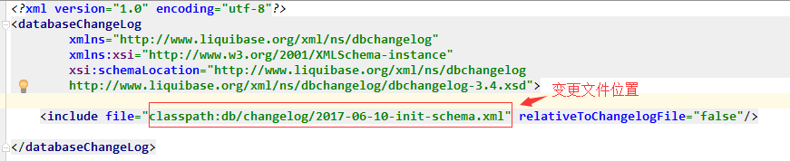
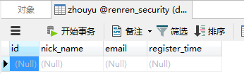

# 导包
```
<!--liquibase依赖-->
		<dependency>
			<groupId>org.liquibase</groupId>
			<artifactId>liquibase-core</artifactId>
			<version>3.5.3</version>
		</dependency>
```
# 写配置
```
liquibase:
      change-log: classpath:/db/changelog/db.changelog-master.xml #指定文件位置
      user: root
      password: 123456
      url: jdbc:mysql://192.168.1.222:3308/renren_security?allowMultiQueries=true&useUnicode=true&characterEncoding=UTF-8
```

# 变更文件2017-06-10-init-schema.xml
```
<property name="autoIncrement" value="true" dbms="mysql"/>
    <changeSet id="init-schema" author="tianshouzhi" >
        <comment>init schema</comment>
        <createTable tableName="zhouyu">
            <column name="id" type="bigint" autoIncrement="${autoIncrement}">
                <constraints primaryKey="true" nullable="false"/>
            </column>
            <column name="nick_name" type="varchar(255)">
                <constraints  nullable="false"/>
            </column>
            <column name="email" type="varchar(255)">
                <constraints  nullable="false"/>
            </column>
            <column name="register_time" type="timestamp"  defaultValueComputed="CURRENT_TIMESTAMP">
                <constraints nullable="false"/>
            </column>
        </createTable>

        <modifySql dbms="mysql">
            <append value="ENGINE=INNODB DEFAULT CHARSET utf8mb4 COLLATE utf8mb4_general_ci"/>
        </modifySql>
    </changeSet>
```
# 启动springboot,自动建表
