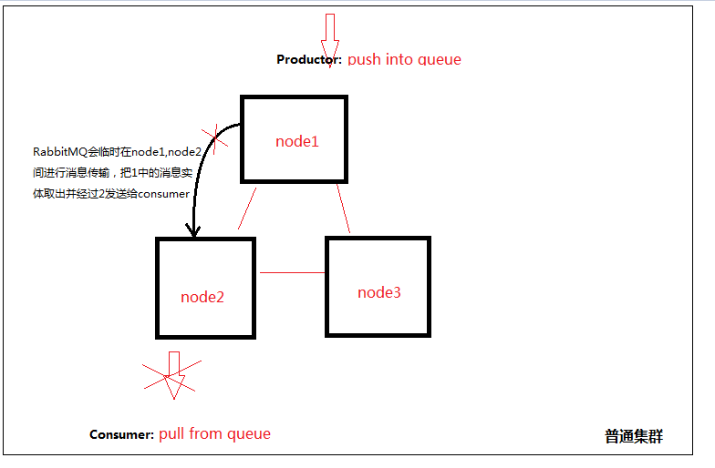

# 关于rabbitmq集群搭建，你必须提前知道的： 
## 集群普通集群和镜像集群是不同的
* 普通集群模式：当生产者产生一个队列以后，该队列的消息实体只会存在一个节点中，例如存放在node1.当消息进入node1节点的Queue中后，consumer从node2节点拉取时，RabbitMQ会临时在1、2间进行消息传输，把1中的消息实体取出并经过2发送给consumer。但是该模式存在一个问题就是当node1节点故障后，node2节点无法取到node1节点中还未消费的消息实体。如果做了消息持久化，那么得等1节点恢复，然后才可被消费.


* 内存节点和磁盘节点：消息的元数据存放位置，放在内存就是内存节点，开启持久化就是磁盘节点。通过普通集群模式的工作机制，可以看到几个集群必须存在至少一个磁盘节点来保障集群的元数据的存放安全。
例如，node2以磁盘节点的方式加入集群
```
[root@bogon node2]# rabbitmqctl join_cluster rabbit@node1 
```
node2以内存节点的方式加入集群
```
[root@bogon node2]# rabbitmqctl join_cluster --ram rabbit@node1 
```

* 镜像集群模式：其实就是主从，各个节点间会同步数据，主挂了从顶上。镜像队列是基于普通的集群模式的,所以你还是得先配置普通集群,然后才能设置镜像队列.
## 集群之前工作的原理
* 使用相同的cookie来建立集群。当然，如果配置镜像集群，以node1为主，那么记得将node1的cookie复制到另外两个。加入集群的时候，先停止node2和node3的服务，再分别加入node1组成集群。