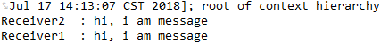

# 这里测试fanout模式
# config配置类 
```
@Configuration
public class RabbitmqConfig {
    //队列1
    final static String queue1 = "queue1";
    //队列2
    final static String queue2 = "queue2";
    //队列3
    final static String queue3 = "queue2";

    @Bean
    public Queue queue1() {
        return new Queue(RabbitmqConfig.queue1);
    }

    @Bean
    public Queue queue2() {
        return new Queue(RabbitmqConfig.queue2);
    }

    @Bean
    public Queue queue3() {
        return new Queue(RabbitmqConfig.queue3);
    }
    
    /**
     * 设置交换机
     * FanoutExchange
     * @return
     */
    @Bean
    FanoutExchange exchange() {
        return new FanoutExchange("Fanoutexchange");
    }

    /**
     * @param queue1   队列1
     * @param exchange 交换机
     * @return
     */
    @Bean
    Binding bindingExchange1(Queue queue1, FanoutExchange exchange) {
        return BindingBuilder.bind(queue1).to(exchange);
    }

    @Bean
    Binding bindingExchange2(Queue queue2, FanoutExchange exchange) {
        return BindingBuilder.bind(queue2).to(exchange);
    }

    @Bean
    Binding bindingExchange3(Queue queue3, FanoutExchange exchange) {
        return BindingBuilder.bind(queue3).to(exchange);
    }
}

```
# 消息生产者
```
@Component
public class Sender {
    @Autowired
    private AmqpTemplate rabbitTemplate;

    /**
     * 发送消息1到指定交换机exchange，路由会失效，消息将会发布到所有队列
     */
    public  void send1(){
        String context = "hi, i am message";
        System.out.println("Sender : " + context);
        // 交换机，路由键，消息
        this.rabbitTemplate.convertAndSend("Fanoutexchange", "topic.message", context);
    }

}
```
# 消息消费者
- 消费者1
```
@Component
@RabbitListener(queues = "queue1")
public class Receiver1 {
    @RabbitHandler
    public void process(String hello) {
        System.out.println("Receiver1  : " + hello);
    }
}
```
- 消费者2
```
@Component
@RabbitListener(queues = "queue2")
public class Receiver1 {
    @RabbitHandler
    public void process(String hello) {
        System.out.println("Receiver2  : " + hello);
    }
}
```
# 测试结果
- 所有队列都获得了相同的消息

# fanoutExchange模式特点
* 就是发布-订阅模式，只要订阅的队列都属于一个fanoutExchange，都会获得相同的消息