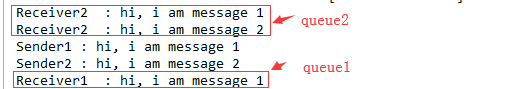

# 这里展示topic模式，导包配置就省略了

# 修改config配置类，改成topic模式
```
    //队列1
    final static String queue1 = "queue1";
    //队列2
    final static String queue2 = "queue2";

    @Bean
    public Queue Queue() {
        return new Queue("hello");
    }

    @Bean
    public Queue queueMessage() {
        return new Queue(RabbitmqConfig.queue1);
    }

    @Bean
    public Queue queueMessages() {
        return new Queue(RabbitmqConfig.queue2);
    }

    /**
     * 设置交换机
     * TopicExchange 类型的交换机
     * @return
     */
    @Bean
    TopicExchange exchange() {
        return new TopicExchange("exchange");
    }

    /**
     * 队列绑定到交换机，并指定路由键
     * @param queueMessage
     * @param exchange
     */
    @Bean
    Binding bindingExchangeMessage(Queue queueMessage, TopicExchange exchange) {
        return BindingBuilder.bind(queueMessage).to(exchange).with("topic.message");
    }

    /**
     * 队列绑定到交换机，并指定路由键：topic.#
     * @param queueMessages
     * @param exchange
     */
    @Bean
    Binding bindingExchangeMessages(Queue queueMessages, TopicExchange exchange) {
        return BindingBuilder.bind(queueMessages).to(exchange).with("topic.#");
    }

```

# 消息生产者，生产消息并指定路由，将放入交换机，交换机根据路由规则放入指定队列
```
/**
     * 发送消息1到指定交换机exchange，交换机将消息路由到该路由绑定的队列1
     */
    public  void send1(){
        String context = "hi, i am message 1";
        System.out.println("Sender1 : " + context);
        // 交换机，路由键，消息
        this.rabbitTemplate.convertAndSend("exchange", "topic.message", context);
    }
    /**
     * 发送消息2到指定交换机exchange，交换机将消息路由到该路由绑定的队列2
     * 所有的路由只要满足topic.#规则的都会路由到对列2：
     */
    public void send2(){
        String context = "hi, i am message 2";
        System.out.println("Sender2 : " + context);
        // 交换机，路由键，消息
        this.rabbitTemplate.convertAndSend("exchange", "topic.messages", context);
    }
```
# 消费者消费消息
消费者1，消费队列queue1
```
@Component
@RabbitListener(queues = "queue1")
public class Receiver1 {
    @RabbitHandler
    public void process(String hello) {
        System.out.println("Receiver1  : " + hello);
    }
}
```
消费者2，消费队列queue2
```
@Component
@RabbitListener(queues = "queue2")
public class Receriver2 {
    @RabbitHandler
    public void process(String hello) {
        System.out.println("Receiver2  : " + hello);
    }
}
```


# topic模式特点
* 只要指定了队列的路由规则，生产者将消息发送打交换机在经过路由规则路由到相应队列，接受者只要消费对列就会消费队列的消息。
* # 代表任意一个单词的通配