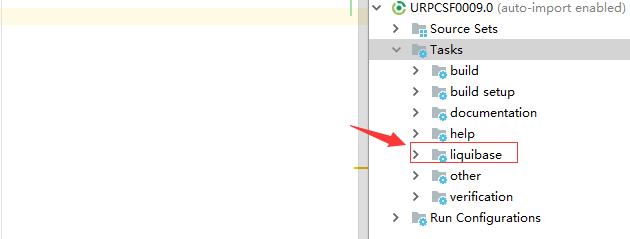
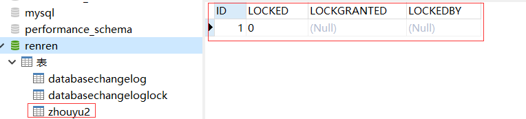

# 1导入插件
## 1.1maven-plugin
```
<!--lquibase-->
            <plugin>
				<groupId>org.liquibase</groupId>
				<artifactId>liquibase-maven-plugin</artifactId>
				<version>3.4.2</version>
				<configuration>
                    <!--指定变更集位置-->
					<changeLogFile>/src/main/resources/db/changelog/changelog-master.xml</changeLogFile>
                    <!-- 指定数据库连接 -->
					<driver>com.mysql.jdbc.Driver</driver>
					<url>jdbc:mysql://localhost:3306/renren</url>
					<username>root</username>
					<password>123456</password>
				</configuration>
				<executions>
                    <!--插件集成命令  -->
					<execution>
						<goals>
							<goal>update</goal>
							<goal>tag</goal>
							<goal>rollbackSQL</goal>
							<goal>rollback</goal>
						</goals>
					</execution>
				</executions>
			</plugin>
```
## 1.2gradle-plugin
### 1.2.1gradle插件集成
* [参考文章](https://github.com/liquibase/liquibase-gradle-plugin)
* 注意plugins{}块需要放到build.gradle文件的最顶端
```
plugins{
	id 'org.liquibase.gradle' version '2.0.0'
}
apply plugin: 'org.liquibase.gradle'
```

###1.2.2配置plugin的activities，在里面指定变更集的位置和数据库连接信息
```
liquibase {
    activities {
        main {
            changeLogFile "src/main/resources/web-bundle-config/liquibase/main-changelog.xml"
            url "jdbc:mysql://127.0.0.1:3306/test?useUnicode=true&amp;characterEncoding=utf-8"
            username "root"
            password "yourpass"
        }
        test {
            main {
                changeLogFile "src/main/resources/web-bundle-config/liquibase/main-test-changelog.xml"
                url "jdbc:mysql://127.0.0.1:3306/test?useUnicode=true&amp;characterEncoding=utf-8"
                username "root"
                password "yourpass"
            }
        }
        runList = project.ext.runList
    }
}
```
# 2.建立changelog-master.xml文件，他是一个变更集，管理所有变更文件
```
<?xml version="1.0" encoding="UTF-8" standalone="no"?>
<databaseChangeLog xmlns="http://www.liquibase.org/xml/ns/dbchangelog"
                   xmlns:xsi="http://www.w3.org/2001/XMLSchema-instance"
                   xsi:schemaLocation="http://www.liquibase.org/xml/ns/dbchangelog
	http://www.liquibase.org/xml/ns/dbchangelog/dbchangelog-2.0.xsd">
    <!--变更文件,不是相对路径-->
    <include file="src/main/resources/db/changelog/2018-07-23-init-schema.xml"/>

</databaseChangeLog>

```
# 3.建立一个变更文件，变更文件支持xml/json/sql/yml格式,本例以xml格式创建一个表
```
<databaseChangeLog
        xmlns="http://www.liquibase.org/xml/ns/dbchangelog"
        xmlns:xsi="http://www.w3.org/2001/XMLSchema-instance"
        xsi:schemaLocation="http://www.liquibase.org/xml/ns/dbchangelog
        http://www.liquibase.org/xml/ns/dbchangelog/dbchangelog-3.4.xsd">
    <property name="autoIncrement" value="true" dbms="mysql"/>
    <changeSet id="init-schema" author="tianshouzhi">
        <comment>init schema</comment>
        <createTable tableName="zhouyu3">
            <column name="id" type="bigint" autoIncrement="${autoIncrement}">
                <constraints primaryKey="true" nullable="false"/>
            </column>
            <column name="nick_name" type="varchar(255)">
                <constraints nullable="false"/>
            </column>
            <column name="email" type="varchar(255)">
                <constraints nullable="false"/>
            </column>
            <column name="register_time" type="timestamp" defaultValueComputed="CURRENT_TIMESTAMP">
                <constraints nullable="false"/>
            </column>
        </createTable>

        <modifySql dbms="mysql">
            <append value="ENGINE=INNODB DEFAULT CHARSET utf8mb4 COLLATE utf8mb4_general_ci"/>
        </modifySql>
    </changeSet>
</databaseChangeLog>
```
# 4.数据库版本管理
* 在这里介绍maven工程下的命令，在gradle工程下请参考[这里](https://github.com/stevesaliman/liquibase-workshop)
### 4.1更新
```
mvn liquibase:update
```

### 4.2添加标志，类似gittag
```
mvn liquibase:tag -Dliquibase.tag=checkpoint1
```
### 4.3再添加一个变更文件,类似步骤3，执行更新和添加标志，然后回滚到指定的tag
```
 mvn liquibase:rollback -Dliquibase.rollbackTag=checkpoint1
```
