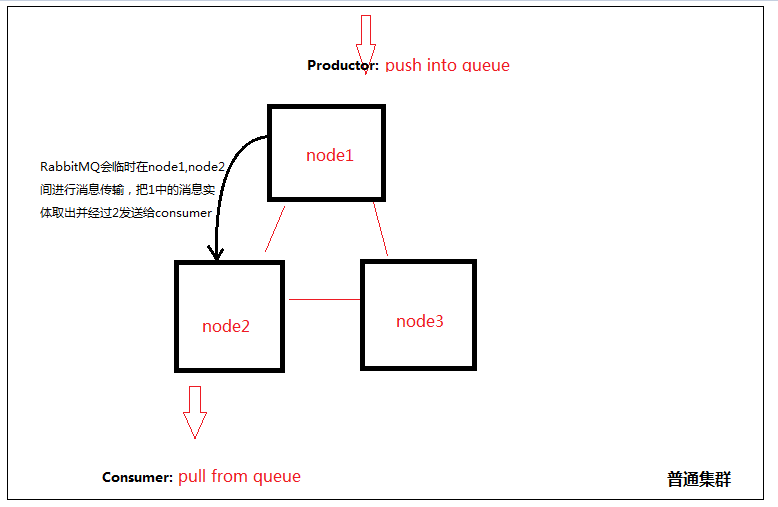
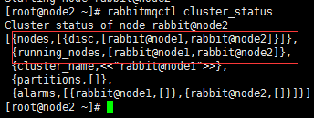

# 关于rabbitmq集群搭建，你必须提前知道的： 
## 集群普通集群和镜像集群是不同的
* 普通集群模式：当生产者产生一个队列以后，该队列的消息实体只会存在一个节点中，例如存放在node1.当消息进入node1节点的Queue中后，consumer从node2节点拉取时，RabbitMQ会临时在1、2间进行消息传输，把1中的消息实体取出并经过2发送给consumer。但是该模式存在一个问题就是当node1节点故障后，node2节点无法取到node1节点中还未消费的消息实体。如果做了消息持久化，那么得等1节点恢复，然后才可被消费.


* 内存节点和磁盘节点：消息的元数据存放位置，放在内存就是内存节点，开启持久化就是磁盘节点。通过普通集群模式的工作机制，可以看到几个集群必须存在至少一个磁盘节点来保障集群的元数据的存放安全。
例如，node2以磁盘节点的方式加入集群
```
[root@bogon node2]# rabbitmqctl join_cluster rabbit@node1 
```
node2以内存节点的方式加入集群
```
[root@bogon node2]# rabbitmqctl join_cluster --ram rabbit@node1 
```

* 镜像集群模式：其实就是主从，各个节点间会同步数据，主挂了从顶上。镜像队列是基于普通的集群模式的,所以你还是得先配置普通集群,然后才能设置镜像队列.
## 集群之前工作的原理
* 使用相同的cookie来建立集群。当然，如果配置镜像集群，以node1为主，那么记得将node1的cookie复制到另外两个。加入集群的时候，先停止node2和node3的服务，再分别加入node1组成集群。
# 集群搭建demo(MQcluster+Haproxy)
* [参考](https://blog.csdn.net/jiyiqinlovexx/article/details/51203897)
## 1.将node1的同步到node2和node3中
## 2.修改hosts文件
## 3.停止node2和node3的服务，将2和3加入node1组成集群
### node1关闭防火墙和开放
* 安装防火墙规则服务
```
yum install -y iptables-services
##关闭防火墙
service iptables stop
Redirecting to /bin/systemctl stop  iptables.service
##检查防火墙状态
service iptables status
```
* 集群需要开放的端口,开放端口非常重要，不然无法加入集群，本人就是因为没有开放4369端口导致2和3无法加入node1

```
firewall-cmd - -list-all ##确认是否开放
```
### 停止node1.node2和node3,全部以后台启动方式启动
```
 rabbitmqctl stop  ##如果报错，见报错处理
 rabbitmq-server -detached ##后台启动
 rabbitmqctl cluster_status ##查看集群节点信息
```

报错处理：
```
setsebool -P nis_enabled1 
reboot
service rabbitmq-server restart
```
### node2和node3关闭应用，加入集群
```
[root@node2 ~]# rabbitmqctl join_cluster rabbit@node1
[root@node3 ~]# rabbitmqctl join_cluster rabbit@node1
[root@node3 ~]# rabbitmqctl cluster_status  ##查看集群状态
```



## 使用镜像集群
在vhost名称为 / 创建了一个策略，策略名称为ha-allqueue,策略模式为 all 即复制到所有节点，包含新增节点，策略正则表达式为 “^” 表示所有匹配所有队列名称

```
[root@node3 ~]rabbitmqctl set_policy -p / ha-allqueue "^" '{"ha-mode":"all"}'
```


## 安装负载均衡器HAProxy

## springboot连接集群