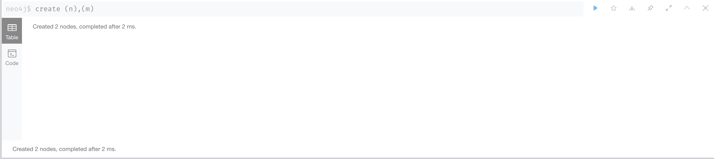
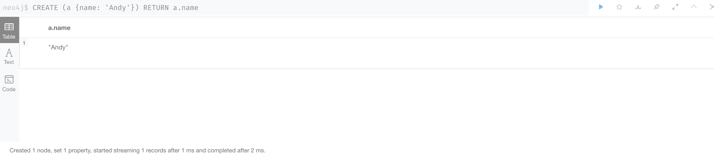

# 使用cypher创建和查询数据


## 简介

cypher 是neo4j的查询语言，最长用的命令如下

```bash 
MATCH      查询数据
CREATE     创建数据
MERGE      合并数据
```

## CREATE 

* 创建一个节点``CREATE (n)``  


* 创建多个节点``CREATE (n),(m)``



* 创建节点并且添加一个标签``CREATE (n:Person)``

* 创建节点并且添加多个标签``CREATE (n:Person:Swedish)``

* 创建节点，添加标签，并且可以同时给该节点添加属性``CREATE (n:Person {name: 'Andy', title: 'Developer'})``

* 创建一个节点，并且查询相关的值  

```bash 
CREATE (a {name: 'Andy'})
RETURN a.name
```




* 两个node 之间创建关系 

```bash 
# 1.创建第一个节点
CREATE (n:Person {name: 'A', title: 'Developer'})
# 2.创建第二个节点
CREATE (n:Person {name: 'B', title: 'Developer'})

MATCH
  (a:Person),
  (b:Person)
WHERE a.name = 'A' AND b.name = 'B'
CREATE (a)-[r:RELTYPE]->(b)
RETURN type(r)
```

## match 

*  ``match (a) return a ``查询所有节点
*  ``match (n) return (n) limit 10`` 查询所有节点，并且限制结果最多10个
*  ``match (a:Person) return a ``,查询所有包含``Person``的标签


## merge 

