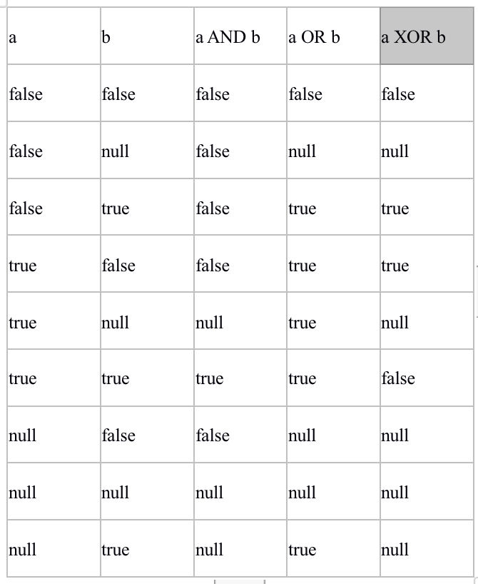
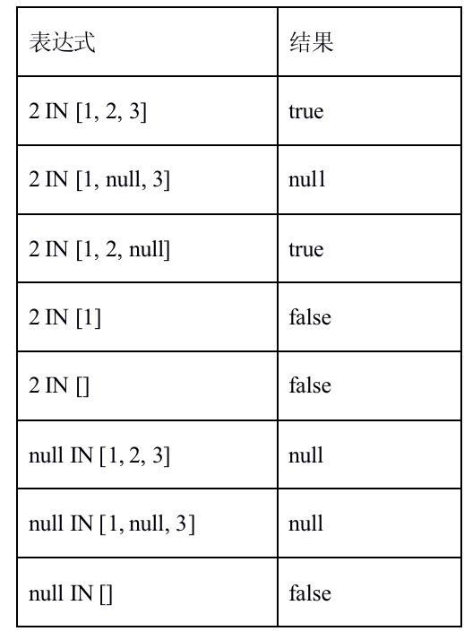

# cypher基础


## cypher   

类似于sql的一种专门用于neo4j的声明式查询语言，cypher依赖于模式(patterns)，在查询过程中使用模式来匹配数据，如下表示关系是朋友：

```
(:Person)-[:friend]-(:Person)
```

### 节点语法

节点cypher使用圆括号来表示节点，圆括号或者方括号内，中括号表示属性

```
(a:Person {name: 'Nick'})
```

### 关系语法

cypher中方括号来表示关系,方号或者方括号内，中括号表示属性

```
-[role]->
-[:ACTED_IN]->
-[role:ACTED_IN]->
-[role:ACTED_IN,{roles: 'Nick'}]->
```
> --表示无方向关系 
> -->或者 <--表示有方向关系

### 模式语法

将节点和关系组合在一起的语法

```
(keanu:Person:Actor {name:"Lucy"})-[role:ACTED_IN {roles: 'Neo'}]->(matrix:Movie {title: "The Matrix"})
```

### cypher支持的数据类型
  * 数值
  * 字符串
  * 布尔型
  * 节点
  * 关系
  * 路径
  * 映射
  * 列表

### cypher表达式如下：

  * 十进制（整型和双精度型）的字面值：13, -4000, 3.14, 6.022E23
  * 十六进制整型字面值（以0x开头）：0x13zf, 0xFC3A9, -0x66eff
  * 八进制整型字面值（以0开头）：01372, 02127, -05671
  * 字符串字面值：'Hello', "World"
  * 布尔字面值：true, false, TRUE, FALSE
  * 变量：n, x, rel, myFancyVariable, `A name with weird stuff in it[]!`
  * 属性：n.prop, x.prop, rel.thisProperty, myFancyVariable. `(weird property name)`
  * 动态属性：n["prop"], rel[n.city + n.zip], map[coll[0]]
  * 参数：$param, $0
  * 表达式列表：['a', 'b'], [1, 2, 3], ['a', 2, n.property, $param], [ ]
  * 函数调用：length(p), nodes(p)
  * 聚合函数：avg(x.prop), count(*)
  * 路径-模式：(a)-->()<--(b)
  * 计算式：1 + 2 >3 and 3 < 4.
  * 返回true或者false的断言表达式：a.prop = 'Hello', length(p) >10, exists(a.name)
  * 正则表达式：a.name =~ 'Tob.*'
  * 大小写敏感的字符串匹配表达式：a.surname STARTS WITH 'Sven', a.surname ENDS WITH 'son' or a.surname CONTAINS 'son'
  * CASE表达式


### 转义字符

|字符|含义|
|--|---|
|\t	|制表符|
|\b	|退格|
|\n	|换行|
|\r	|回车|
|\f	|换页|
|\'	|单引号|
|\"	|双引号|
|\\	|反斜杠|
|\uxxxx	|Unicode UTF-16编码点（4位的十六进制数字必须跟在\u后面）|
|\Uxxxxxxxx	|Unicode UTF-32 编码点（8位的十六进制数字必须跟在\U后面）|


### Case表达式

计算表达式的值，然后依次与WHEN语句中的表达式进行比较，直到匹配上为止。如果未匹配上，则ELSE中的表达式将作为结果。如果ELSE语句不存在，那么将返回null。

语法：

```bash 
CASE test
WHEN value THEN result
[WHEN ...]
[ELSE default]
END 
```

> test：一个有效的表达式
> value：一个表达式，它的结果将与test表达式的结果进行比较
> result：如果value表达式能够与test表达式匹配，它将作为结果表达式
> default：没有匹配的情况下的默认返回表达式

EG:

```BASH 
MATCH (n)
RETURN
CASE n.eyes
WHEN 'blue'
THEN 1
WHEN 'brown'
THEN 2
ELSE 3 END AS result
```

### 变量  

当需要引用模式(pattern)或者查询的某一部分的时候，可以对其进行命名。针对不同部分的这些命名被称为变量。

```bash 
MATCH (n)-[r]->(b)
RETURN b 
```

> n、r、b则为变量

### 参数

```
Match (n) where n.name=$name return n 
```

### 运算符

* 数学运算符 : +，-，*，/ 和%，^。
* 比较运算符 : =，<>，<，>，<=，>=，IS NULL和IS NOT NULL。
* 布尔运算符 : AND，OR，XOR和NOT。
* 字符串运算符 : 连接字符串的运算符为+。正则表达式的匹配运算符为=~。
* 列表运算符 : 列表的连接也可以通过+运算符。可以用IN来检查列表中是否存在某个元素。
* 值的相等与比较 : Cypher支持使用=和<>来比较两个值的相等/不相等关系。同类型的值只有它们是同一个值的时候才相等，如3 = 3和"x" <> "xy"。
* 值的排序与比较 : 比较运算符<=，<（升序）和>=，>（降序）可以用于值排序的比较。

> x < y <= z 等价于： x < y AND y <= z,如： 
> match (n:Student) where 21<n.age<40 return n

### 注释 

// 我是注释


### 模式(Patterns)

模式指期望看到数据的形状，前面已经介绍了label、关系、属性的模式，这里举几个例子：

* （a）    - 一个节点
* (a)-->(b)    - 两个节点之间的关系
* (a)-->(b)<--(c)   - 三个节点的关系 
* (a)-->()<--(c)    - 三个节点关系，中间节点不用变量获取
* (a:User)-->(b)    - a节点标签需要是User
* (a:User {name:'Nick'})  -- a节点的标签必须有User并且名字需要是Nick
* (a)-[{blocked: false}]->(b) -中间关系的属性包含blocked并且值是false
* (a)--(b)    - 无方向关联
* (a)-[r]->(b)  - 有方向关联，关联用变量r提取
* (a)-[r:REL_TYPE]->(b)  - 指定关联的类型是REL_TYPE
* (a)-[r:TYPE1|TYPE2]->(b)   - 指定关联类型是TYPE1或者TYPE2
* (a)-[:REL_TYPE]->(b)       - 省略变量
* (a)-[*2]->(b)              - 指定关系长度
* (a)-[*3..5]->(b)           - 关系长度 [3,5]
* (a)-[*3..]->(b)            - 关系长度 [3,正无穷)
* (a)-[*..5]->(b)            - 关系长度 小于等于5 
* (a)-[*]->(b)               - 关系长度任意

## 列表

创建列表``return [1,2,3,4,5] as list``


## null 

空值null在Cypher中表示未找到或者未定义。从概念上讲，null意味着”一个未找到的未知值”。 对待null会与其他值有些不同。例如从节点中获取一个并不存在的属性将返回null。大多数以null作为输入的表达式将返回null。这包括WHERE语句中用于断言的布尔表达式。
null不等于null。两个未知的值并不意味着它们是同一个值。因此，null = null返回null而不是true。
判断 某个节点上 有或没有 某个属性，如下

```
Match  (n)  where n.name  is null return n
Match  (n)  where n. name  is not  null return n
```

空值的逻辑运算,逻辑运算符(包括AND，OR，XOR，IN，NOT)把null当作未知的三值逻辑值。下面为AND，OR和XOR的逻辑值表。



空值与IN,IN运算符遵循类似的逻辑。如果列表中存在某个值，结果就返回true。如果列表包含null值并且没有匹配到值，结果返回null。否则结果为false。下面表中是一些例子：




