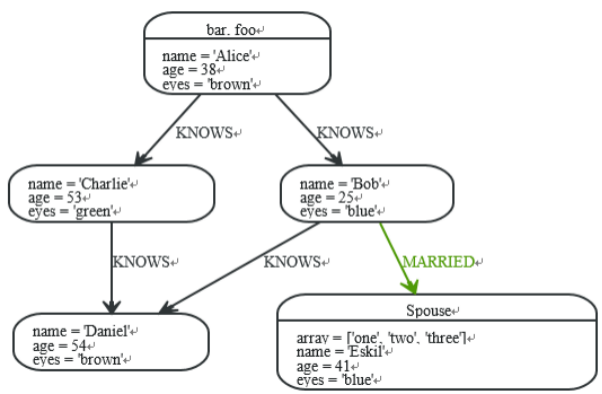

# cypher函数

## 简介

cypher内置了很多函数，其主要分为以下几类：


* 断言函数 ，给输入返回true和false，通常是用来判断的函数
* 标量函数
* 列表函数
* 数学函数
* 字符串函数


## 准备数据  

```
CREATE (Alice { name: 'Alice' ,age:38,eyes:'brown'}),
    (Charlie { name: 'Charlie' ,age:53,eyes:'green'}),
    (Bob { name: 'Bob' ,age:25,eyes:'blue'}),
    (Daniel { name: 'Daniel' ,age:54,eyes:'brown'}),
    (Eskil { array:['one','two','three'],name: 'Eskil' ,age:41,eyes:'blue'})
CREATE (Alice)-[:KNOWS]->(Charlie),
  (Alice)-[:KNOWS]->(Bob),
  (Charlie)-[:KNOWS]->(Daniel),
  (Bob)-[:KNOWS]->(Daniel),
  (Bob)-[:MARRIED]->(Eskil)
return Alice,Charlie,Bob,Daniel,Eskil
```




## 断言函数  

* all 
* any 
* none 
* single
* exists


## 标量(Scalar)函数

* size 
* length 
* type 
* id
* coalesce
* head 
* latst
* timestamp
* startNode
* endNode
* properties
* toInt
* toFloat


## 列表(List)函数

* nodes
* relationships
* labels
* keys
* extract
* filter
* tail
* range
* reduce


## 数学函数

* abs
* ceil
* floor
* round
* sign
* rand
* log
* log10
* exp
* sqrt
* sin
* cos
* tan
* cot
* asin
* acos
* atan
* atan2
* pi
* degrees
* radians
* haversin


### 字符串函数

* replace
* substring
* left
* right
* ltrim
* rtrim
* trim
* lower
* upper
* split
* reverse
* toString


### 自定义函数

自定义函数用Java语言写，可部署到数据库中，调用方式与其他Cypher函数一样。
下面的例子展示了如何调用一个名为join的自定义函数。


* 编写自定义函数，自定义函数的编写类似于过程(procedure)的创建，但它采用@UserFunction注解，并且只返回一个单值。有效的输出类型包括long，Long， double，Double，boolean，Boolean，String，Node，Relationship，Path，Map<String, Object>或者List<T>，这里的T可以是任意支持的类型。下面是一个简单的自定义函数例子，该函数将List中的字符串用指定的分隔符连接起来。


```java
package example;
import org.neo4j.procedure.Name;
import org.neo4j.procedure.Procedure;
import org.neo4j.procedure.UserFunction;
public class Join
{
  @UserFunction
  @Description("example.join(['s1','s2',...], delimiter) - join the given strings with the given
  delimiter.")
  public String join(
    @Name("strings") List<String> strings,
    @Name(value = "delimiter", defaultValue = ",") String delimiter) {
    if (strings == null || delimiter == null) {
    return null;
    }
    return String.join(delimiter, strings);
  }
}
```


* 调用自定义函数,调用自定义函数org.neo4j.procedure.example.join()。

```
MATCH (n:Member)
RETURN org.neo4j.function.example.join(collect(n.name))
```


