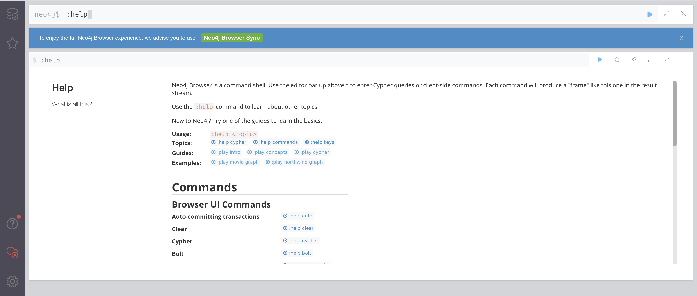
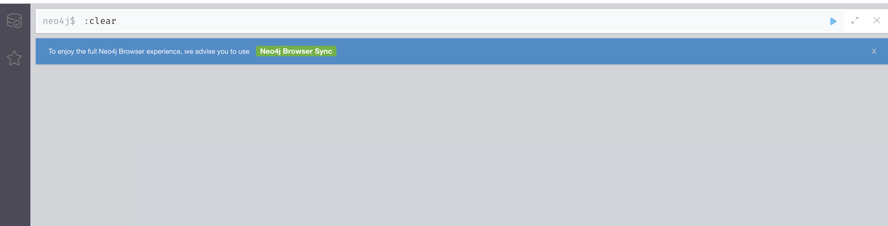

#  安装Neo4j docker


## 官方镜像 


https://hub.docker.com/_/neo4j


## 启动镜像 

> 三选一
```bash 
# 挂载目录
docker run \
    -p 7474:7474 -p 7687:7687 \
    --volume=$HOME/neo4j/data:/data \
    neo4j:4.2
# 挂载目录并且后台执行
docker run \
    -p 7474:7474 -p 7687:7687 \
    --volume=$HOME/neo4j/data:/data \
    -d \
    neo4j:4.2

# 不挂载目录
docker run \
    -p 7474:7474 -p 7687:7687 \
    neo4j:4.2

# 房爷访问ip 地址,进入该数据库的管理界面，默认账户/密码  neo4j/neo4j  
http://localhost:7474

# 使用Bolt协议访问 0.0.0.0:7687.

```


## 演示使用  

* 在命令行输入``:help``命令获取帮助



* 输入``:clear``命令清除执行记录  




