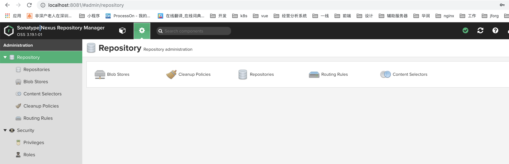
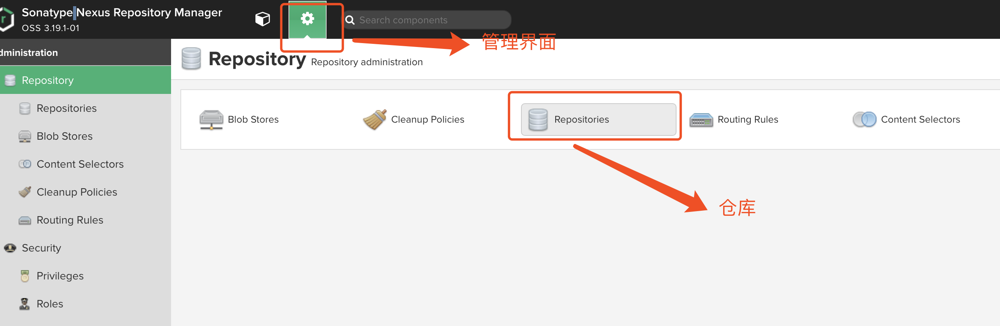
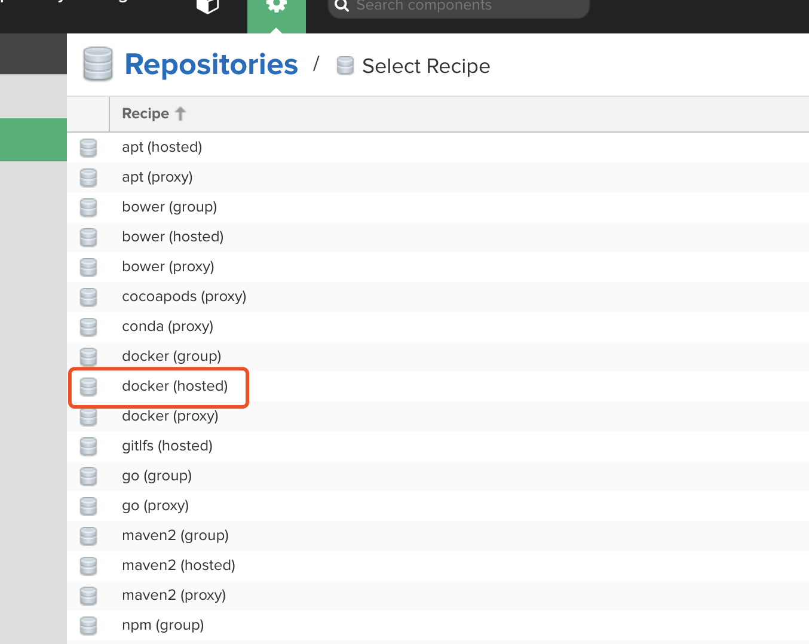
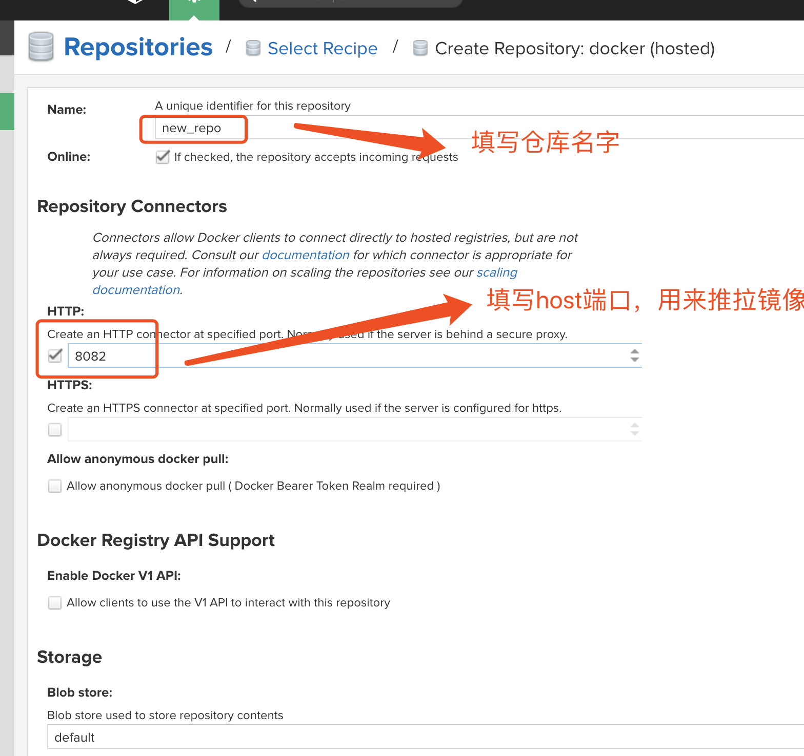

# host docker仓库

## 前言

本文介绍如何使用Nexus host一个镜像仓库。 大致操作步骤如下：  
* 访问登录nexus 地址 
* 创建仓库
* 客户端配置登录；
* 上传镜像 

##  详细步骤


* 访问登录nexus 地址  
 

* 创建仓库，管理员界面-》仓库——》点击新建仓库-》选择docker(hosted)   
   
  

* 填写新建仓库信息，点击新建；    
    

* 客户端配置登录； 
  * 笔者测试仓库地址为 ``localhost:8081`` ,配置daemon.json里面的私有仓库
  * docker login localhost:8081  


* 上传镜像 

```bash 
# 给镜像打标签，使其关联nexus仓库
docker tag nginx:1.14 localhost:8082/self/nginx:1.15
docker push localhost:8082/self/nginx:1.15
```
