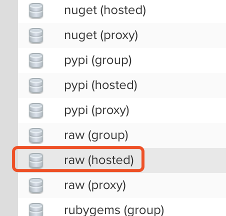
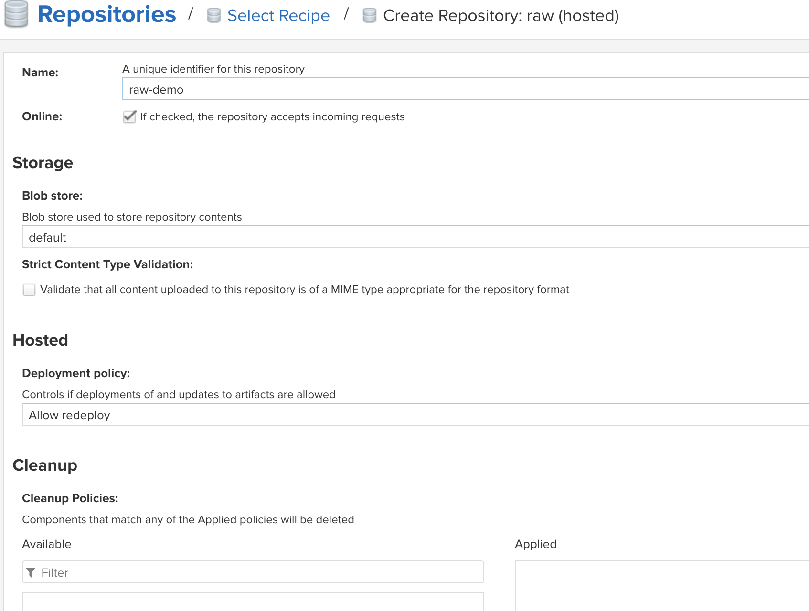

# host raw仓库

## 前言

本文讲解如何创建一个Raw仓库，这种仓库可以存储任意编译好的文件到nexus中来；
  
* 访问登录nexus 地址 
* 创建仓库
* 上传文件
* 下载文件 

##  详细步骤


* 访问登录nexus 地址  
 

* 创建仓库，管理员界面-》仓库——》点击新建仓库-》选择row(hosted)   
  
  

* 填写新建仓库信息，点击新建；      



* 上传文件信息


```bash 
# 上传一个文件
curl -v --user 'admin:admin' \
  --upload-file ~/Desktop/1.png \
  http://localhost:8081/repository/raw-demo/1.png
# 上传文件到仓库的test 目录下
curl -v --user 'admin:admin' \
  --upload-file ~/Desktop/1.png \
  http://localhost:8081/repository/raw-demo/test/1.png

```

* 下载文件  

```bash
# 可使用如下命令，或者直接访问该网页下载文件
wget --http-user=admin  --http-passwd=admin  \
  http://localhost:8081/repository/raw-demo/1.png
```
