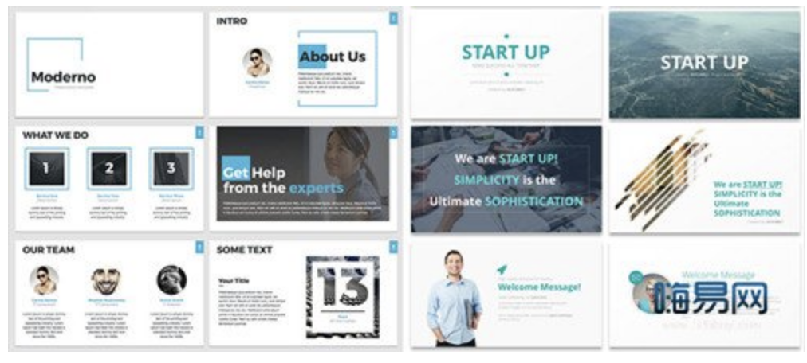
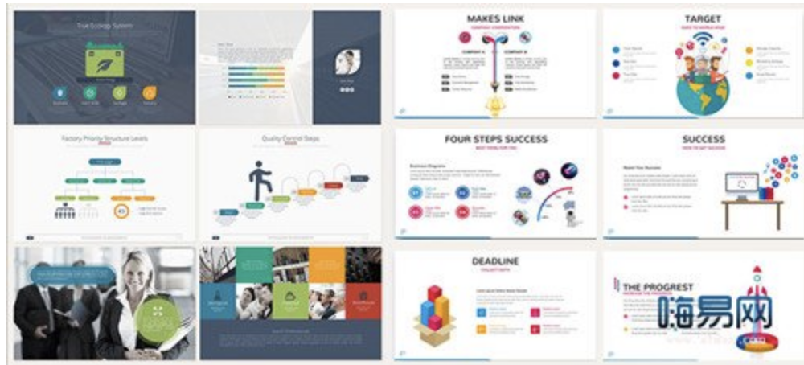
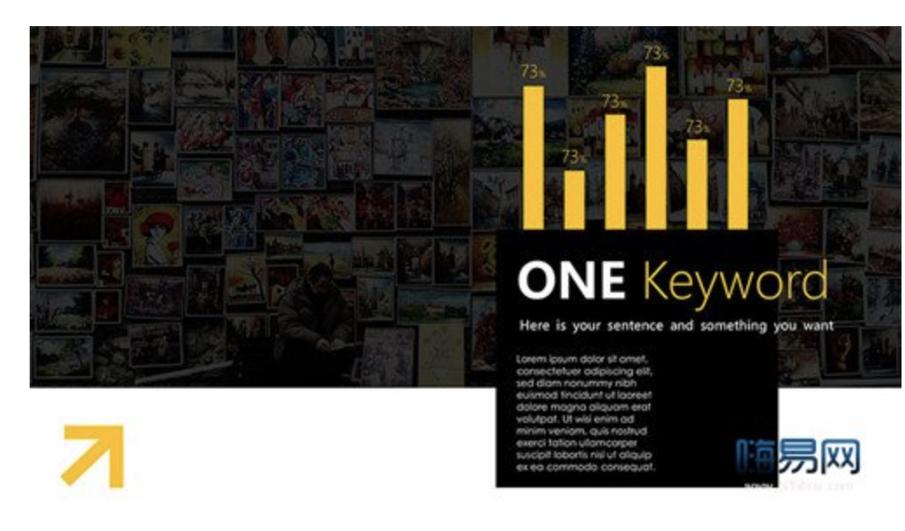

# 配色

## 色彩基础

## 配色方案

### 单一配色

**公式：黑/白/灰背景色+1种主色（小面积使用）:**

简洁商务风格的PPT的建议使用该配色方法。

通常，辅助色的存在是为了需要区分多个项目的情况下使用（如：图表等），起到对比强调的作用。辅助色最好选择黑白灰等类似的颜色，且不要大面积使用。另外，如果不需要辅助色就可以说清楚问题，那就可以不使用。

辅助色选择：  
* 公司logo，内部通用颜色
* 受众喜好
* 行业颜色
  * 科技蓝（5,39,175   #051DAF）

> 辅助色尽量避免大面积使用  
> 扁平化流行，尽量使用明亮一点的颜色  

### 多色配色方案

公式：背景色+1种主色+2~3种辅助色（小面积使用）

1、背景色选择：白色、淡色色调、深色色调（足够深的）、黑色

个人觉得背景色是首先要决定的颜色。根据研究，人类的整体认知主要依靠周边视觉（用来扫视人眼能看到的周边区域）而非中央视觉（用来直视事物，观察细节），而背景色在PPT页面中的占比重非常大（尤其是没有内容遮挡的周边背景）。所以，背景色不仅决定着整个页面的风格，也影响着人们最PPT页面的整体印象。

同时，背景色还有着强调内容，突出画面图片、文字等信息的作用，所以背景色在色调上最好使用白色、淡色色调、深色色调、黑色的背景色。

白色背景：体现舒畅、简约、高档、纯净、趣味、整洁、朴素。

淡色调背景：体现优雅、情绪化、家庭、清新、慰藉、女性、素净、轻松、轻薄。

深色调背景：体现豪华、执着、幻想、格调、趣味、沉静、稳重、坚实。

黑色背景：体现压抑、幻想、强力、刺激、高级、刚毅、庄重、严肃、神秘。

使用深色背景色时建议采用渐变色，且色彩间的差异不要太大。这样做能避免单一颜色过于死板和“闷”，同时，也保证了页面的和谐，减少主色搭配的难度。

具体选择哪个色相的颜色来做背景色呢？这需要结合PPT内容和一些颜色所传递的感觉来决定，内容和颜色传递的感觉一致即可。

切记：不要选择饱和度极高色彩作为背景色，会亮瞎双眼，让人不敢直视的。

2、选择主色和辅助色：配色工具自动选取

一般，PPT只要将事情讲述清楚即可，如果能传递一些情绪就算是加分项。因此，PPT的设计要求远没有平面设计高。我们将背景色确定之后，主色和辅助色使用配色工具确定即可。色彩的搭配可以按照以下方式搭配： “单色搭配”、“互补色搭配”、“三角形搭配（三元群）”、“矩形搭配（全相型）”、“类似色搭配（类比色）”。

配色方案确定后，如何使用？

配好色以后，使用RGB的数值（或者截图），在PPT里找到对应颜色即可。在使用时，在这注意颜色间的比例。日本设计师まりっぺ曾经针对色彩的配色提出75：25：5 的配色比例，其中的底色是占比最多的，剩下的颜色种任选一种来做主色，其余全部做辅助色即可。

4、如何搭配有图片的色彩

公式1：增加半透明的黑/白矩形+白/黑文字+1种强调色（强调色小面积使用）  

为这个图片添加一个有一定透明度的黑色/白色矩形，减弱图片中过于丰富的色彩，这样就可以使用“单一配色”的方法。

公式2：提取图片中1-3种颜色

 

观察插入图片中面积最多的1-3种色彩，然后使用取色器提取这个颜色，最后，在你需要的地方使用这种颜色，这样就会显得非常和谐。

原文： https://www.sohu.com/a/113277177_415535