# 行业配色详情

[原文](https://zhuanlan.zhihu.com/p/93451127)

## 单位配色  

通过单位的LOGO给PPT配色  

## 行业配色

### 科研学术类：蓝、白、黑、深红

 

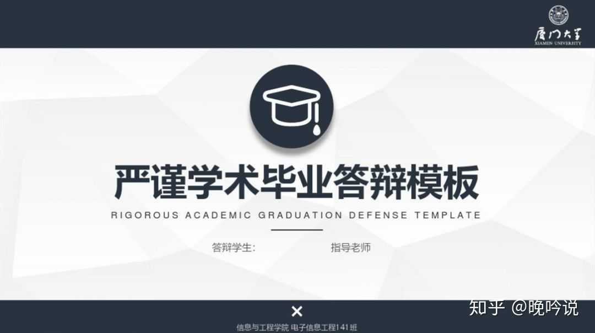 

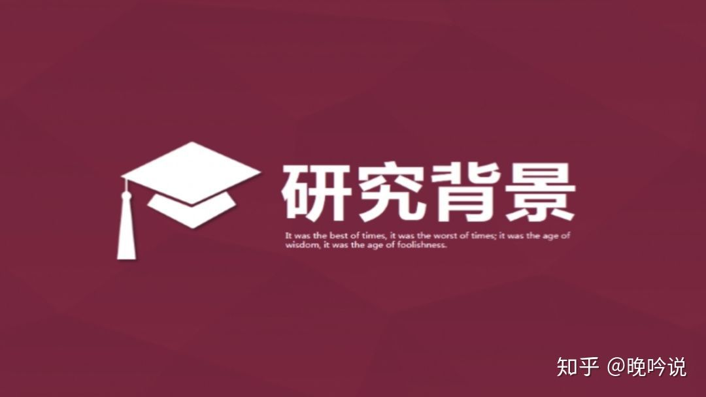 

### 高科技行业：蓝、黑、灰、深色渐变

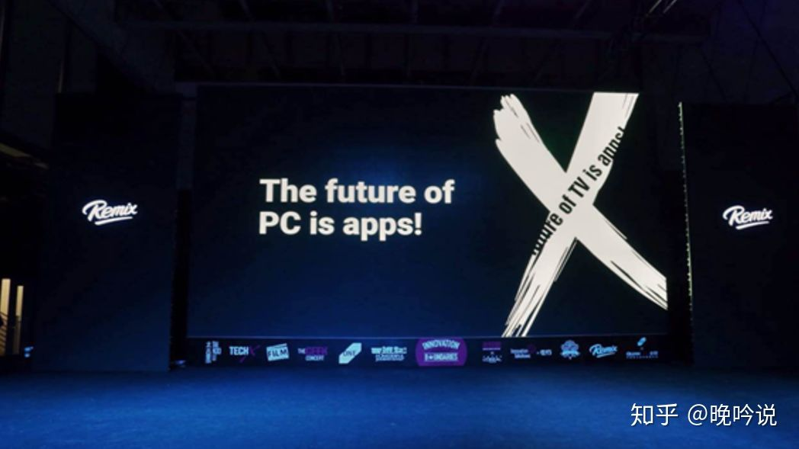 

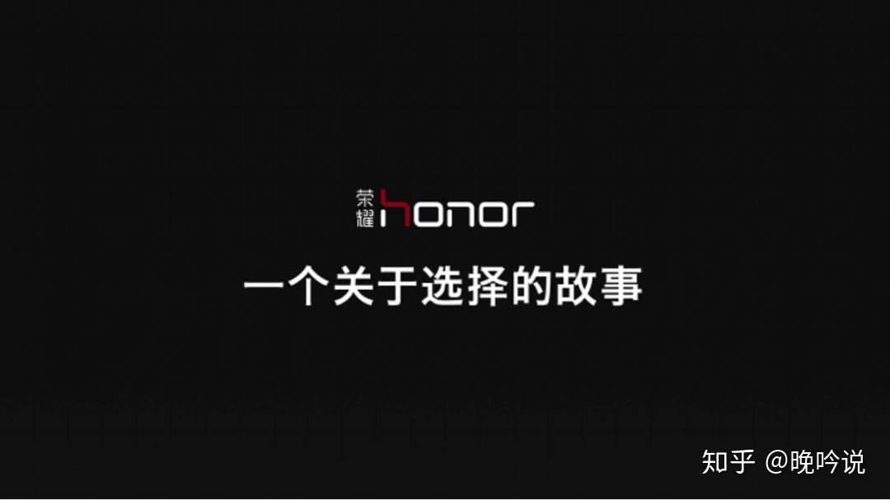 

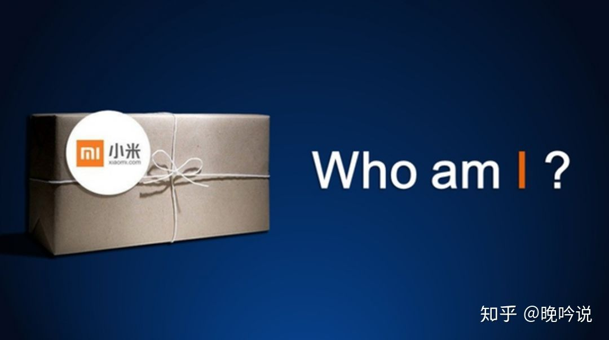

### 财经行业：深蓝、紫、金黄

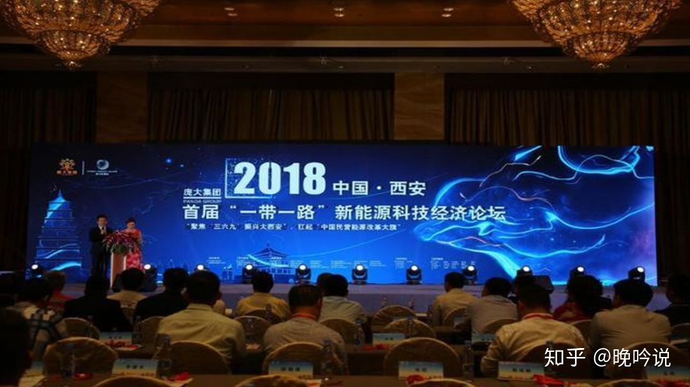

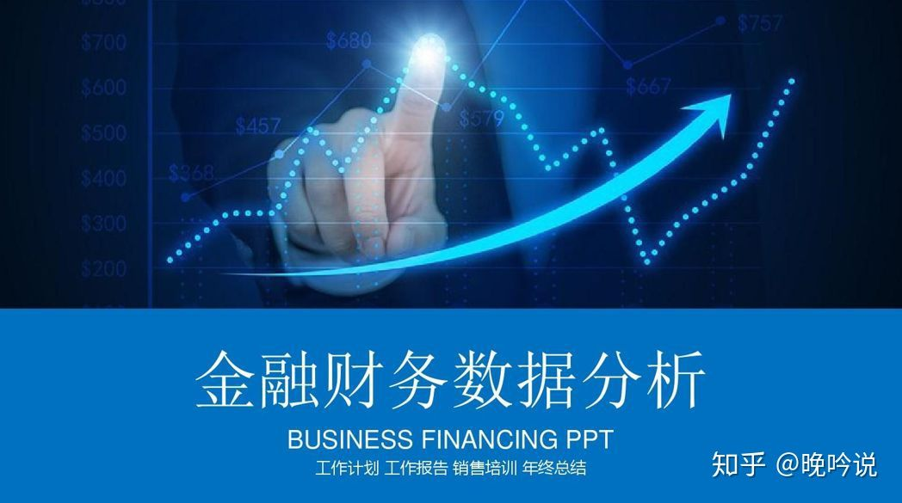 

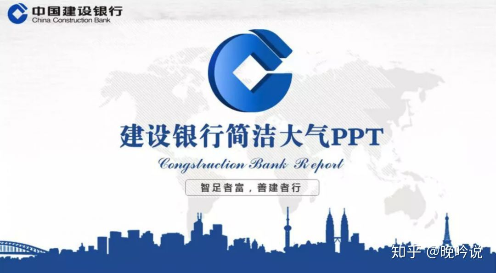 

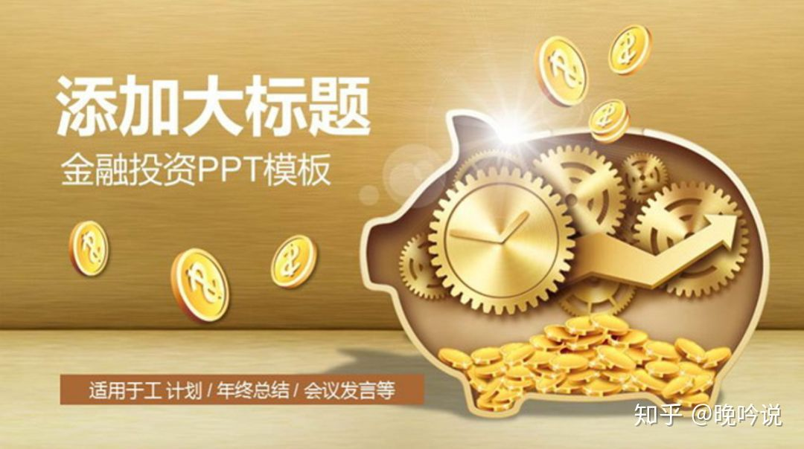 

### 党政机关、政府部门：深红、黄、白

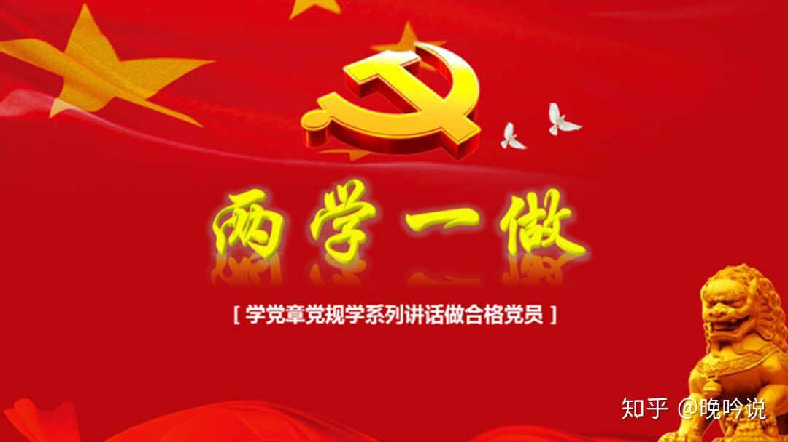 

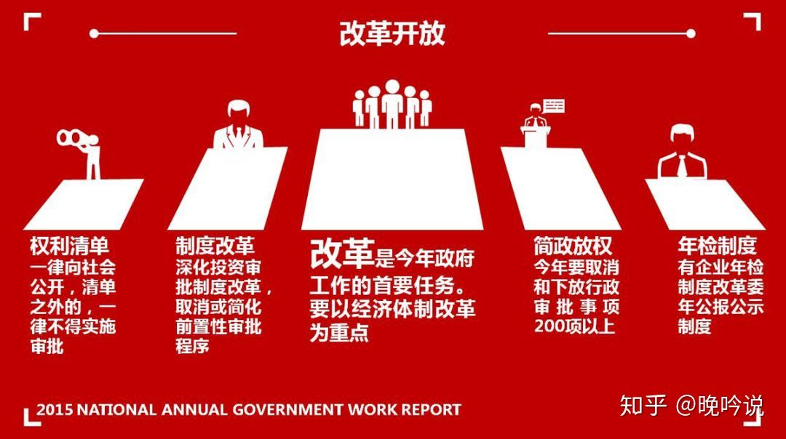 

### 教育培训行业：绿、黄、紫、白

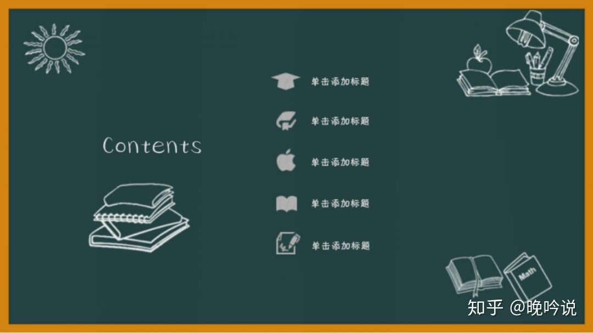 

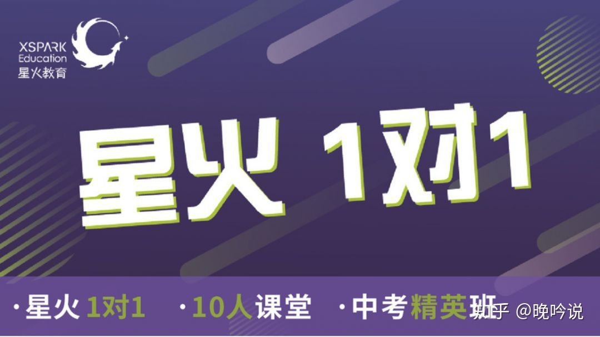 

### 医疗卫生行业：蓝、绿、白

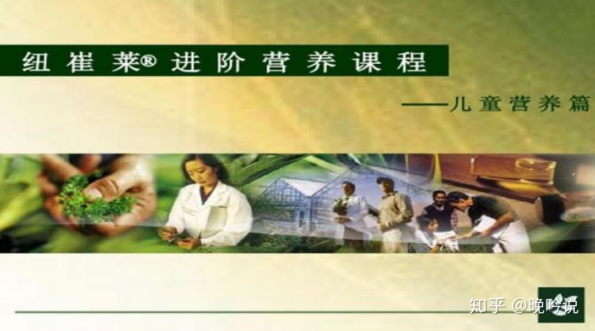 

### 互联网行业：黑、深蓝、白、浅蓝、渐变

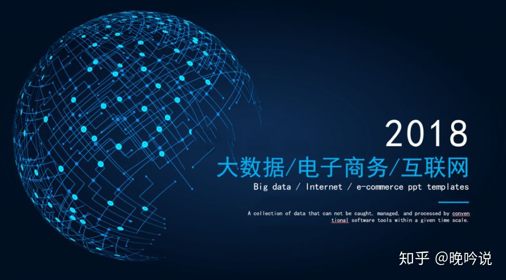 

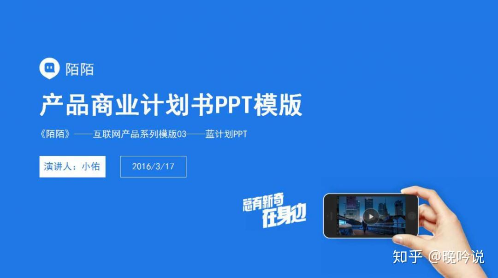 
