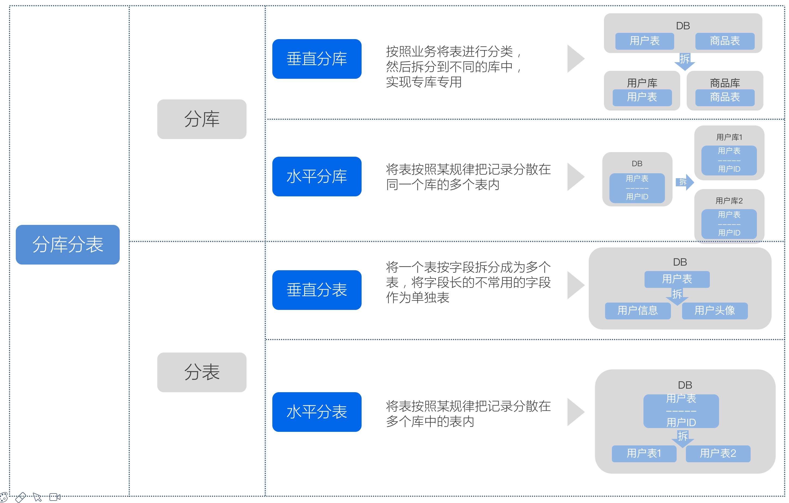
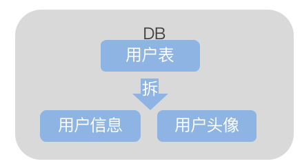
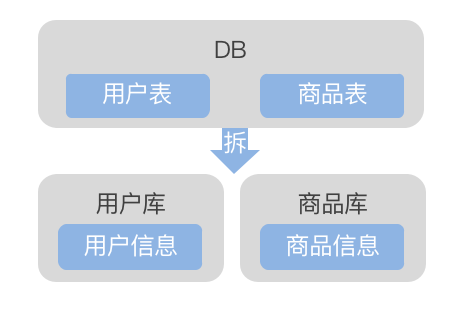
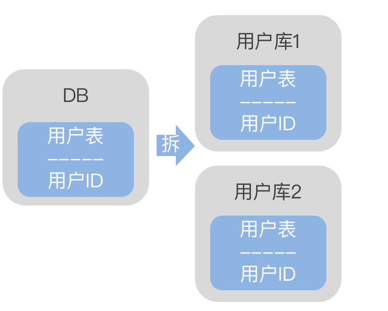
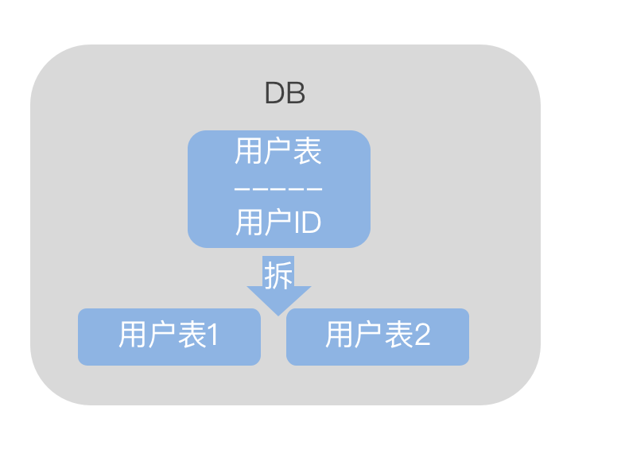
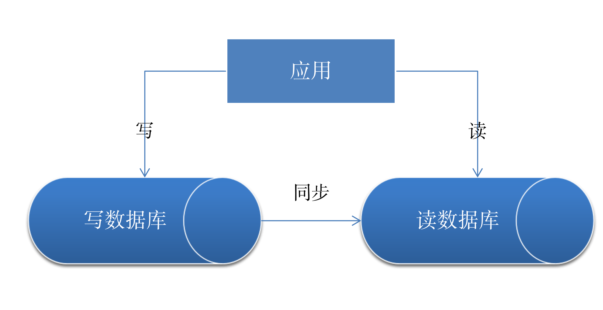

# 分库分表基础

## 常见的分库分表方法

如上图所示，常见的分库分表方法包括：

* 垂直分表
* 垂直分库
* 水平分库
* 水平分表

## 分库方法详解

### 垂直分表

 

如上图所示，用户表内包含用户头像图片，这一类新型数据量大，且使用频率少，可以通过把此类表单独列举出来优化性能。

此类拆分方法，一定层度上优化了性能，且无需添加额外库表，但是由于数据同样落在了一个数据库下所以不同表的读写使用的同样的硬件资源IO，如此会带来一些竞争。

### 垂直分库

 

按照业务将表进行分类，然后拆分到不同的库中，实现专库专用。

此类拆分方法，分散了数据库压力，但是却没有从根本上解决单表数据量大的问题，适合于各个业务模块比较平均，需要分散压力的场景。

### 水平分库

 

将表按照某规律把记录分散在同一个库的多个表内。

此类方法试用与单表数量较大的场景，不过多个库资源提升了系统的复杂度，如果每个取模后的数据访问压力不大的情况下，可以

### 水平分表 

 

将表按照某规律把记录分散在多个库中的表内。

此类方法相对于水平分库一定程度上简化了架构，但是由于所有表都还是在同一个数据内，所以物理上还存在着竞争。

## 分表规则

常见的分表规则如下：  

* 取模算法，取模的方式有很多，比如前面介绍的按照用户 ID 进行取模，当然也可以通过表的一列或多列字段进行 hash 求值来取模；

* 范围限定算法，范围限定也很常见，比如可以采用按年份、按时间等策略路由到目标数据库或表；

* 预定义算法，是指事先规划好具体库或表的数量，然后直接路由到指定库或表中。

## 读写分离

在分库分表的同时为提高数据库效率我们常用的措施还包括读写分离。

如下图所示，应用通过在不同的数据读写，来提高应用的效率，其中写库与读库可通过binlog日志同步数据。

