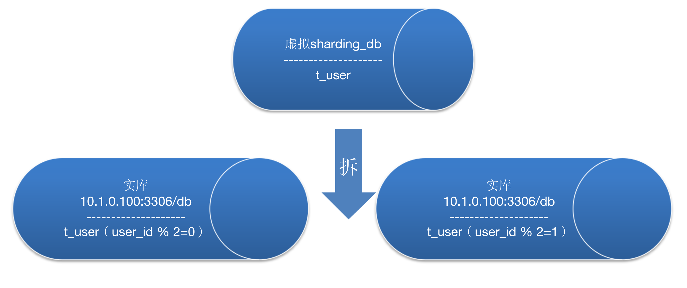

# 快速使用


## 简介

本文快速介绍sharding-proxy的简单使用。使用docker-compose做简单测试。启动三个虚拟机，2个mysql,1个sharding proxy，实现如下图分库效果：




## 测试步骤 


* 配置文件


```bash 
mkdir conf 
cat << 'EOF' > conf/server.yaml
authentication:
  users:
  # 名为root的用户的配置
    root:
      password: 123456
  # 名为sharding的用户的配置，为sharding用户配置管理表的权限，不配置时为全部权限
    sharding:
      password: 123456 
      authorizedSchemas: sharding_db

props:
  executor.size: 16
  sql.show: false
EOF

cat << 'EOF' > conf/config-sharding_db.yaml
schemaName: sharding_db

dataSources:
  ds0: 
    url: jdbc:mysql://10.1.0.100:3306/db
    username: root
    password: 123456
    connectionTimeoutMilliseconds: 30000
    idleTimeoutMilliseconds: 60000
    maxLifetimeMilliseconds: 1800000
    maxPoolSize: 65
  ds1:
    url: jdbc:mysql://10.1.0.101:3306/db
    username: root
    password: 123456
    connectionTimeoutMilliseconds: 30000
    idleTimeoutMilliseconds: 60000
    maxLifetimeMilliseconds: 1800000
    maxPoolSize: 65

shardingRule:
  tables:
    t_user:
      actualDataNodes: ds${0..1}.t_user
      databaseStrategy:
        inline:
          shardingColumn: user_id
          algorithmExpression: ds${user_id % 2}
      keyGenerator:
        type: SNOWFLAKE
        column: user_id
  defaultTableStrategy:
    none:
EOF

mkdir init 
cat << 'EOF' > init/init.sql
use db;
CREATE TABLE `t_user` (
  `user_id` int(11) NOT NULL AUTO_INCREMENT,
  `username` varchar(150) NOT NULL,
  `first_name` varchar(30) NOT NULL,
  `last_name` varchar(150) NOT NULL,
  PRIMARY KEY (`user_id`),
  UNIQUE KEY `username` (`username`)
) ENGINE=InnoDB AUTO_INCREMENT=2 DEFAULT CHARSET=utf8;

EOF

cat << 'EOF' > docker-compose.yml
version: '3'
services:
  mysql0:
    image: mysql:5.7
    ports:
      - "3307:3306"
    environment: 
      MYSQL_ROOT_PASSWORD: '123456'
      MYSQL_DATABASE: 'db'
    volumes:
          # - ./datadir0:/var/lib/mysql
          - ./init:/docker-entrypoint-initdb.d
    networks:
      test:
        ipv4_address: 10.1.0.100
  mysql1:
    image: mysql:5.7
    ports:
      - "3308:3306"
    environment: 
      MYSQL_ROOT_PASSWORD: '123456'
      MYSQL_DATABASE: 'db'
    volumes:
          # - ./datadir1:/var/lib/mysql
          - ./init:/docker-entrypoint-initdb.d
    networks:
      test:
        ipv4_address: 10.1.0.101
  sharding:
    image: apache/sharding-proxy:4.1.1
    ports:
      - "13308:3308"
    environment: 
      PORT: '3308'
    volumes:
          - ./conf:/opt/sharding-proxy/conf
          - ./conf/check_proxy.sh:/bin/check.sh
          - ./lib/mysql-connector-java-5.1.47.jar:/opt/sharding-proxy/lib/mysql-connector-java-5.1.47.jar
    depends_on:
      - "mysql0"
      - "mysql1"
    restart: always
    networks:
      test:
        ipv4_address: 10.1.0.102
networks:
  test:
    driver: bridge
    ipam:
      driver: default
      config:
        - subnet: 10.1.0.0/24
EOF

```

* 下载mysql 驱动文件到lib文件夹 

```bash 
mkdir lib 
# 官网下载： https://dev.mysql.com/downloads/connector/j/5.1.html
# mysql-connector-java-5.1.47.jar

```

*  启动docker镜像 


```bash 

docker-compose up -d
echo "sleep for 60 seconds ......................."
sleep 60
# 等待mysql启动完毕，重新启动sharding proxy（因为第一次启动proxy因为Mysql没有准备好，所以会启动你那个失败）  
docker-compose restart sharding

```


* 使用navicat用如下信息，连接服务器，测试mysql连接 

```
地址：   127.0.0.1
端口:    13308
用户名： root
密码：   123456
```

* 执行sql语句,测试插入，最终检查物理库，可以发现两条记录被分别插入到了2个不同的物理库。  

```sql 
INSERT INTO `sharding_db`.`t_user`(`user_id`, `username`, `first_name`, `last_name`) VALUES (1, 'nick qiu', 'nick', 'qiu');
INSERT INTO `sharding_db`.`t_user`(`user_id`, `username`, `first_name`, `last_name`) VALUES (2, 'elaine jin', 'elaine', 'jin');
```

