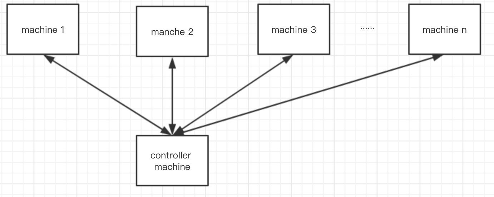

## ansible介绍

ansible 是一个自动化运维工具，它可以用来配置系统，发布软件，可以用来允许更多复杂的任务如持续发布、不停机滚动更新等。

如上图所示，其中machine 1 ~ machine n是需要控制的主机，controller是控制机用来向被控机发送指令；使用ansible要求如下：

* 需要在控制机上安装ansible
* 在控制节点上生成ssh key并且拷贝到被控机上；