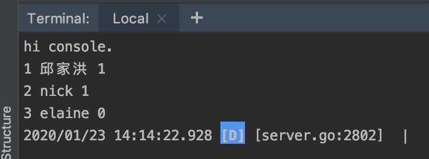

# 接入mysql-直接用SQL取数
 
## 说明

本练习接上一章，[路由简介](./router.md),本章节将从mysql中使用sql语句直接读取数据。


## 详细说明

* 新建一个名字为db1的数据库编码格式使用utf8 

*  使用如下脚本初始化mysql数据库  

```sql
DROP TABLE IF EXISTS `USER`;
CREATE TABLE `USER`(
	ID INT NOT NULL AUTO_INCREMENT COMMENT '主键',
	NAME VARCHAR(45) DEFAULT '' COMMENT '名称',
	SEX TINYINT NOT NULL DEFAULT 0  COMMENT '性别0女,1男',
	PRIMARY KEY (`ID`)
);
INSERT INTO USER  (NAME,SEX)VALUES('邱家洪',1),('nick',1),('elaine',0);
```

* 新建一个模型文件``models/testuser.go``  
```go
package models

import (
	"database/sql"
	"fmt"

	_ "github.com/go-sql-driver/mysql"
)

func PrintUsers() {

	var db, err = sql.Open("mysql", "root:123456@tcp(127.0.0.1:3306)/db1?charset=utf8")

	//延迟关闭
	defer db.Close()

	if err != nil {
		return
	}

	stmt, err := db.Prepare("select * from user limit 10")
	//延迟关闭
	defer stmt.Close()
	if err != nil {
		return
	}

	rows, err := stmt.Query()
	defer rows.Close()
	if err != nil {
		return
	}

	for rows.Next() {
		var id int
		var name string
		var sex int8
		rows.Scan(&id, &name, &sex)
		fmt.Println(id, name, sex)
	}

}
```


* 在控制类内调用该模型``controllers/default.go``  
```go

import (
	"fmt"
	"hello/models"
	"github.com/astaxie/beego"
)

...

func (c * MainController) Hi(){
	fmt.Println("hi console.")

	models.PrintUsers()
	c.TplName = "index.tpl"
} 

```

## 验证

* 启动执行该程序，访问页面``http://localhost:8080/hi``

```bash 
bee run 
```

