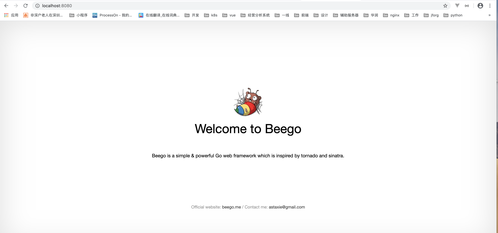

# 新建项目


## 创建一个测试项目

```BASH 
cd $GOPATH/src

# export GO111MODULE=auto
# 新建项目
bee new quickstart
cd quickstart
go mod init
# 运行项目
bee run 

```

# 验证  

访问服务器http://localhost:8080/ 可以看到如下页面 ： 





## 文件目录简介  

```
./
├── conf           # 配置文件
│   └── app.conf
├── controllers    # 控制类所在目录
│   └── default.go
├── go.mod         # 模块依赖关系管理
├── go.sum         # 
├── hello
├── main.go        # 入口函数
├── models         # 模型函数
├── routers     
│   └── router.go  # 路由控制函数
├── static         # 静态资源
│   ├── css
│   ├── img
│   └── js
│       └── reload.min.js
├── tests           # 测试函数目录
│   └── default_test.go
└── views           # 视图
    └── index.tpl
```
