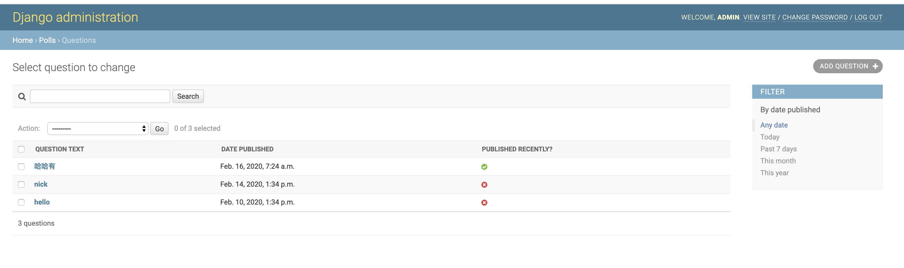
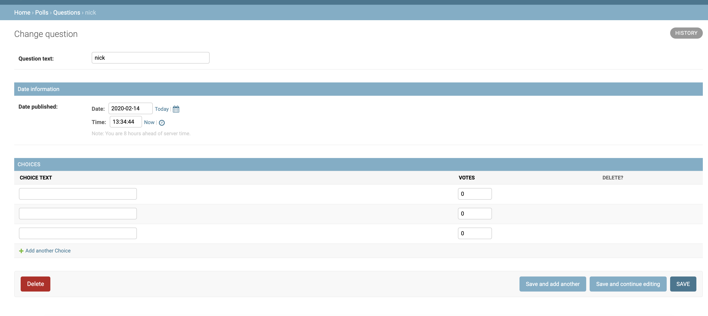

# 创建第一个django站点-定制admin表单


* ``polls/admin.py``,修改管理配置文件  

```py 
from django.contrib import admin

# Register your models here.
from django.contrib import admin

from .models import Question, Choice


# 定义Choice的布局文件
# class ChoiceInline(admin.StackedInline):
class ChoiceInline(admin.TabularInline):  # 不换行
    model = Choice
    extra = 3


# 定义Question的布局文件
class QuestionAdmin(admin.ModelAdmin):
    fieldsets = [
        (None, {'fields': ['question_text']}),
        ('Date information', {'fields': ['pub_date']}),
    ]
    # 定义对象的嵌入
    inlines = [ChoiceInline]
    # 添加显示table行信息
    list_display = ('question_text', 'pub_date', 'was_published_recently')
    # 添加过滤器
    list_filter = ['pub_date']
    # 为question_text 添加一个搜索框
    search_fields = ['question_text']


admin.site.register(Question, QuestionAdmin)
# admin.site.register(Choice)

```


* 修改``polls/models.py`` 文件 ``Question``    

```py 
class Question(models.Model):
    # max_length定义了最大值
    question_text = models.CharField(max_length=200)
    pub_date = models.DateTimeField('date published')

    def __str__(self):
        return self.question_text

    # 确定是不是最近
    def was_published_recently(self):
        # return self.pub_date >= timezone.now() - datetime.timedelta(days=1)
        now = timezone.now()
        return now - datetime.timedelta(days=1) <= self.pub_date <= now

    was_published_recently.admin_order_field = 'pub_date'
    # true - 显示为✔️图标，false显示为❌图标
    was_published_recently.boolean = True
    was_published_recently.short_description = 'Published recently?'
```


* 效果   

```bash 
python3 manage.py runserver
```  

  

