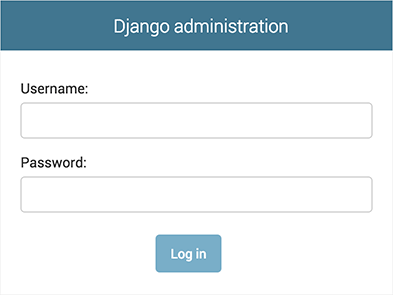
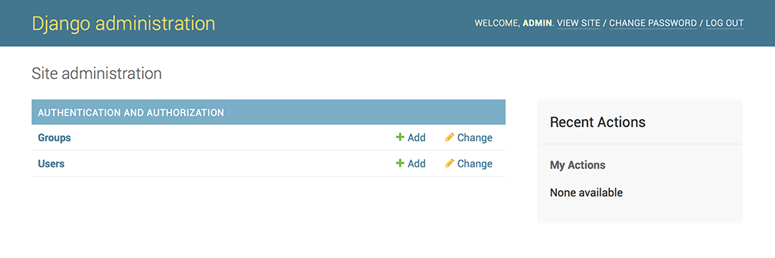
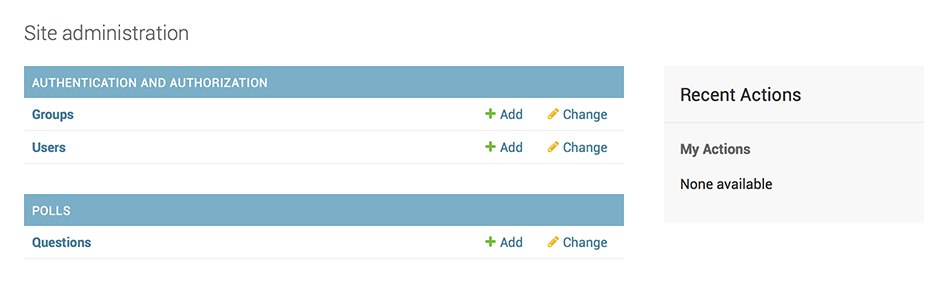

# 创建模型

## 创建第一个django站点-连接数据库


* 修改配置文件``mysite/settings.py``，数据库信息根据实际情况填写  
```PY 
DATABASES = {
    'default': {
        'ENGINE': 'django.db.backends.mysql',
        'NAME': 'db1',
        'USER': 'root',
        'PASSWORD': '123456',
        'HOST': '127.0.0.1',
        'PORT': '3306'
    }
}
```


* 安装包，并且升级数据库

```bash 

# pip3 uninstall pymysql
# pip3 uninstall mysqlclient
pip3 install pymysql
pip3 install mysqlclient
# 如果遇到找不到mysql_config，可以使用如下第一句找到文件目录，再修改执行第二句配置环境变量
# find / -name mysql_config
# PATH="$PATH":/usr/local/mysql-5.7.26-macos10.14-x86_64/bin/

# 如下语句升级初始化数据库 
python3 manage.py migrate

```

## 创建一个models 

在Django里写一个数据驱动的web应用的第一步就是定义模型。

* ``polls/models.py``定义模型  

```py 
import datetime
from django.db import models
from django.utils import timezone


class Question(models.Model):
    # max_length定义了最大值
    question_text = models.CharField(max_length=200)
    pub_date = models.DateTimeField('date published')

    def __str__(self):
        return self.question_text

    def was_published_recently(self):
        return self.pub_date >= timezone.now() - datetime.timedelta(days=1)


class Choice(models.Model):
    # ForeignKey 定义了一个关系。这将告诉 Django，每个 Choice 对象都关联到一个 Question 对象。Django 支持所有常用的数据库关系：多对一、多对多和一对一。
    question = models.ForeignKey(Question, on_delete=models.CASCADE)
    choice_text = models.CharField(max_length=200)
    votes = models.IntegerField(default=0)
    def __str__(self):
        return self.choice_text
```
> 每个字段都是 Field 类的实例

* polls 应用安装到我们的项目里，mysite/settings.py 文件中的INSTALLED_APP中添加  

```py 
INSTALLED_APPS = [
    'polls.apps.PollsConfig',
    'django.contrib.admin',
    'django.contrib.auth',
    'django.contrib.contenttypes',
    'django.contrib.sessions',
    'django.contrib.messages',
    'django.contrib.staticfiles',
]
```

* 现在 Django 项目会包含 polls 应用。接着运行下面的命令：  

```bash 
$ python3 manage.py makemigrations polls
# 会有类似如下输出
Migrations for 'polls':
  polls/migrations/0001_initial.py:
    - Create model Choice
    - Create model Question
    - Add field question to choice

# 执行如下命令建立数据库模型
$ python3 manage.py migrate
Operations to perform:
  Apply all migrations: admin, auth, contenttypes, polls, sessions
Running migrations:
  Rendering model states... DONE
  Applying polls.0001_initial... OK
```


> 迁移是非常强大的功能，它能让你在开发过程中持续的改变数据库结构而不需要重新删除和创建表 - 它专注于使数据库平滑升级而不会丢失数据。我们会在后面的教程中更加深入的学习这部分内容，现在，你只需要记住，改变模型需要这三步：
> 编辑 models.py 文件，改变模型。
> 运行 python manage.py makemigrations 为模型的改变生成迁移文件。
> 运行 python manage.py migrate 来应用数据库迁移。


## 创建一个管理员账号  

```bash 
$ python3 manage.py createsuperuser
# 键入你想要使用的用户名，然后按下回车键：
Username: admin
# 然后提示你输入想要使用的邮件地址：
Email address: qiujiahongde@163.com
# 最后一步是输入密码。你会被要求输入两次密码，第二次的目的是为了确认第一次输入的确实是你想要的密码。
Password: **********
Password (again): *********
Superuser created successfully.

```

## 启动服务器

* 启动服务器


```bash 
$ python3 manage.py runserver

```

* 进入管理页面查看``http://127.0.0.1:8000/admin/``  






## 向管理页面中加入投票应用  

* 修改文件 ``polls/admin.py``  

```PY 
from django.contrib import admin

from .models import Question

admin.site.register(Question)
```

* 注册额之后就可以在管理页面上便捷的管理了   
