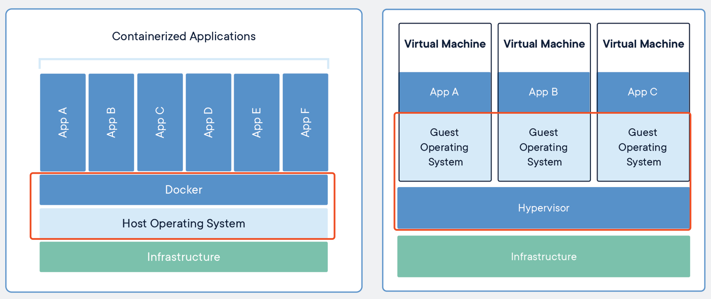

# docker基础知识

Docker 是一个开源的应用容器引擎，基于 Go 语言 并遵从 Apache2.0 协议开源。

Docker 可以让开发者打包他们的应用以及依赖包到一个轻量级、可移植的容器中，然后发布到任何流行的 Linux 机器上，也可以实现虚拟化。

基于Linux容器(LXC)技术，利用namespace的隔离机制隔离资源和cgoup的限额 功能进行资源管理。

## docker 优点

1、快速，一致地交付您的应用程序，解决环境一致性问题；

2、快速部署和扩展，Docker 的可移植性和轻量级的特性，还可以使您轻松地完成动态管理的工作负担，并根据业务需求指示，实时扩展或拆除应用程序和服务；

3、在同一硬件上运行更多工作负载，轻巧快速，资源复用。

## 容器虚拟机对比 

【Docker + Host opertion system 】< 【Hypervisor(虚拟机管理系统)+guest system 】

### 理论分析 

* guest system多份内核的全量拷贝
* Hypervisor虚拟机管理系统也是个操作系统也占用资源
* docker轻量

### 详细对比

* docker启动快速属于秒级别。虚拟机通常需要几分钟去启动。
* docker需要的资源更少，docker在操作系统级别进行虚拟化，docker容器和内核交互，几乎没有性能损耗，性能优于通过Hypervisor层与内核层的虚拟化。；
* docker更轻量，docker的架构可以共用一个内核与共享应用程序库，所占内存极小。同样的硬件环境，Docker运行的镜像数远多于虚拟机数量。对系统的利用率非常高
* 与虚拟机相比，docker隔离性更弱，docker属于进程之间的隔离，虚拟机可实现系统级别隔离；
* 安全性： docker的安全性也更弱。Docker的租户root和宿主机root等同，一旦容器内的用户从普通用户权限提升为root权限，它就直接具备了宿主机的root权限，进而可进行无限制的操作。虚拟机租户root权限和宿主机的root虚拟机权限是分离的，并且虚拟机利用如Intel的VT-d和VT-x的ring-1硬件隔离技术，这种隔离技术可以防止虚拟机突破和彼此交互，而容器至今还没有任何形式的硬件隔离，这使得容器容易受到攻击。
* 高可用和可恢复性：docker对业务的高可用支持是通过快速重新部署实现的。虚拟化具备负载均衡，高可用，容错，迁移和数据保护等经过生产实践检验的成熟保障机制，VMware可承诺虚拟机99.999%高可用，保证业务连续性。
* 快速创建、删除：虚拟化创建是分钟级别的，Docker容器创建是秒级别的，Docker的快速迭代性，决定了无论是开发、测试、部署都可以节约大量时间。
* 交付、部署：虚拟机可以通过镜像实现环境交付的一致性，但镜像分发无法体系化；Docker在Dockerfile中记录了容器构建过程，可在集群中实现快速分发和快速部署;
