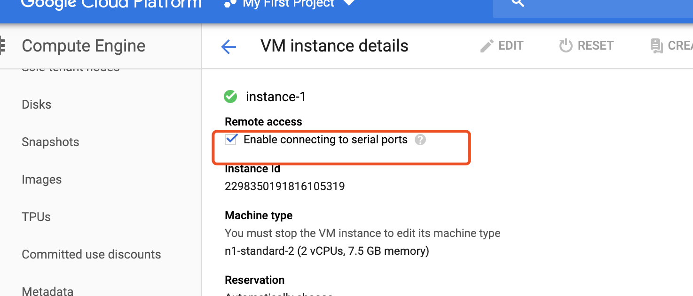

# 如何使用ssh工具登录


* 实列中配置使能ssh连接  




* 浏览器登录ssh做如下修改  

```bash
# 切换root用户
sudo -i 
sed -i "s/^PermitRootLogin.*/PermitRootLogin yes/g" /etc/ssh/sshd_config
sed -i "s/^PasswordAuthentication.*/PasswordAuthentication yes/g" /etc/ssh/sshd_config
service sshd restart
# passwd
echo "passwod" |passwd --stdin 

```