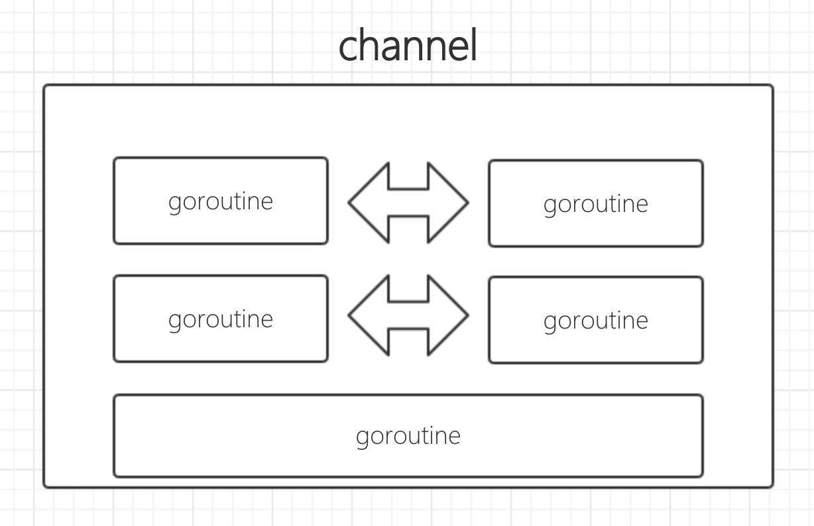

# channel


## 简介

* 




## 例子

* 简单示例   
```go 
package main

import (
	"fmt"
	"time"
)

func chanDemo()  {
  // c := make(chan  int,3)  //声明一个channel有3个缓冲区
	c := make(chan  int)
	//需要开放一个协程来收数据，这样才不至于程序死掉
	go func() {
		for {
			n := <- c
			fmt.Println("received:",n)
		}
	}()
	//发送数据，然后该线程挂起，直到该数据被收到
	c <- 1
	c <- 2
	//为避免第二个打印有可能打印不出来，加入适当延迟
	time.Sleep(time.Millisecond)
}

func main() {
	chanDemo()
}
```

* 把channel作为参数使用  

```go 
package main

import (
	"fmt"
	"time"
)

//单独写一个函数，把channel作为参数传递进去
func worker(c chan  int) {
	for {
		n := <- c
		fmt.Println("received:",n)
	}
}


func chanDemo()  {
	c := make(chan  int)
	//需要开放一个协程来收数据，这样才不至于程序死掉
	go worker(c)
	//发送数据，然后该线程挂起，直到该数据被收到
	c <- 1
	c <- 2
	//为避免第二个打印有可能打印不出来，加入适当延迟
	time.Sleep(time.Millisecond)
}

func main() {
	chanDemo()
}

```

* 多个worker消费数据  
```go 
package main

import (
	"fmt"
	"time"
)

//单独写一个函数，把channel作为参数传递进去
func worker( id int, c chan  int) {
	for {
		fmt.Printf("worker:%d,received:%c \n",id , <- c)
	}
}


func chanDemo()  {
	var channels [10] chan int
	for i :=0 ; i<10 ; i++  {
		channels[i] = make(chan int)
		go worker(i,channels[i])
	}
	//发送数据，然后该线程挂起，直到该数据被收到
	for i:=0; i<10;i++  {
		channels[i] <- 'a'+i
	}
	//为避免第二个打印有可能打印不出来，加入适当延迟
	time.Sleep(time.Millisecond)
}

func main() {
	chanDemo()
}

```


* channel作为返回值使用  

```go 
package main

import (
	"fmt"
	"time"
)

// func createWorker( id int)chan<-  int  //这样写表示函数范围的chan到外部智能够利用这个chan发送数据，指定该chan的用法，如果这样写，后面的应用chan的类型也要做对应变化
//单独写一个函数，把channel作为参数传递进去
func createWorker( id int)chan  int {
	c := make(chan int)
	go func() {
		for {
			fmt.Printf("worker:%d,received:%c \n",id , <- c)
		}
	}()
	return c
}


func chanDemo()  {
	var channels [10] chan int
	for i :=0 ; i<10 ; i++  {
		channels[i] = createWorker(i)
	}
	//发送数据，然后该线程挂起，直到该数据被收到
	for i:=0; i<10;i++  {
		channels[i] <- 'a'+i
	}
	//为避免第二个打印有可能打印不出来，加入适当延迟
	time.Sleep(time.Millisecond)
}

func main() {
	chanDemo()
}

```

* 主动关闭channel  

```go
package main

import (
	"fmt"
	"time"
)

func chanDemo()  {
	// c := make(chan  int,3)  //声明一个channel有3个缓冲区
	c := make(chan  int)
	//需要开放一个协程来收数据，这样才不至于程序死掉
	go func() {
		for {
			n,ok := <- c
			if !ok{
				break
			}
			fmt.Println("received:",n)
		}
	}()
	//发送数据，然后该线程挂起，直到该数据被收到
	c <- 1
	c <- 2
	//主动关闭channel
	close(c)
	time.Sleep(time.Millisecond)
}

func main() {
	chanDemo()
} 
```