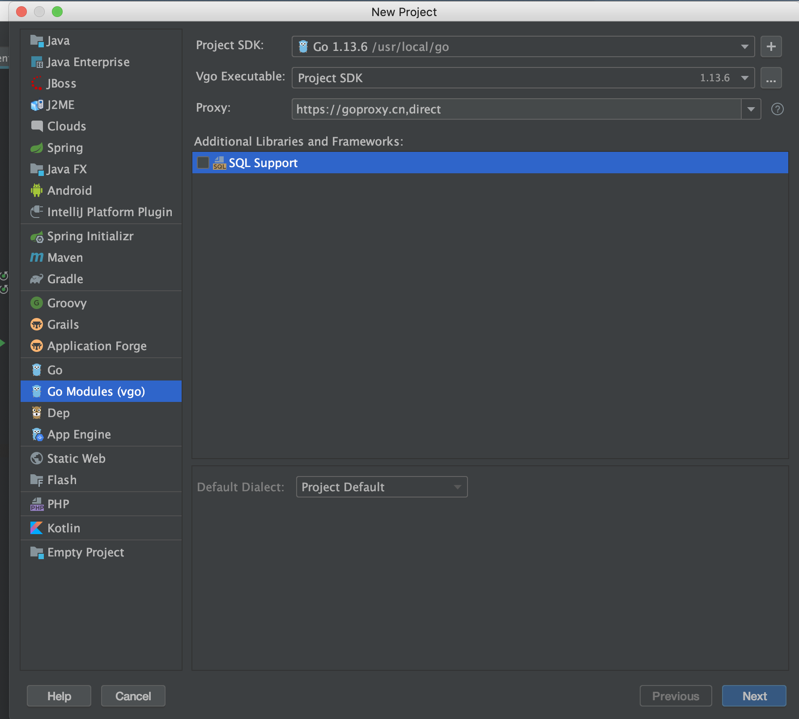

# go语言库

* go语言依赖管理经过了三个阶段，GOPATH GOVENDOR go mod（2018年底1.1版本开始支持）


## GOPATH 

GOPATH默认路径在，~/go（MAC、LINUX），%USERPROFILE%\go(WINDOWS),该管理的方式，所有的依赖都在GOPATH目录下去找

```bash 
# 该命令可以查看到GOPATH的默认值
go env | grep GOPATH
# 修改系统的GOPATH
go env -w GOPATH=/new/path
# 修改系统的GOPATH,临时修改，重启就没了
export GOPATH=/new/path
```

## GOVENDOR

每个项目建立一个自己的vendor目录，该方式通常通过一些第三方的管理工具在管理(glide,dep,go dep....)


## go mods


## 使用idea新建go mod项目

* 新建选择go modules项目，填proxy:``https://goproxy.cn,direct``  




* 安装依赖 

```bash 
# 例子,安装zap依赖
go get -u go.uber.org/zap

```