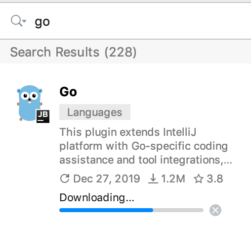
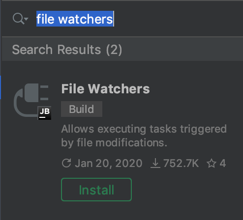
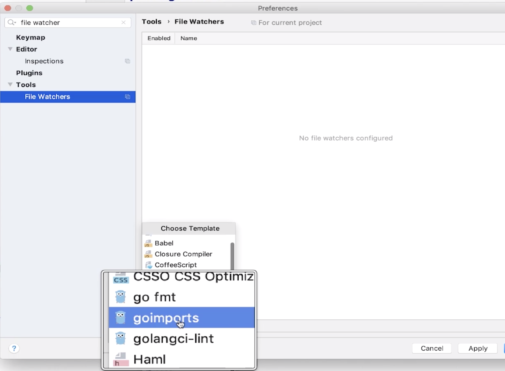

# go语言开发环境

这里推荐使用idea开发go语言。

* 安装goimports

```bash
go get -v golang.org/x/tools/cmd/goimports
```


* [官方下载idea](https://www.jetbrains.com/)

* 安装插件``go``  



* 安装插件``file watchers``  




* 使用idea创建go工程时需要配置 
```bash 
GOPROXY=https://goproxy.cn,direct
```

* 添加goimports的file watcher  

  
