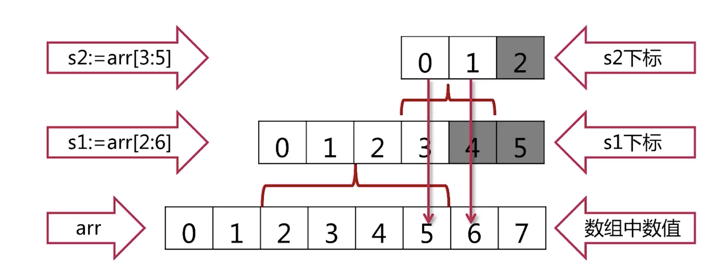

# go语言切片

* 切片本身没有数据，切片是对底层数据的一个view  
* 改变切面数据内容的值，底层数据的值也会改变   
* slice可以嵌套多层使用  
```go 
s := arr[2:6]
s = s[:3]
s = s[1:]
```
* 底层结构   
  
  

* 获取slice的长度和容量  
```
fmt.Printf("s3=%v, len(s3)=%d, cap(s3)=%d",s3,len(s3),cap(s3))
```

* append可以在slice后面加数据  

## 例子 


```go  
package main

import (
	"fmt"
)

func printSlice(s [] int)  {
	fmt.Printf("%v, len=%d,cap=%d\n",s, len(s),cap(s))
}
func main() {
	//创建slcie
	var s [] int	//Zero value for slice is nil
	for i:=0 ; i<100 ; i++  {
		printSlice(s)
		s = append(s, 2 * i + 1)
	}
	fmt.Println(s)

	s1 := [] int {2,4,6,8}
	printSlice(s1)
	//使用内置函数创建slice
	s2 := make([]int ,16)
	s3 := make([]int ,16,20)
	printSlice(s2)
	printSlice(s3)

	fmt.Println("copy slice")
	//	slice拷贝
	copy(s2,s1)
	fmt.Println(s2)

	fmt.Println("delete element from slice ")
	//删除掉第三个元素
	s2 = append(s2[:3] ,s2[4:]...)
	printSlice(s2)
	//从头删除
	font := s2[0]
	s2 = s2[1:]
	fmt.Println("font=",font)
	printSlice(s2)
	//从尾巴删除
	tail := s2[len(s2)-1]
	s2 = s2[:len(s2)-1]
	fmt.Println("tail=",tail)
	printSlice(s2)
	
}

```