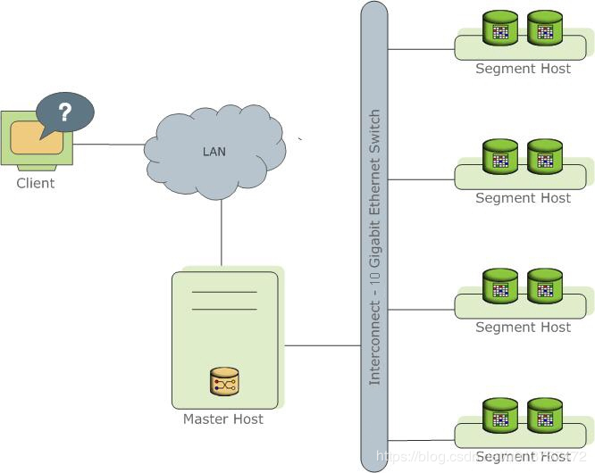
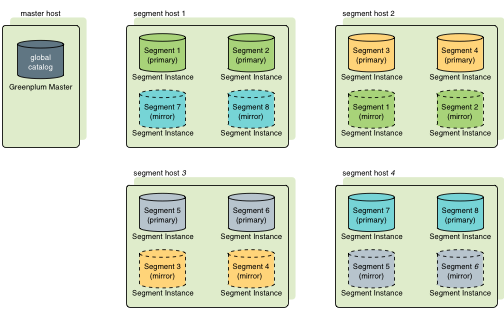

#  greenplum介绍

## Greenplum简介

是一款开源的分布式数据库存储解决方案，其主要关注在数据仓库和商业智能方面。可以在虚拟化x86服务器上运行无分享（shared-nothing）的大规模并行处理（MPP）架构。

## GreeenPlum特性

* 支持海量数据存储和处理
* 高性价比
* 支持Just In Time BI：通过准实时、实时的数据加载方式，实现数据仓库的实时更新，进而实现动态数据仓库（ADW），基于动态数据仓库，业务用户能对当前业务数据进行BI实时分析（Just In Time BI）
* 系统易用性
  * 支持主流的sql语法，使用起来十分方便，学习成本低
  * 扩展性好，支持多语言的自定义函数和自定义类型等
  * 提供了大量的维护工具，使用维护起来很方便
  * 在internet上有这丰富的postgreSQL资源供用户参考
* 支持线性扩展：采用MPP并行处理架构。在MPP结构中增加节点就可以线性提供系统的存储容量和处理能力
* 较好的并发支持及高可用性支持除了提供硬件级的Raid技术外，还提供数据库层Mirror机制保护，也剧场将每个节点的数据在另外的节点中同步镜像，单个节点的错误不影响整个系统的使用。对于主节点，还提供Master/Stand by机制进行主节点容错，当主节点发生错误时，可以切换到Stand by节点继续服务
* 支持MapReduce：一种大规模数据分析技术
* 数据库内部压缩

## GreenPlum架构

GP数据通过多台主机进行大量的数据处理；master节点是整个GP集群的入口，用户通过master节点连接并提交sql语句；segment节点功能是处理数据和存储数据，master负责协调各个节点直接的工作负载

* 技术架构如下图：

* 部署架构：

参考官方文档：
https://gpdb.docs.pivotal.io/6-0/install_guide/preinstall_concepts.html

