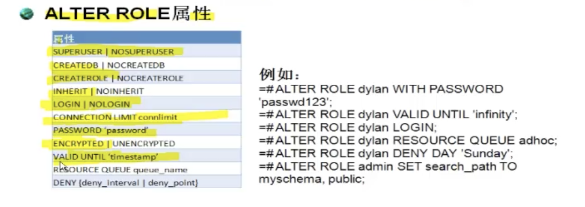

# psql命令

## psql命令

```bash 
# master上使用命令登录gp数据库
psql
# master上使用命令登录gp数据库，指定数据库
psql -d template1
# master上使用命令登录gp数据库，指定数据库，指定用户
psql -d template1 -U gpadmin

```

## 数据库操作命令

psql命令登录之后可以使用使用相关gp数据库命令  
```bash 
# 查看当前用户
template1=# \du
                                                          List of roles
 Role name |                                                Attributes                                                | Member of
-----------+----------------------------------------------------------------------------------------------------------+----------
 gpadmin   | Superuser, Create role, Create DB, Ext gpfdist Table, Wri Ext gpfdist Table, Ext http Table, Replication | {}
# 查看帮助内容，sql命令的帮助
template1=# \h
# 查看\命令的帮助
template1=# \？

```


## 操作案例

* 创建一个用户角色并添加登录权限

```bash
# 创建一个role
template1=# create role nick;
NOTICE:  resource queue required -- using default resource queue "pg_default"
CREATE ROLE
# 添加登录权限,也可以一句话搞定  create role nick with login;
template1=# alter role nick with login;
# 可以看到多了一个role
template1=# \du
                                                          List of roles
 Role name |                                                Attributes                                                | Member of
-----------+----------------------------------------------------------------------------------------------------------+-----------
 gpadmin   | Superuser, Create role, Create DB, Ext gpfdist Table, Wri Ext gpfdist Table, Ext http Table, Replication | {}
 nick      |                                                                                                          | {}


```

* 修改role权限

```bash 
# 查看alter role的语法帮助
template1=# \h alter role
# 修改角色的密码 
template1=# alter role nick with password 'nick123';
ALTER ROLE
```




* 创建组Group Role 

```bash 
# 创建一个group role，不提供login的权限，因为不考虑作为用户来使用，只是用它作为一个组，来管理
create role admin createrole createdb;
# 添加或者删除member（User role）,分配admin给
grant admin to nick;
revoke admin from nick;
# 赋予合适的权限给group role
grant all on table mytable to admin;
grant all on schema myschema to admin;
grant all on database mydb to admin;
grant all on database template1 to admin;
# 获取管理属性，创建表，创建db，nick连接之后，调用下面的语句
set role admin
```