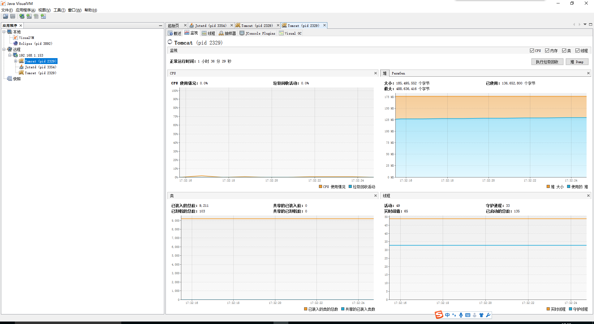

<!-- @import "[TOC]" {cmd="toc" depthFrom=1 depthTo=6 orderedList=false} -->
<!-- code_chunk_output -->

* [前言](#前言)
* [服务器配置](#服务器配置)
	* [配置``catalina.sh``](#配置catalinash)
	* [修改权限文件](#修改权限文件)
	* [修改防火墙](#修改防火墙)
	* [设置hostname](#设置hostname)
* [客户端配置](#客户端配置)
	* [打开客户端](#打开客户端)
	* [插件中心配置](#插件中心配置)
* [执行效果图](#执行效果图)

<!-- /code_chunk_output -->


# 前言
本问主要介绍如何安装配置jvisualvm，后续可用其监控远程tomcat项目

本文的测试环境是：
* 服务器：
   CENTOS 6.7
   tomcat 7
   java 1.7
* 客户端
   WINDOWS 10
   java 1.7

本文假设该环境已经搭建好。

# 服务器配置

## 配置``catalina.sh``
* 打开文件 vim {tomccat_home}/bin/catalina.sh
* 查找：`Execute The Requested Command`，在这行代码之前加入如下代码

```
CATALINA_OPTS="$CATALINA_OPTS -Djava.rmi.server.hostname=192.168.1.153 -Dcom.sun.management.jmxremote -Dcom.sun.management.jmxremote.port=9004 -Dcom.sun.management.jmxremote.ssl=false -Dcom.sun.management.jmxremote.authenticate=true"
```
注：hostname和port根据自己的实际情况配置；

## 修改权限文件
```
cd $JAVA_HOME/jre/lib/management
mv jmxremote.password.template jmxremote.password
chmod 600 jmxremote.password jmxremote.access
vim jmxremote.password
```
如下所示，123是密码，根据自己的实际情况设置；
monitorRole 只有读权限
controlRole 有写权限
```
monitorRole  123
controlRole   123
```

## 修改防火墙
```
vim /etc/sysconfig/iptables
```
添加行：
```
# -A INPUT -s 192.168.1.244 -p tcp -j ACCEPT
-A INPUT -p tcp -m state --state NEW -m tcp --dport 9004 -j ACCEPT
-A INPUT -p tcp -m state --state NEW -m tcp --dport 1099 -j ACCEPT
```
注：
1. 上面注释是允许某个固定的IP访问服务器；
1. 下面是允许两个端口访问，使用的端口一个是``catalina.sh``文件下端口，一个是jstatd端口，具体根据自己实际情况设置。

## 设置hostname

输入命令``hostname -i``如果报错，启动tomcat监听日志，看报错的hostname


修改设置``vim /etc/hosts``
```
127.0.0.1  bogon localhost localhost.localdomain localhost4 localhost4.localdomain4
::1         localhost localhost.localdomain localhost6 localhost6.localdomain6
```
如上所属，加入``bogon``

# 客户端配置
## 打开客户端
* JAVA目录下找到``jdk1.7.0_80/bin/jvisualvm.exe``（建议客户端与服务器版本一致）
* 右键添加远程主机，填写IP地址，点击确认


* 右键点击添加JMX链接，填写链接信息，点击确认(controlRole,monitorRole登陆)


* 环境搭建完成，查看监听数据；


## 插件中心配置
* 点击工具->插件->设置->编辑->URL填写地址 ``https://visualvm.github.io/archive/uc/8u40/updates.xml.gz``，点击确定。

注：
如果不是JDK 1.7_79,可参考网址``https://visualvm.github.io/pluginscenters.html``选
择自己版本的插件中心。

* 安裝插件


解决此时Visual GC插件「不受此JVM支持」问题


要解决这个问题需要Java自带的Jstatd服务， 使用步骤如下
* 在服务器上的java安装的bin下（如$JAVA_HOME/bin）新建一个文件文件名为jstatd.all.policy
```
grant codebase "file:${java.home}/../lib/tools.jar" { 
        permission java.security.AllPermission; 
    };
```
* 在当前目录中（bin）执行如下命令
```
./jstatd -J-Djava.rmi.server.hostname=192.168.1.153 -J-Djava.security.policy=jstatd.all.policy -p 1099
```
IP使用本机IP，端口默认配置是1099，根据实际情况填写


# 执行效果图




[返回](readme.md)