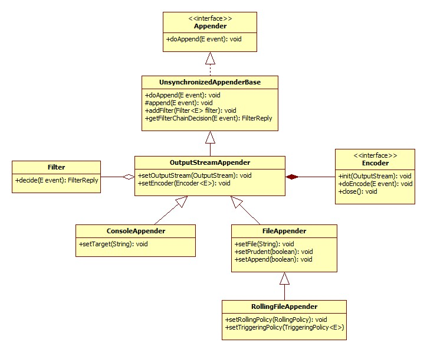

# logback 

[参考文献](https://logback.qos.ch/)

## 简介

logback被看作为log4j的继承者，但是相比log4j有如下优点；

* 更快的速度；
* 更充分的测试；
* 从log4j切换及其容易；
* 更优雅的处理io失败；
* ......


## 工程添加logback 

* pom依赖

```xml
        <dependency>
            <groupId>ch.qos.logback</groupId>
            <artifactId>logback-classic</artifactId>
            <version>1.0.13</version>
        </dependency>
```

> maven 工程添加该依赖之后会自动添加slf4j-api。


## logback的配置

```
configuration  ---- appender    # 关联输出，定义格式
                 | 
                 -- logger      # 关联content与appender，定义级别等；
                 |
                 -- root
```

> logger context 通过org.slf4j.LoggerFactory 类的静态方法getLogger取得
> 输出日志的时候先从logger开始，如果logger找不到匹配输出源(appender)，则最终使用root.

*  实例如下：

```xml
<?xml version="1.0" encoding="UTF-8"?>
<configuration scan="true" scanPeriod="10 seconds" debug="false">
    <!--<jmxConfigurator/>-->
    <!-- 定义日志文件 输出位置 -->
    <property name="log_dir" value="/Users/fangle/Desktop/study/logbackdemo/logs"/>
    <!-- 日志最大的历史 30天 -->
    <property name="maxHistory" value="30"/>

    <appender name="STDOUT" class="ch.qos.logback.core.ConsoleAppender">
        <encoder>
            <pattern>%d{HH:mm:ss.SSS} [%thread] %-5level %logger{36} - %msg%n</pattern>
        </encoder>
    </appender>

    <appender name="TIME_BASED_FILE" class="ch.qos.logback.core.rolling.RollingFileAppender">
        <file>${log_dir}/timeBasedlogFile.log</file>
        <rollingPolicy class="ch.qos.logback.core.rolling.TimeBasedRollingPolicy">
            <fileNamePattern>${log_dir}/timeBasedlogFile.%d{yyyy-MM-dd}.log</fileNamePattern>
            <maxHistory>${maxHistory}</maxHistory>
        </rollingPolicy>
        <encoder>
            <pattern>%d{HH:mm:ss.SSS} [%thread] %-5level %logger{36} - %msg%n</pattern>
        </encoder>
    </appender>

    <logger name="com.nick.logbackdemo">
        <level value="debug" />
        <appender-ref ref="TIME_BASED_FILE"/>
    </logger>

    <root level="debug">
        <appender-ref ref="STDOUT"/>
        <appender-ref ref="TIME_BASED_FILE"/>
        <!--<appender-ref ref="TIME_BASED_FILE"/>-->
    </root>
</configuration>
```

## 配置讲解

### 标签configuration 

该标签包括如下属性：

* scan="true" 文件如果发生改变时会重新加载；
* scanPeriod="10 seconds" 监听文件是否修改的时间间隔，默认1分钟
* debug="false"，logback内部日志，默认为false;

```xml
<configuration scan="true" scanPeriod="60 seconds" debug="false"> 
</configuration>　
```
### 标签property

该标签的属性包括name以及value，配置了标签之后，在后面可以使用${tag_name}格式引用；

```xml
　　　<property name="tag_name" value="tag_value" /> 
```

### 标签appender

* 该标签包含name以及class属性
* name是是appender的名字，在logger中可以使用名字引用该appender
* class的值可以是，ch.qos.logback.core.ConsoleAppender，ch.qos.logback.core.FileAppender，ch.qos.logback.core.rolling.RollingFileAppender，其具体配置可查看[官网](https://logback.qos.ch/manual/appenders.html)，其依赖关系见下图。





## 应用举例

* 每天生成一个日志文件，保存30天的日志。

```xml
<configuration> 
  <appender name="FILE" class="ch.qos.logback.core.rolling.RollingFileAppender"> 
　　　　　　　　　　　　<rollingPolicy class="ch.qos.logback.core.rolling.TimeBasedRollingPolicy"> 
　　　　　　　　　　　　　　<fileNamePattern>logFile.%d{yyyy-MM-dd}.log</fileNamePattern> 
　　　　　　　　　　　　　　<maxHistory>30</maxHistory> 
　　　　　　　　　　　　</rollingPolicy> 
　　　　　　　　　　　　<encoder> 
　　　　　　　　　　　　　　<pattern>%-4relative [%thread] %-5level %logger{35} - %msg%n</pattern> 
　　　　　　　　　　　　</encoder> 
　　　　　　　　　　</appender> 

　　　　　　　　　　<root level="DEBUG"> 
　　　　　　　　　　　　<appender-ref ref="FILE" /> 
　　　　　　　　　　</root> 
</configuration>
```

* 按照固定窗口模式生成日志文件，当文件大于20MB时，生成新的日志文件。窗口大小是1到3，当保存了3个归档文件后，将覆盖最早的日志。

```xml
<configuration> 
　　　　　　　　　　<appender name="FILE" class="ch.qos.logback.core.rolling.RollingFileAppender"> 
　　　　　　　　　　　　<file>test.log</file> 

　　　　　　　　　　　　<rollingPolicy class="ch.qos.logback.core.rolling.FixedWindowRollingPolicy"> 
　　　　　　　　　　　　　　<fileNamePattern>tests.%i.log.zip</fileNamePattern> 
　　　　　　　　　　　　　　<minIndex>1</minIndex> 
　　　　　　　　　　　　　　<maxIndex>3</maxIndex> 
　　　　　　　　　　　　</rollingPolicy> 

　　　　　　　　　　　　<triggeringPolicy class="ch.qos.logback.core.rolling.SizeBasedTriggeringPolicy"> 
　　　　　　　　　　　　　　<maxFileSize>5MB</maxFileSize> 
　　　　　　　　　　　　</triggeringPolicy> 
　　　　　　　　　　　　<encoder> 
　　　　　　　　　　　　　　<pattern>%-4relative [%thread] %-5level %logger{35} - %msg%n</pattern> 
　　　　　　　　　　　　</encoder> 
　　　　　　　　　　</appender> 

　　　　　　　　　　<root level="DEBUG"> 
　　　　　　　　　　　　<appender-ref ref="FILE" /> 
　　　　　　　　　　</root> 
　　　　　　　　</configuration>
```


## 完整使用例子

* pom文件添加依赖

```xml
        <dependency>
            <groupId>ch.qos.logback</groupId>
            <artifactId>logback-classic</artifactId>
            <version>1.0.13</version>
        </dependency>
```

*  resources 下添加logback.xml文件
```xml
<?xml version="1.0" encoding="UTF-8"?>
<configuration debug="false">
<!--定义日志文件的存储地址 勿在 LogBack 的配置中使用相对路径-->
<property name="LOG_HOME" value="/home" />
<!-- 控制台输出 -->
<appender name="STDOUT" class="ch.qos.logback.core.ConsoleAppender">
<encoder class="ch.qos.logback.classic.encoder.PatternLayoutEncoder">
<!--格式化输出：%d表示日期，%thread表示线程名，%-5level：级别从左显示5个字符宽度%msg：日志消息，%n是换行符-->
<pattern>%d{yyyy-MM-dd HH:mm:ss.SSS} [%thread] %-5level %logger{50} - %msg%n</pattern>
</encoder>
</appender>
<!-- 按照每天生成日志文件 -->
<appender name="FILE" class="ch.qos.logback.core.rolling.RollingFileAppender">
<rollingPolicy class="ch.qos.logback.core.rolling.TimeBasedRollingPolicy">
<!--日志文件输出的文件名-->
<FileNamePattern>${LOG_HOME}/TestWeb.log.%d{yyyy-MM-dd}.log</FileNamePattern>
<!--日志文件保留天数-->
<MaxHistory>30</MaxHistory>
</rollingPolicy>
<encoder class="ch.qos.logback.classic.encoder.PatternLayoutEncoder">
<!--格式化输出：%d表示日期，%thread表示线程名，%-5level：级别从左显示5个字符宽度%msg：日志消息，%n是换行符-->
<pattern>%d{yyyy-MM-dd HH:mm:ss.SSS} [%thread] %-5level %logger{50} - %msg%n</pattern>
</encoder>
<!--日志文件最大的大小-->
<triggeringPolicy class="ch.qos.logback.core.rolling.SizeBasedTriggeringPolicy">
<MaxFileSize>4096MB</MaxFileSize>
</triggeringPolicy>
</appender>

<!-- 日志输出级别 -->
<root level="INFO">
<appender-ref ref="STDOUT" />
</root>
</configuration>
```


* java代码

```java
public class Test {

　　private final static Logger logger = LoggerFactory.getLogger(Test.class);

　　　　public static void main(String[] args) {
　　　　　　logger.info("test");
　　　　}
　　}
```


## 补充说明

* logback支持自动压缩文件，只需要 在fileNamePattern值的末尾加上.gz即可，如： ${log_dir}/tomcat.%d{yyyy-MM-dd}.log.gz
* 输出日志格式详见[官方相关文档](https://logback.qos.ch/manual/layouts.html)

