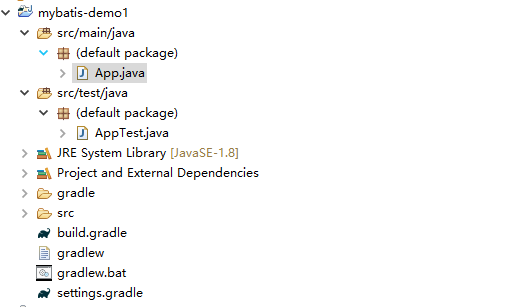

# mybatis在JAVA中的应用 {ignore=true}


<!-- @import "[TOC]" {cmd="toc" depthFrom=1 depthTo=6 orderedList=false} -->
<!-- code_chunk_output -->

* [简介](#简介)
* [第一个项目](#第一个项目)

<!-- /code_chunk_output -->

## 简介

本文简要数目了如何在java项目中使用mybatis,读者通过阅读改文，能够了解mybatis的基本用法。本文假设读者对eclipse,gradle,mysql数据库的使用的已经熟悉。

## 第一个项目

* 执行效果  
    读test数据库中表users中的id=1的记录,users表的创建脚本如下：
    ```
    CREATE TABLE `users` (
    `id` int(11) NOT NULL,
    `name` varchar(20) DEFAULT NULL,
    `age` int(11) DEFAULT NULL,
    PRIMARY KEY (`id`)
    ) ENGINE=InnoDB DEFAULT CHARSET=utf8;
    ```
    表内存储数据：
    

* 新建项目
    ```
    $ mkdir mybatis-demo1

    Administrator@WIN-KH7USRS3HHQ MINGW64 /e/workspace/ws_urpcs8.0
    $ cd mybatis-demo1/

    Administrator@WIN-KH7USRS3HHQ MINGW64 /e/workspace/ws_urpcs8.0/mybatis-demo1
    $ gradle init --type java-application
    :wrapper
    :init

    BUILD SUCCESSFUL in 0s
    2 actionable tasks: 2 executed
    ```

* 使用eclipse 导入该项目

    

* 加入必要的jar包
    ```
        // https://mvnrepository.com/artifact/org.mybatis/mybatis
        compile 'org.mybatis:mybatis:3.4.2'
        
        // https://mvnrepository.com/artifact/mysql/mysql-connector-java
        compile group: 'mysql', name: 'mysql-connector-java', version: '5.1.6'
    ```

* 加入bean文件``User.java``
    ```
    package com.fangle.mybatisDemo;

    import java.io.IOException;
    import java.io.InputStream;

    import org.apache.ibatis.io.Resources;
    import org.apache.ibatis.session.SqlSession;
    import org.apache.ibatis.session.SqlSessionFactory;
    import org.apache.ibatis.session.SqlSessionFactoryBuilder;

    /*
    * This Java source file was generated by the Gradle 'init' task.
    */
    public class App {
        public String getGreeting() {
            return "Hello world.";
        }

        public static void main(String[] args) throws IOException {
            String resource = "com/fangle/mybatisDemo/mybatis-config.xml";
            InputStream inputStream = Resources.getResourceAsStream(resource);
            SqlSessionFactory sqlSessionFactory = new SqlSessionFactoryBuilder().build(inputStream);
            
            SqlSession session = sqlSessionFactory.openSession();
        
            String statement = "com.fangle.mybatisDemo.userMapper.getUser";//映射sql的标识字符串
            //执行查询返回一个唯一user对象的sql
            User user = session.selectOne(statement, 1);
            System.out.println(user);
            System.out.println(new App().getGreeting()+"1");
        }
    }
    ```
    注：如上代码放在包com.fangle.mybatisDemo中。

* 加入mybatis配置文件``mybatis-config.xml``
    ```
    <?xml version="1.0" encoding="UTF-8" ?>
    <!DOCTYPE configuration
    PUBLIC "-//mybatis.org//DTD Config 3.0//EN"
    "http://mybatis.org/dtd/mybatis-3-config.dtd">
    <configuration>
        <environments default="development">
            <environment id="development">
                <transactionManager type="JDBC" />
                <dataSource type="POOLED">
                    <property name="driver" value="com.mysql.jdbc.Driver" />
                    <property name="url" value="jdbc:mysql://localhost:3306/test" />
                    <property name="username" value="root" />
                    <property name="password" value="123456" />
                    <!-- 
                    <property name="driver" value="${driver}" />
                    <property name="url" value="${url}" />
                    <property name="username" value="${username}" />
                    <property name="password" value="${password}" />
                    -->
                </dataSource>
            </environment>
        </environments>
        <mappers>
            <mapper resource="com/fangle/mybatisDemo/userMapper.xml" />
        </mappers>
    </configuration>
    ```
    注：如上代码放在包com.fangle.mybatisDemo中。

* 加入xxxMapper.xml文件``userMapper.xml``
    ```
    <?xml version="1.0" encoding="UTF-8" ?>
    <!DOCTYPE mapper PUBLIC "-//mybatis.org//DTD Mapper 3.0//EN" "http://mybatis.org/dtd/mybatis-3-mapper.dtd">
    <!-- 为这个mapper指定一个唯一的namespace，namespace的值习惯上设置成包名+sql映射文件名，这样就能够保证namespace的值是唯一的
    例如namespace="me.gacl.mapping.userMapper"就是me.gacl.mapping(包名)+userMapper(userMapper.xml文件去除后缀)
    -->
    <mapper namespace="com.fangle.mybatisDemo.userMapper">
        <!-- 在select标签中编写查询的SQL语句， 设置select标签的id属性为getUser，id属性值必须是唯一的，不能够重复
        使用parameterType属性指明查询时使用的参数类型，resultType属性指明查询返回的结果集类型
        resultType="me.gacl.domain.User"就表示将查询结果封装成一个User类的对象返回
        User类就是users表所对应的实体类
        -->
        <!-- 
            根据id查询得到一个user对象
        -->
        <select id="getUser" parameterType="int" 
            resultType="com.fangle.mybatisDemo.User">
            select * from users where id=#{id}
        </select>
    </mapper>
    ```
    注：如上代码放在包com.fangle.mybatisDemo中。

* 测试代码  
    在``App.java``中加入我们的测试代码
    ```
    package com.fangle.mybatisDemo;

    import java.io.IOException;
    import java.io.InputStream;

    import org.apache.ibatis.io.Resources;
    import org.apache.ibatis.session.SqlSession;
    import org.apache.ibatis.session.SqlSessionFactory;
    import org.apache.ibatis.session.SqlSessionFactoryBuilder;

    /*
    * This Java source file was generated by the Gradle 'init' task.
    */
    public class App {
        public String getGreeting() {
            return "Hello world.";
        }

        public static void main(String[] args) throws IOException {
            String resource = "com/fangle/mybatisDemo/mybatis-config.xml";
            InputStream inputStream = Resources.getResourceAsStream(resource);
            SqlSessionFactory sqlSessionFactory = new SqlSessionFactoryBuilder().build(inputStream);
            
            SqlSession session = sqlSessionFactory.openSession();
        
            String statement = "com.fangle.mybatisDemo.userMapper.getUser";//映射sql的标识字符串
            //执行查询返回一个唯一user对象的sql
            User user = session.selectOne(statement, 1);
            System.out.println(user);
            System.out.println(new App().getGreeting()+"1");
        }
    }
    ```

* 编译./gradlew build

* App.java下java application程序

