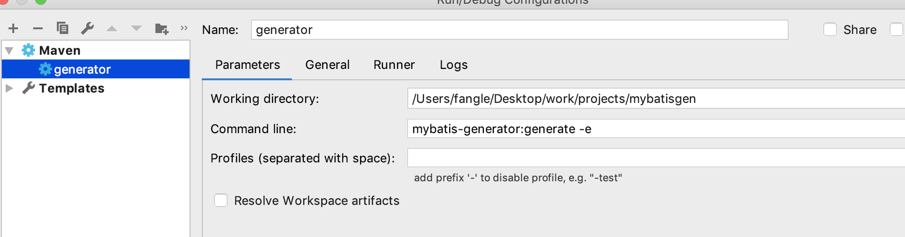

# mybatis generator

## 前言

本文讲解如何使用mybatis反向工程，生成mapper。使用环境如下:

* idea 
* maven 

## 操作步骤

* 新建maven 项目


* pom.xml文件  

```xml
<?xml version="1.0" encoding="UTF-8"?>
<project xmlns="http://maven.apache.org/POM/4.0.0"
         xmlns:xsi="http://www.w3.org/2001/XMLSchema-instance"
         xsi:schemaLocation="http://maven.apache.org/POM/4.0.0 http://maven.apache.org/xsd/maven-4.0.0.xsd">
    <modelVersion>4.0.0</modelVersion>
    <groupId>com.sxhome</groupId>
    <artifactId>mybatis-generator</artifactId>
    <packaging>war</packaging>
    <version>1.0-SNAPSHOT</version>
    <name>mybatis-generator Maven Webapp</name>
    <url>http://maven.apache.org</url>
    <build>
        <finalName>zsxt</finalName>
        <plugins>
            <plugin>
                <groupId>org.mybatis.generator</groupId>
                <artifactId>mybatis-generator-maven-plugin</artifactId>
                <version>1.3.2</version>
                <configuration>
                    <configurationFile>src/main/resources/generatorConfig.xml</configurationFile>
                    <overwrite>true</overwrite>
                    <verbose>true</verbose>
                </configuration>
            </plugin>
        </plugins>
    </build>

</project>
```

* ``../src/main/resources/generatorConfig.xml ``
  * classPathEntry中驱动路径根据使用电脑的实际路径配置；
  * targetPackage和targetProject，根据实际情况配置。

```xml
<?xml version="1.0" encoding="UTF-8"?>
<!DOCTYPE generatorConfiguration
        PUBLIC "-//mybatis.org//DTD MyBatis Generator Configuration 1.0//EN"
        "http://mybatis.org/dtd/mybatis-generator-config_1_0.dtd">
<generatorConfiguration>
    <!-- 数据库驱动:选择你的本地硬盘上面的数据库驱动包-->
    <classPathEntry location="/Users/fangle/.m2/repository/mysql/mysql-connector-java/5.1.47/mysql-connector-java-5.1.47.jar"/>
    <!--<classPathEntry location="C:\Users\xx\.m2\repository\mysql\mysql-connector-java\5.1.35\mysql-connector-java-5.1.35.jar"/>-->
    <context id="DB2Tables" targetRuntime="MyBatis3">
        <commentGenerator>
            <property name="suppressDate" value="true"/>
            <!-- 是否去除自动生成的注释 true：是 ： false:否 -->
            <property name="suppressAllComments" value="true"/>
        </commentGenerator>
        <!--数据库链接URL，用户名、密码 -->
        <jdbcConnection driverClass="com.mysql.jdbc.Driver" connectionURL="jdbc:mysql://localhost:3306/test" userId="root" password="123456">
        </jdbcConnection>
        <javaTypeResolver>
            <property name="forceBigDecimals" value="false"/>
        </javaTypeResolver>
        <!-- 生成模型的包名和位置-->
        <javaModelGenerator targetPackage="com.info.statistics.model" targetProject="src/main/java">
            <property name="enableSubPackages" value="true"/>
            <property name="trimStrings" value="true"/>
        </javaModelGenerator>
        <!-- 生成映射文件的包名和位置-->
        <sqlMapGenerator targetPackage="com.info.statistics.mapping" targetProject="src/main/java">
            <property name="enableSubPackages" value="true"/>
        </sqlMapGenerator>
        <!-- 生成DAO的包名和位置-->
        <javaClientGenerator type="XMLMAPPER" targetPackage="com.info.statistics.dao" targetProject="src/main/java">
            <property name="enableSubPackages" value="true"/>
        </javaClientGenerator>
        <!-- 要生成的表 tableName是数据库中的表名或视图名 domainObjectName是实体类名-->
        <table tableName="account" domainObjectName="Account" enableCountByExample="false" enableUpdateByExample="false" enableDeleteByExample="false" enableSelectByExample="false" selectByExampleQueryId="false"></table>
        <!--<table tableName="tel_bill_record" domainObjectName="DSTelBillRecord" enableCountByExample="false" enableUpdateByExample="false" enableDeleteByExample="false" enableSelectByExample="false" selectByExampleQueryId="false"></table>-->

    </context>
</generatorConfiguration>
```


* 运行配置，新建maven,如下:working directory:``/Users/fangle/Desktop/work/projects/mybatisgen``是项目路径,Command line: ``mybatis-generator:generate -e``




* 运行生成模型、mapper以及dao文件。