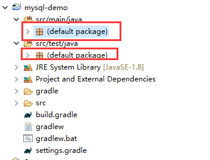

# 访问mysql数据库 {ignore=true}


<!-- @import "[TOC]" {cmd="toc" depthFrom=1 depthTo=6 orderedList=false} -->
<!-- code_chunk_output -->

* [简介](#简介)
* [开发环境](#开发环境)
* [编写步骤](#编写步骤)
* [自定义查询](#自定义查询)
* [基本增删改查](#基本增删改查)
* [条件查找](#条件查找)
* [@Query](#query)
	* [查询](#查询)
	* [查询翻页](#查询翻页)
	* [修改查询](#修改查询)
* [总结](#总结)

<!-- /code_chunk_output -->


## 简介

读者通过阅读本文能够知道怎么通过使用spring访问mysql数据库。

## 开发环境

* mysql 5.1 以上
* Navicat for MySQL
* eclipse
* gradle 3以上
* git 


## 编写步骤

* 创建工程 

    ```
    $ mkdir mysql-demo

    Administrator@WIN-KH7USRS3HHQ MINGW64 /e
    $ cd mysql-demo/

    Administrator@WIN-KH7USRS3HHQ MINGW64 /e/mysql-demo
    $ gradle init --type java-application
    Starting a Gradle Daemon (subsequent builds will be faster)
    :wrapper
    :init

    BUILD SUCCESSFUL in 2s
    2 actionable tasks: 2 executed
    ```

* 导入gradle 项目到eclipse,如果不知道如何操作，请查看[【导入gradle项目到eclipse】](import_gradle_proj.md)

* 删除default package  
    

* 修改build.gradle
    ```
    buildscript {
        repositories {
            mavenCentral()
        }
        dependencies {
            classpath("org.springframework.boot:spring-boot-gradle-plugin:1.5.7.RELEASE")
        }
    }

    apply plugin: 'java'
    apply plugin: 'eclipse'
    apply plugin: 'idea'
    apply plugin: 'org.springframework.boot'

    jar {
        baseName = 'gs-accessing-data-mysql'
        version =  '0.1.0'
    }

    repositories {
        mavenCentral()
    }

    sourceCompatibility = 1.8
    targetCompatibility = 1.8

    dependencies {
        compile("org.springframework.boot:spring-boot-starter-web")

        // JPA Data (We are going to use Repositories, Entities, Hibernate, etc...)
        compile 'org.springframework.boot:spring-boot-starter-data-jpa'

        // Use MySQL Connector-J
        compile 'mysql:mysql-connector-java'

        testCompile('org.springframework.boot:spring-boot-starter-test')
    }
    ```

* 使用navicat创建数据库``db_example``  
    

* 创建``src/main/resources/application.properties``文件

    ```
    spring.jpa.hibernate.ddl-auto=create
    spring.datasource.url=jdbc:mysql://localhost:3306/db_example
    spring.datasource.username=springuser
    spring.datasource.password=ThePassword
    ```
    这里``spring.jpa.hibernate.ddl-auto``可以是``none``, ``update``,``create``, ``create-drop``,可以阅读Hibernate的相关文档获取更为详细的信息。

    * none MySQL的默认值,不改变数据库结构；
    * update Hibernate根据提供的entity改变数据库结构；
    * create 创建但是并不删除数据库.
    * create-drop 创建并删除数据库.
    这里我们设置为create,因为档期我们的数据库还是个空数据库，实际我们可以根据自己的需要更新数据库。如果没有必要的情况下尽可能设置成为none更安全，此时程序只有SELECT, UPDATE, INSERT, DELETE权限。

* 创建@Entity模型User类在hello包里面
    ```java
    package hello;

    import javax.persistence.Entity;
    import javax.persistence.GeneratedValue;
    import javax.persistence.GenerationType;
    import javax.persistence.Id;

    @Entity // This tells Hibernate to make a table out of this class
    public class User {
        @Id
        @GeneratedValue(strategy=GenerationType.AUTO)
        private Integer id;

        private String name;

        private String email;

        public Integer getId() {
            return id;
        }

        public void setId(Integer id) {
            this.id = id;
        }

        public String getName() {
            return name;
        }

        public void setName(String name) {
            this.name = name;
        }

        public String getEmail() {
            return email;
        }

        public void setEmail(String email) {
            this.email = email;
        }


    }
    ```
* 创建Repository，UserRepository

    ```java
    package hello;

    import org.springframework.data.repository.CrudRepository;

    import hello.User;

    // This will be AUTO IMPLEMENTED by Spring into a Bean called userRepository
    // CRUD refers Create, Read, Update, Delete

    public interface UserRepository extends CrudRepository<User, Long> {

    }
    ```
* 创建控制器MainController
    ```java
    package hello;

    import org.slf4j.Logger;
    import org.slf4j.LoggerFactory;
    import org.springframework.beans.factory.annotation.Autowired;
    import org.springframework.stereotype.Controller;
    import org.springframework.web.bind.annotation.RequestMapping;
    import org.springframework.web.bind.annotation.GetMapping;
    import org.springframework.web.bind.annotation.RequestParam;
    import org.springframework.web.bind.annotation.ResponseBody;

    import hello.User;
    import hello.UserRepository;

    @Controller    // This means that this class is a Controller
    @RequestMapping(path="/demo") // This means URL's start with /demo (after Application path)
    public class MainController {
        
        private static final Logger log = LoggerFactory.getLogger(MainController.class);
        
        @Autowired // This means to get the bean called userRepository
                // Which is auto-generated by Spring, we will use it to handle the data
        private UserRepository userRepository;

        @GetMapping(path="/add") // Map ONLY GET Requests
        public @ResponseBody String addNewUser (@RequestParam String name
                , @RequestParam String email) {
            // @ResponseBody means the returned String is the response, not a view name
            // @RequestParam means it is a parameter from the GET or POST request
            log.info("call /demo/add ");
            User n = new User();
            n.setName(name);
            n.setEmail(email);
            userRepository.save(n);
            return "Saved";
        }

        @GetMapping(path="/all")
        public @ResponseBody Iterable<User> getAllUsers() {
            // This returns a JSON or XML with the users
            log.info("call /demo/all ");
            return userRepository.findAll();
        }
    }
    ```
* 创建main入口

    ```java
    package hello;

    import org.springframework.boot.SpringApplication;
    import org.springframework.boot.autoconfigure.SpringBootApplication;

    @SpringBootApplication
    public class Application {

        public static void main(String[] args) {
            SpringApplication.run(Application.class, args);
        }
    }
    ```

* 编译程序``./gradlew build``

* 执行程序``java -jar build/libs/gs-accessing-data-mysql-0.1.0.jar``


* 测试应用

    现在我们可以测试应用,该应用包含了2个rest web服务，``localhost:8080/demo/all``和``localhost:8080/demo/add``  
    * 添加用户
        ```
        $ curl 'localhost:8080/demo/add?name=nick&email=someemail@someemailprovider.com'
        Saved
        ```

    * 查询所有用户
        ```
        $ curl 'localhost:8080/demo/all'
        ```

## 自定义查询


* 修改application.properties
    ```
    spring.jpa.hibernate.ddl-auto=none
    spring.datasource.url=jdbc:mysql://localhost:3306/db_example
    spring.datasource.username=root
    spring.datasource.password=123456
    ```

* 修改UserRepository.java查询类，添加查询函数
    添加查询函数``List<User> findByName(String name);``

* 修改MainController.java，添加查询的测试函数
    ```java
        @GetMapping(path="/whois")
        public @ResponseBody Iterable<User> getUsersByName(@RequestParam String name) {
            // This returns a JSON or XML with the users
            log.info("call /demo/whois ");
            
            return userRepository.findByName(name);
        }
    ```

* 重新启动服务``./gradlew build && java -jar build/libs/gs-accessing-data-mysql-0.1.0.jar``

* 测试服务
    ```
    $ curl 'localhost:8080/demo/whois?name=nick'
    [{"id":1,"name":"nick","email":"nick@63.com"}]
    ```

## 基本增删改查

注意：后续文章，只做了代码示例，无完整执行代码，请读者按前面的方法，自行完成测试代码；

如下，UserRepository.java声明了一些基础的增删改查。
```java
package hello;

import java.util.List;

import org.springframework.beans.factory.annotation.Autowired;
import org.springframework.data.repository.CrudRepository;
import org.springframework.transaction.annotation.Transactional;

import hello.User;

// This will be AUTO IMPLEMENTED by Spring into a Bean called userRepository
// CRUD refers Create, Read, Update, Delete

public interface UserRepository extends CrudRepository<User, Long> {
	
	
	//查询
	List<User> findByName(String name);
	Long countByName(String name);
	
	//新增
	//@Autowired // 获取对象
	// private UserRepository userRepository;
	// 新建对象
	//调用userRepository.save(n);
	
	//删除
	@Transactional(timeout = 10)
	List<User> removeByName(String name);
	@Transactional(timeout = 10)
	Long deleteByName(String name);
	
	//修改
	//查询出对象，再调用userRepository.save(n);保存
	
}
```

## 条件查找
| Keyword           | Sample                                                  | JPQL snippet                                                   |
|-------------------|---------------------------------------------------------|----------------------------------------------------------------|
| And               | findByLastnameAndFirstname                              | … where x.lastname = ?1 and x.firstname = ?2                   |
| Or                | findByLastnameOrFirstname                               | … where x.lastname = ?1 or x.firstname = ?2                    |
| Is,Equals         | findByFirstname,findByFirstnameIs,findByFirstnameEquals | … where x.firstname = ?1                                       |
| Between           | findByStartDateBetween                                  | … where x.startDate between ?1 and ?2                          |
| LessThan          | findByAgeLessThan                                       | … where x.age < ?1                                             |
| LessThanEqual     | findByAgeLessThanEqual                                  | … where x.age <= ?1                                            |
| GreaterThan       | findByAgeGreaterThan                                    | … where x.age > ?1                                             |
| GreaterThanEqual  | findByAgeGreaterThanEqual                               | … where x.age >= ?1                                            |
| After             | findByStartDateAfter                                    | … where x.startDate > ?1                                       |
| Before            | findByStartDateBefore                                   | … where x.startDate < ?1                                       |
| IsNull            | findByAgeIsNull                                         | … where x.age is null                                          |
| IsNotNull,NotNull | findByAge(Is)NotNull                                    | … where x.age not null                                         |
| Like              | findByFirstnameLike                                     | … where x.firstname like ?1                                    |
| NotLike           | findByFirstnameNotLike                                  | … where x.firstname not like ?1                                |
| StartingWith      | findByFirstnameStartingWith                             | … where x.firstname like ?1 (parameter bound with appended %)  |
| EndingWith        | findByFirstnameEndingWith                               | … where x.firstname like ?1 (parameter bound with prepended %) |
| Containing        | findByFirstnameContaining                               | … where x.firstname like ?1 (parameter bound wrapped in %)     |
| OrderBy           | findByAgeOrderByLastnameDesc                            | … where x.age = ?1 order by x.lastname desc                    |
| Not               | findByLastnameNot                                       | … where x.lastname <> ?1                                       |
| In                | findByAgeIn(Collection<Age> ages)                       | … where x.age in ?1                                            |
| NotIn             | findByAgeNotIn(Collection<Age> age)                     | … where x.age not in ?1                                        |
| True              | findByActiveTrue()                                      | … where x.active = true                                        |
| False             | findByActiveFalse()                                     | … where x.active = false                                       |
| IgnoreCase        | findByFirstnameIgnoreCase                               | … where UPPER(x.firstame) = UPPER(?1)                          |


## @Query

### 查询

如下，可以使用Query直接调用SQL命令
```java
public interface UserRepository extends JpaRepository<User, Long> {

  @Query(value = "SELECT * FROM USERS WHERE EMAIL_ADDRESS = ?1", nativeQuery = true)
  User findByEmailAddress(String emailAddress);
}}
```

### 查询翻页

```java
public interface UserRepository extends JpaRepository<User, Long> {

  @Query(value = "SELECT * FROM USERS WHERE LASTNAME = ?1",
    countQuery = "SELECT count(*) FROM USERS WHERE LASTNAME = ?1",
    nativeQuery = true)
  Page<User> findByLastname(String lastname, Pageable pageable);
}
```

### 修改查询

```java
@Modifying
@Query("update User u set u.firstname = ?1 where u.lastname = ?2")
int setFixedFirstnameFor(String firstname, String lastname);
```


## 总结

本文介绍了一些基础操作，更多详细说明请查看[Spring Data JPA - Reference Documentation](https://docs.spring.io/spring-data/jpa/docs/1.11.7.RELEASE/reference/html/)