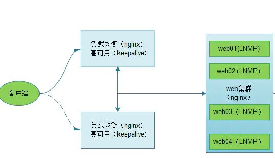

# keepalived


## 简介

* Keekpalived工作原理：通过vrrp协议实现，当master节点故障之后，vip和mac地址自动漂移到backup节点。

* Keepalived工作方式：抢占式、非抢占式

* Keepalived的日志路径： /var/log/messages


 


## 安装

### keepalived在线安装 

```bash
# 安装  
yum install keepalived -y
# 启动  
systemctl start keepalived 
# 配置开机启动  
systemctl enables keepalived 
```

### keepalived离线安装  

```bash 
# 待完善
```

## 配置例子  

### 抢占式

强制式为一个master节点和一个backup节点构成，由master节点先抢占vip，如果master节点故障了，则由backup节点接管vip。  
MASTER从故障中恢复后，会将VIP从BACKUP节点中抢占过来。

* master节点和backup节点的探测脚本  

```bash 
# 脚本，检查nginx程序是否存在,也可以通过curl命令检测返回值     
cat << 'EOF' > /etc/keepalived/nginx_check.sh
#!/bin/bash
A=`ps -C nginx  |wc -l`
if [ $A -eq 0 ];then
  echo "start nginx"
  /usr/bin/nginx
  sleep 2
  if [ `ps -C nginx |wc -l` -eq 0 ];then
    echo "kill keepalived"
    ps -ef | grep nginx | grep -v  grep | awk '{print $2}' | xargs kill -9
    # killall keepalived
  fi
fi
EOF
chmod +x /etc/keepalived/nginx_check.sh

```


* master节点例子： 

```bash 
cat << 'EOF' > /etc/keepalived/keepalived.conf
! Configuration File for keepalived
global_defs {
	## keepalived 自带的邮件提醒需要开启 sendmail 服务。 建议用独立的监控或第三方 SMTP
	router_id m1 ## 标识本节点的字条串，通常为 hostname
} 
## keepalived 会定时执行脚本并对脚本执行的结果进行分析，动态调整 vrrp_instance 的优先级。
## 如果脚本执行结果为 0，并且 weight 配置的值大于 0，则优先级相应的增加。
## 如果脚本执行结果非 0，并且 weight配置的值小于 0，则优先级相应的减少。
## 其他情况，维持原本配置的优先级，即配置文件中 priority 对应的值。
vrrp_script chk_nginx {
	script "/etc/keepalived/nginx_check.sh" ## 检测 nginx 状态的脚本路径
	interval 2 ## 检测时间间隔
	weight -20 ## 如果条件成立，权重-20
}
## 定义虚拟路由， VI_1 为虚拟路由的标示符，自己定义名称
vrrp_instance VI_1 {
	state MASTER ## 主节点为 MASTER， 对应的备份节点为 BACKUP
	interface eth1 ## 绑定虚拟 IP 的网络接口，与本机 IP 地址所在的网络接口相同， 我的是 eth0
	virtual_router_id 33 ## 虚拟路由的 ID 号， 两个节点设置必须一样， 可选 IP 最后一段使用, 相同的 VRID 为一个组，他将决定多播的 MAC 地址
	mcast_src_ip 192.168.100.11 ## 本机 IP 地址
	priority 100 ## 节点优先级， 值范围 0-254， MASTER 要比 BACKUP 高
	nopreempt ## 优先级高的设置 nopreempt 解决异常恢复后再次抢占的问题
	advert_int 1 ## 组播信息发送间隔，两个节点设置必须一样， 默认 1s
	## 设置验证信息，两个节点必须一致
	authentication {
		auth_type PASS
		auth_pass 1111 ## 真实生产，按需求对应该过来
	}
	## 将 track_script 块加入 instance 配置块
	track_script {
		chk_nginx ## 执行 Nginx 监控的服务
	} 
	# 虚拟 IP 池, 两个节点设置必须一样
	virtual_ipaddress {
		192.168.100.21/24 ## 虚拟 ip，可以定义多个
	}
}
EOF

systemctl restart keepalived 

```

* backup节点配置  


```bash 
cat << 'EOF' > /etc/keepalived/keepalived.conf
! Configuration File for keepalived
global_defs {
	router_id m2
}
vrrp_script chk_nginx {
	script "/etc/keepalived/nginx_check.sh"
	interval 2
	weight -20
}
vrrp_instance VI_1 {
	state BACKUP
	interface eth1
	virtual_router_id 33
	mcast_src_ip 192.168.100.12
	priority 90
	advert_int 1
	authentication {
		auth_type PASS
		auth_pass 1111
	}
	track_script {
		chk_nginx
	}
	virtual_ipaddress {
		192.168.100.21/24
	}
}
EOF

systemctl restart keepalived 

```


### 非抢占式

非抢占式结合抢占式来看，就是主节点恢复之后，VIP不会恢复到master节点，而是保持现状。如下是一个例子: 

* master 节点

```bash 
cat <<'EOF'>  /etc/keepalived/keepalived.conf
vrrp_instance VI_1
{
　　state BACKUP
　　nopreempt
　　priority 100

　　advert_int 1
　　virtual_router_id 1
　　interface eth0

　　authentication
　　{
　　　　auth_type PASS
　　　　auth_pass abcd@hehe
　　}

　　virtual_ipaddress
　　{
　　　　100.92.2.110
　　}
}
EOF
systemctl restart keepalived 
 
```


* backup 节点

```bash 
cat <<'EOF'>  /etc/keepalived/keepalived.conf
vrrp_instance VI_1
{
　　state BACKUP
　　nopreempt
　　priority 90

　　advert_int 1
　　virtual_router_id 1
　　interface eth0

　　authentication
　　{
　　　　auth_type PASS
　　　　auth_pass abcd@hehe
　　}

　　virtual_ipaddress
　　{
　　　　100.92.2.110
　　}
}
EOF
systemctl restart keepalived 
 
```


> 1. 两个节点的state都必须配置为BACKUP
> 1. 两个节点都必须加上配置 nopreempt ,该参数允许低优先级的机器去充当master的角色
> 1. 其中一个节点的优先级必须要高于另外一个节点的优先级。


