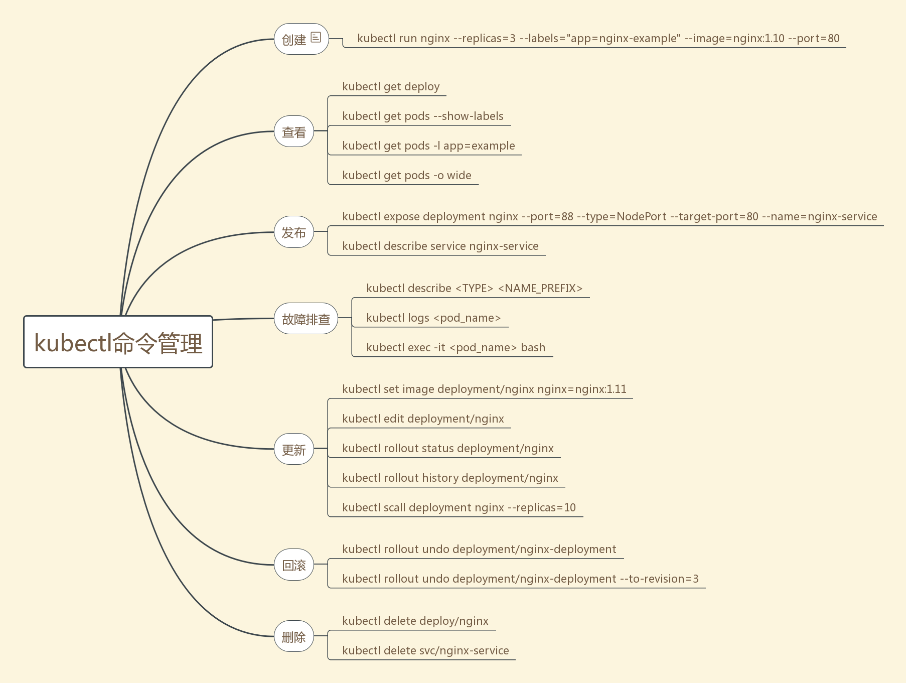

# 常用命令


## 创建集群
### minikube

* ``minikube version``
  获取minikube版本

* ``minikube start``
  启动minikube

### kubectl 


* ``kubectl --help`` 
查看相关帮助

* ``kubectl version``
  获取kubectl的版本号

* ``kubectl cluster-info``
  获取kubectl集群信息
```
kubectl cluster-info
Kubernetes master is running at https://172.17.0.37:8443
```

* kubectl get nodes   
  显示所有可以部署应用的节点
```
$ kubectl get nodes
NAME       STATUS    ROLES     AGE       VERSION
minikube   Ready     <none>    37s       v1.10.0
```

* `` kubectl api-versions ``

查看api的版本

## 使用kubectl创建deployment

### 运行应用

* 运行应用
``` bash
kubectl run kubernetes-bootcamp --image=gcr.io/google-samples/kubernetes-bootcamp:v1 --port=8080
```
* 查看正在运行的应用

```bash
kubectl get deployments
```

### 查看应用

pods运行在kubernetes内部网络的私有网络里面。默认情况下同个集群内的其他pods和services可以访问，但是默认情况下外部网络不能访问，我们需要开放应用的访问；


* ``kubectl proxy``

  该命令之后，我们在集群和主机之间开启了一个proxy链接。 

```
curl http://localhost:8001/version
```

```
export POD_NAME=$(kubectl get pods -o go-template --template '{{range .items}}{{.metadata.name}}{{"\n"}}{{end}}')
curl http://localhost:8001/api/v1/namespaces/default/pods/$POD_NAME/proxy/
Hello Kubernetes bootcamp! | Running on: kubernetes-bootcamp-5c69669756-vqr2n | v=1

kubectl logs $POD_NAME     # 查看对应pod日志
```


## 查看pod和node 

* kubectl get pods 
  查看正在运行的pods 

* 或者在命令后面加-o 来定义输出格式，常用有wide或者yaml，例如

```bash
kubectl get pods -o wide -n kube-system
```


* kubectl describe pods
  获取pods的详细信息


* kubectl get - list resources
* kubectl describe - show detailed information about a resource
* kubectl logs - print the logs from a container in a pod
* kubectl exec - execute a command on a container in a pod


## 命令管理应用统计


