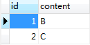
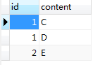
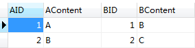
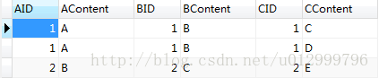
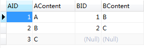
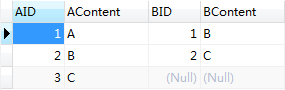
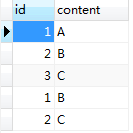

# 数据库联合查询

## 联合查询分类

* 内连接（inner Join 或 Join）
* 外连接（outer Join） 
    * 左外连接（left outer Join 或 left Join）
    * 右外连接（right outer Join 或 right Join）
    * 全外连接（full outer Join 或 full Join）
    * 交叉连接 （cross Join）
* 结果集链接 （union 和 union all）

## 联合查询介绍

* A表   


* B表  


* C表  


### 内连接（Inner Join） 

内连接：仅显示两个表中匹配行，即两表中都有才显示。  
* sql:  
```sql
SELECT
    A.id AS AID,
    A.content AS AContent,
    B.id AS BID,
    B.content AS BContent
FROM
    A
INNER JOIN B ON (A.id = B.id)
```
* 执行结果   


>  由查询结果可以看出，内连接根据连接条件（A.id=B.id）查询出了A、B两表中都存在的数据信息。2个表的联合查询结果如此，那么3个表甚至更多表联合查询的结果呢？

* A、B、C三表联合内查询SQL

```sql
SELECT
    A.id AS AID,
    A.content AS AContent,
    B.id AS BID,
    B.content AS BContent,
    C.id AS CID,
    C.content AS CContent
FROM
    A
INNER JOIN B ON (A.id = B.id)
INNER JOIN C ON (A.id = C.id)
```

* 查询结果：  
  
>  多了一行数据？其实C表中有2个id为1的记录，然而我们怎么理解得到的查询结果呢？ 
可以把A、B两表的查询结果作为T表（中间结果表），然后T表内连接C表，连接条件为T.A.id=C.id。简单来说n(n>=2)都可以看做两张表的联合查询，后面的小节将只介绍两个表的联合查询。


### 外连接（Outer Join）

#### 左外连接（Left outer Join）

左外连接：左表有就显示，不论右表。
* SQL  
```SQL
SELECT
    A.id AS AID,
    A.content AS AContent,
    B.id AS BID,
    B.content AS BContent
FROM
    A
LEFT JOIN B ON (A.id = B.id);
```
* 查询结果：   


* 左连接并不是把B表左连接到A表上，而是把A表作为基准表。由查询结果可以看出，A、B两表左连接，只要A中有结果，无论B表中有无结果，都会被查询出来。

#### 右外连接（Right outer Join）

右外连接：右表有就显示，不论左表。

* SQL  
```SQL
SELECT
    A.id AS AID,
    A.content AS AContent,
    B.id AS BID,
    B.content AS BContent
FROM
    A
RIGHT JOIN B ON (A.id = B.id);
```

* 查询结果：   


> 右连接和左连接类似，只是把B表（连接的表）作为基准表。由查询结果可以看出，无论A表是否存在其他数据，只要B表数据存在就会被查询出来。

#### 全外连接（Full outer Join）

全外连接：左表/右表，有一个有就显示。

* SQL 
```SQL
SELECT
    A.id AS AID,
    A.content AS AContent,
    B.id AS BID,
    B.content AS BContent
FROM
    A
FULL OUTER JOIN B ON (A.id = B.id);
```  
  

>  全外连接查询就字面意思也不难看出是查询出两表（A、B）中的所有记录信息。 
注：MySQL中不支持全外连接（但是可以union来实现）。

#### 交叉连接（Cross Join）  

* sql
```sql
SELECT
    A.id AS AID,
    A.content AS AContent,
    B.id AS BID,
    B.content AS BContent
FROM
    A
CROSS JOIN B;
```


* 由结果可以看出，交叉连接是对A、B量表进行笛卡尔积的结果查询出来。即A的每条记录都有和B中所有记录相对应的信息。

### SQL Union

>  SQL Union用于将多个select结果集进行合并。值得注意的是，UNION 内部的 SELECT 语句必须拥有相同数量的列。列也必须拥有相似的数据类型。同时，每条 SELECT 语句中的列的顺序必须相同。

* sql
```sql
SELECT * FROM A UNION SELECT * from B;
```


> Union是把2个Select结果集进行合并，由查询结果也不难看出，A、B两表的结果数据进行了合并，并且都被查询出来了。 如果2个Select结果集中存在相同的结果，用Union则会把相同的记录进行合并，查询结果中仅仅会显示一条。那么如果想都显示出来，把Union换成Union All 即可。

```sql

drop table  if EXISTS recharge_records;
CREATE TABLE recharge_records(
	id int(11) NOT NULL AUTO_INCREMENT COMMENT 'id',
	time TIMESTAMP  DEFAULT CURRENT_TIMESTAMP COMMENT '充值时间',
	fee int(11) DEFAULT 0 COMMENT '费用',
	PRIMARY KEY (id)
);

INSERT INTO recharge_records (time,fee) VALUES ("2018-09-08 08:00:00",10);
INSERT INTO recharge_records (time,fee) VALUES ("2018-09-08 10:00:00",20);

drop table  if EXISTS consume_records;
CREATE TABLE consume_records(
	id int(11) NOT NULL AUTO_INCREMENT COMMENT 'id',
	time TIMESTAMP  DEFAULT CURRENT_TIMESTAMP COMMENT '充值时间',
	fee int(11) DEFAULT 0 COMMENT '费用',
	PRIMARY KEY (id)
);

INSERT INTO consume_records (time,fee) VALUES ("2018-09-08 09:00:00",30);
INSERT INTO consume_records (time,fee) VALUES ("2018-09-08 12:00:00",40);


-- 联合查询
SELECT "消费记录"  type,time,fee FROM recharge_records UNION SELECT "充值记录"  type ,time,fee FROM consume_records;

-- 联合查询并且排序
SELECT a.type,a.time,a.fee FROM (
SELECT "消费记录" type,time,fee FROM recharge_records UNION 
SELECT "充值记录" type,time,fee FROM consume_records) AS a ORDER BY time;
```

