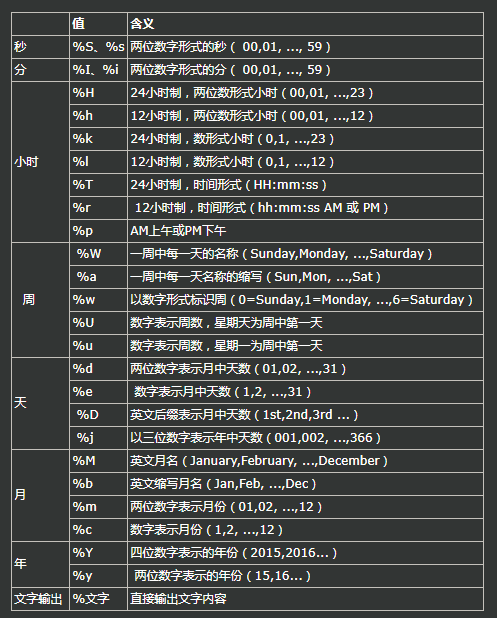

# 日期-字符串-时间戳

## 简介
平时比较常用的时间、字符串、时间戳之间的互相转换，虽然常用但是几乎每次使用时候都喜欢去搜索一下用法；本文将作为一个笔记，整理一下三者之间的 转换（即：date转字符串、date转时间戳、字符串转date、字符串转时间戳、时间戳转date，时间戳转字符串）用法，方便日后查看；

## 涉及的函数

* date_format(date, format) 函数，MySQL日期格式化函数date_format()  
* unix_timestamp() 函数  
* str_to_date(str, format) 函数  
* from_unixtime(unix_timestamp, format) 函数，MySQL时间戳格式化函数from_unixtime

## 常用转换

* 时间转字符串
```
select date_format(now(), '%Y-%m-%d');  
  
#结果：2016-01-05  
```

* 时间转时间戳
```
select unix_timestamp('2016-01-02');  
#结果：1451664000  
```

* 时间戳转时间
```
select from_unixtime(1451997924);  
  
#结果：2016-01-05 20:45:24  
```

* 时间戳转字符串
```
select from_unixtime(1451997924,'%Y-%d');  
  
//结果：2016-01-05 20:45:24  
```

## 附表
