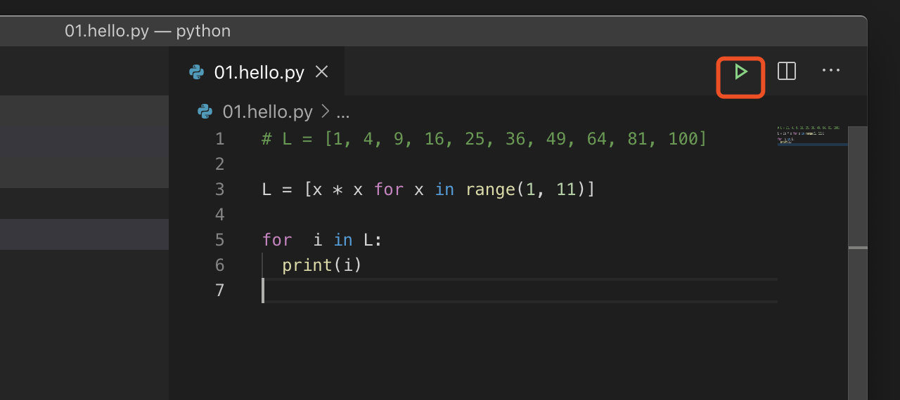

# 第一个python程序

## 交互界面

```bash
 nick@nicks-MacBook-Pro  ~/Desktop/study  python3
Python 3.7.4 (default, Jul  9 2019, 18:13:23)
[Clang 10.0.1 (clang-1001.0.46.4)] on darwin
Type "help", "copyright", "credits" or "license" for more information.
>>> print("hello word")
hello word
>>> exit()
 nick@nicks-MacBook-Pro  ~/Desktop/study 
```

如上为在交互窗口上执行第一个python程序： 
* 终端窗口上输入python3 进入窗口   
* 输入print("hello word")，打印输出字符串
* 输入exit()，返回终端  


## 命令行

笔者使用vscode 作为编译器，安装Python插件，执行程序可以通过，如下两种方法：  

* 命令执行： ``python3 file.py``

* IDE点击执行按钮  
