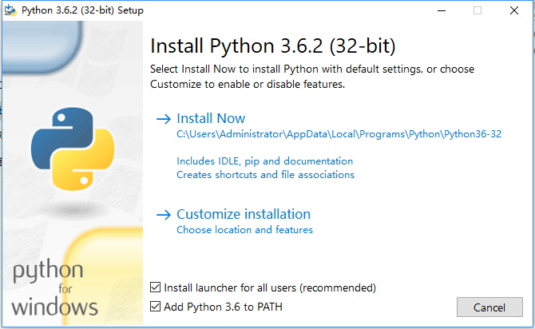

# python开发环境搭建 

## 简要说明

本文介绍在windows系统上安装python开发环境。

## WINDOWS安装

* 到[官网](https://www.python.org/downloads/)上下载python
* 点击安装，请选中安装到path环境变量中去
    
* 管理员打开dos窗口
```
$ pip install utils
$ pip install db
```

## MAC安装


方法一：到[官网](https://www.python.org/downloads/)下载Python 3的安装程序，下载后双击运行并安装；

方法二：如果安装了Homebrew，直接通过命令``brew install python3``安装即可。

## LINUX (待验证)


1.安装编译相关工具
yum -y groupinstall "Development tools"
yum -y install zlib-devel bzip2-devel openssl-devel ncurses-devel sqlite-devel readline-devel tk-devel gdbm-devel db4-devel libpcap-devel xz-devel
yum install libffi-devel -y
2.下载安装包解压
cd #回到用户目录
wget https://www.python.org/ftp/python/3.7.0/Python-3.7.0.tar.xz
tar -xvJf  Python-3.7.0.tar.xz
3.编译安装
mkdir /usr/local/python3 #创建编译安装目录
cd Python-3.7.0
./configure --prefix=/usr/local/python3
make && make install
4.创建软连接
ln -s /usr/local/python3/bin/python3 /usr/local/bin/python3
ln -s /usr/local/python3/bin/pip3 /usr/local/bin/pip3
5.验证是否成功
python3 -V
pip3 -V
