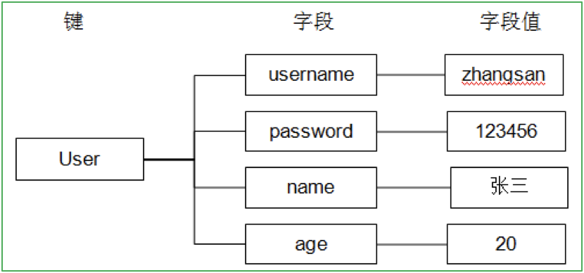

# redis命令


[官网](https://redis.io/commands)

## redis支持的数据类型


* String(字符串类型)
* Hash （散列类型）
* List （列表类型）
* Set （集合类型）
* SortedSet （有序集合类型）

## 支持命令

### String 

* 赋值,语法``set key value``  
```
127.0.0.1:6379> set test 123
OK
```
* 取值，语法``get test``  
```
127.0.0.1:6379> get test
"123“
```

*  取值并赋值，``getset key value``,返回的是上一次的值  
```
127.0.0.1:6379> getset s2 222
"111"
127.0.0.1:6379> get s2
"222"
```

* 数值增减,递增数字 ,``incr key``   
```
127.0.0.1:6379> incr num
(integer) 1
127.0.0.1:6379> incr num
(integer) 2
127.0.0.1:6379> incr num
(integer) 3
```

* 增加指定的整数,``incrby key increment``  
```
127.0.0.1:6379> incrby num 2
(integer) 5
127.0.0.1:6379> incrby num 2
(integer) 7
127.0.0.1:6379> incrby num 2
(integer) 9
```

* 递减数值,``DECR key``  
```
127.0.0.1:6379> decr num
(integer) 9
127.0.0.1:6379> decr num
(integer) 8
```

* 减少指定的整数,``DECRBY key decrement``   
```
127.0.0.1:6379> decr num
(integer) 6
127.0.0.1:6379> decr num
(integer) 5
127.0.0.1:6379> decrby num 3
(integer) 2
127.0.0.1:6379> decrby num 3
(integer) -1
```

* 仅当不存在时赋值,``setnx key value``,分布式锁  
```
redis> EXISTS job                # job 不存在
(integer) 0
redis> SETNX job "programmer"    # job 设置成功
(integer) 1
redis> SETNX job "code-farmer"   # 尝试覆盖 job ，失败
(integer) 0
redis> GET job                   # 没有被覆盖
"programmer"
```

* 向尾部追加值,``APPEND key value``  
```
127.0.0.1:6379> set str hello
OK
127.0.0.1:6379> append str " world!"
(integer) 12
127.0.0.1:6379> get str 
"hello world!"
```

* 获取字符串长度  ,``STRLEN key``,如果不存在则返回0
```
127.0.0.1:6379> strlen str 
(integer) 0
127.0.0.1:6379> set str hello
OK
127.0.0.1:6379> strlen str 
(integer) 5
```


* 同时设置/获取多个键值,写：``MSET key value [key value …]``,读：``MGET key [key …]``

```
127.0.0.1:6379> mset k1 v1 k2 v2 k3 v3
OK
127.0.0.1:6379> get k1
"v1"
127.0.0.1:6379> mget k1 k3
1) "v1"
2) "v3"
```

### Hash类型

hash叫散列类型，它提供了字段和字段值的映射。字段值只能是字符串类型，不支持散列类型、集合类型等其它类型。如下：

  


* 赋值，HSET命令不区分插入和更新操作，当执行插入操作时HSET命令返回1，当执行更新操作时返回0。  
  * 一次只能设置一个字段值，``HSET key field value``  
```
127.0.0.1:6379> hset user username zhangsan 
(integer) 1
```
  * 一次可以设置多个字段值,``HMSET key field value [field value ...]``

```
127.0.0.1:6379> hmset user age 20 username lisi 
OK
``` 

  * 当字段不存在时赋值，类似HSET，区别在于如果字段存在，该命令不执行任何操作

```
127.0.0.1:6379> hsetnx user age 30	//如果user中没有age字段则设置age值为30，否则不做任何操作
(integer) 0
```

 
* 取值  
   * 一次只能获取一个字段值,``HGET key field	``  
```
127.0.0.1:6379> hget user username
"zhangsan“
```
  * 一次可以获取多个字段值,``HMGET key field [field ...]		``

```
127.0.0.1:6379> hmget user age username
1) "20"
2) "lisi"
```

  * 获取所有字段值,``HGETALL key``  

```
127.0.0.1:6379> hgetall user
1) "age"
2) "20"
3) "username"
4) "lisi"
```

* 删除字段,可以删除一个或多个字段，返回值是被删除的字段个数 ,``HDEL key field [field ...]``

```
127.0.0.1:6379> hdel user age
(integer) 1
127.0.0.1:6379> hdel user age name
(integer) 0
127.0.0.1:6379> hdel user age username
(integer) 1 
```

* 增加数字 ,``HINCRBY key field increment``  
```
127.0.0.1:6379> hincrby user age 2	将用户的年龄加2
(integer) 22
127.0.0.1:6379> hget user age		获取用户的年龄
"22“
```


### List 

### Set 

### SortedSet


