# 邮箱配置 {ignore=true}
## 简要说明
当zabbix中的某些被监控的指标出现异常时，维护员需要及时知道，因此我们需要配置一下报警媒介来通知维护员，本文主要配置通过邮件的方式来通知运维攻城狮

## 操作步骤

### 登录服务器操作
* 在安装docker时我们已经编写好mail.sh和mail.rc配置文件，那么我们下面只需要在zabbix页面上配置即可
### zabbix页面配置
* 添加触发媒介
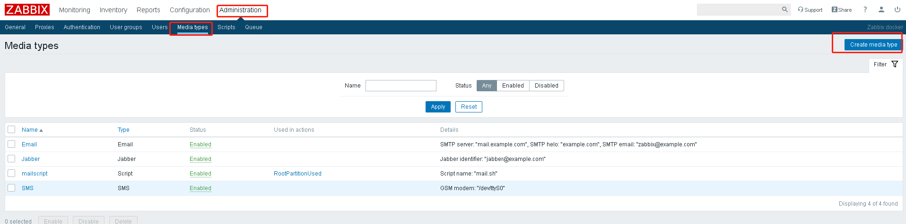 
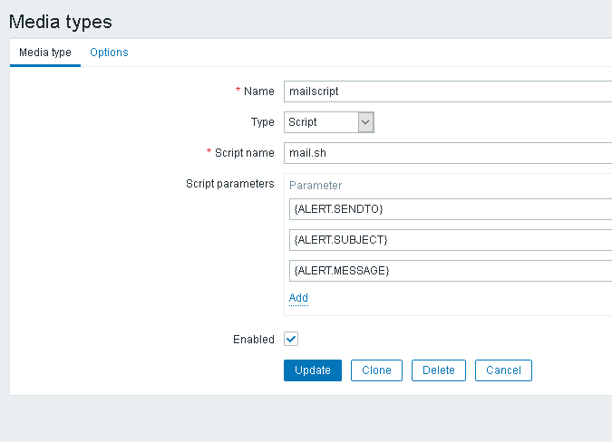
参数说明：
Name：随便写
Type：选择你要发送的类型，这里选的是Script，这里是用脚本触发，发送邮件的 
Script name: mail.sh 选择触发的脚本，服务器会自动在/usr/lib/zabbix/alertscripts/中寻找，所以在刚开始docker run的时候我们把mail.sh挂载到了这个目录
Script parameters: 这里对应的就是我们mail.sh里面传进行的三个参数（$1、2、3）
```
{ALERT.SENDTO}:发送给谁

{ALERT.SUBJECT}：发送标题

{ALERT.MESSAGE}：发送内容
```

* 选择一个zabbix用户来启用这个媒介，这里选择Admin用户
  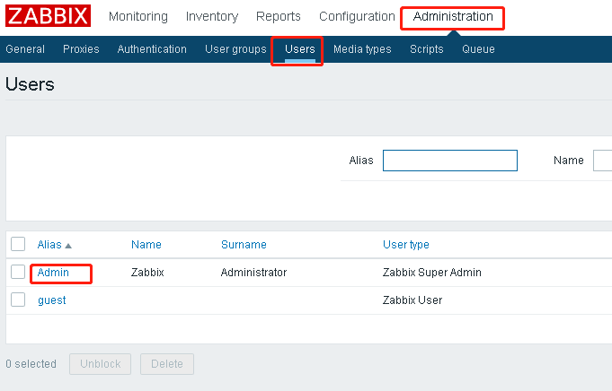
  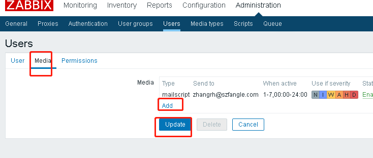

* 选择创建的媒介，填写接收报警邮件的邮箱
  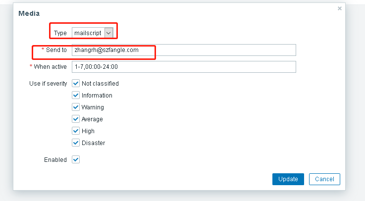

* 到此邮件的配置已经基本完成了，下面我们来验证一下

### 验证

* 在这之前已经添加了一个用来监控空闲硬盘使用率的item
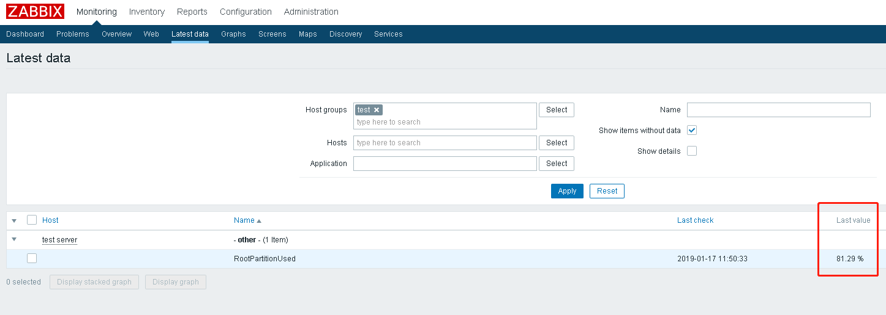

* 目前使用率是81%，那么我们设置一个Triggers来触发报警，当它低于80%的时候触发
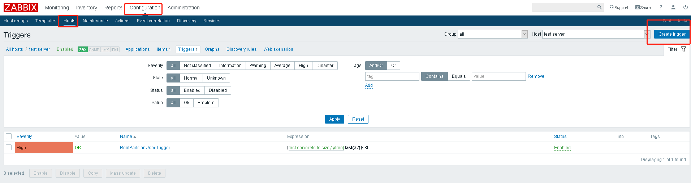
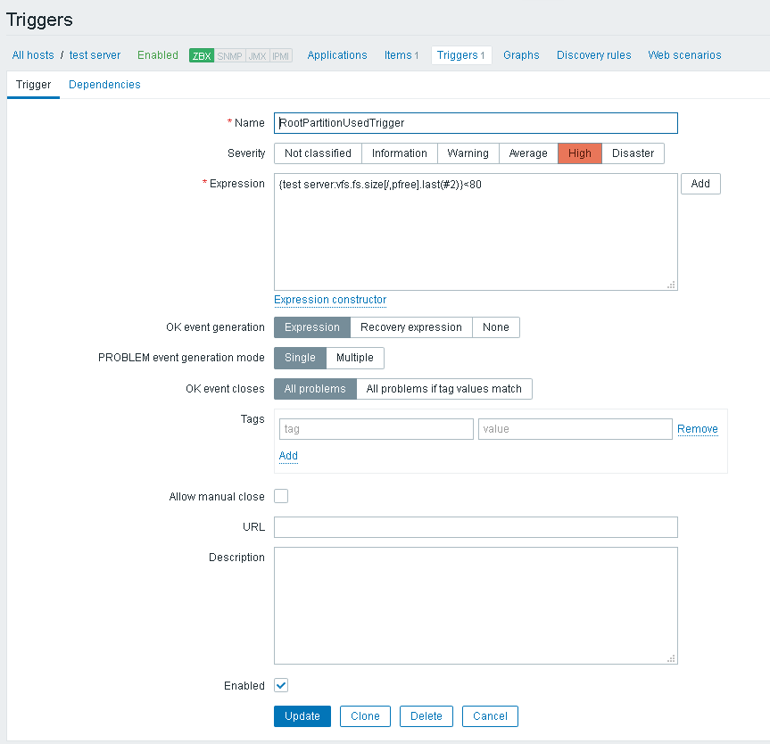
参数说明：
Name：定义报警古镇名称
Severity:严重程度
Expression：点击ADD,
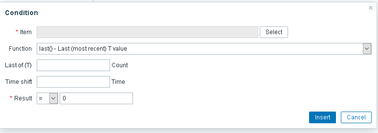
选择我们定义的item，Function这个选择最新的数据，Result选择大于等于小于设定的数值

* 设置完Triggers后，那么触发后我们需要进行什么样的动作，这个时候我们要定义发送邮件的动作，即Action
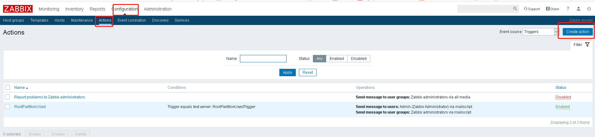
* New condition选择我们定义的Triggers
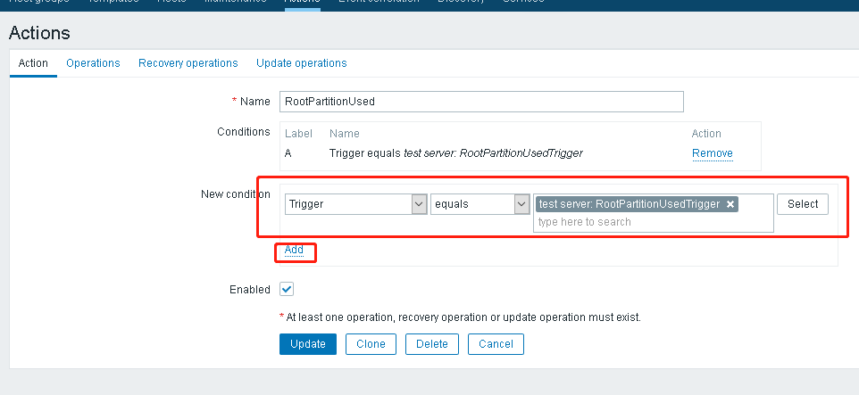
* 这里可以定义发送报警问题邮件的内容：
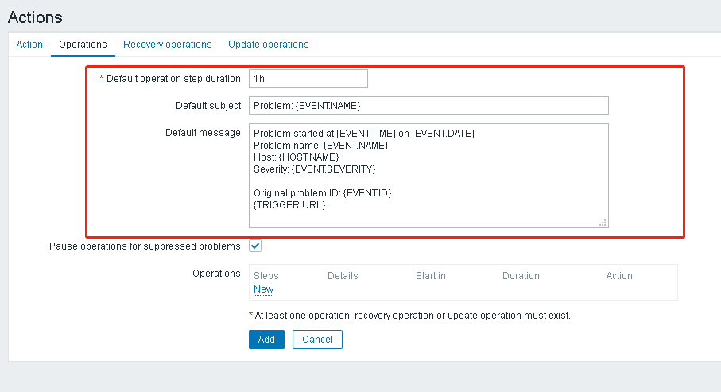
* 点击new
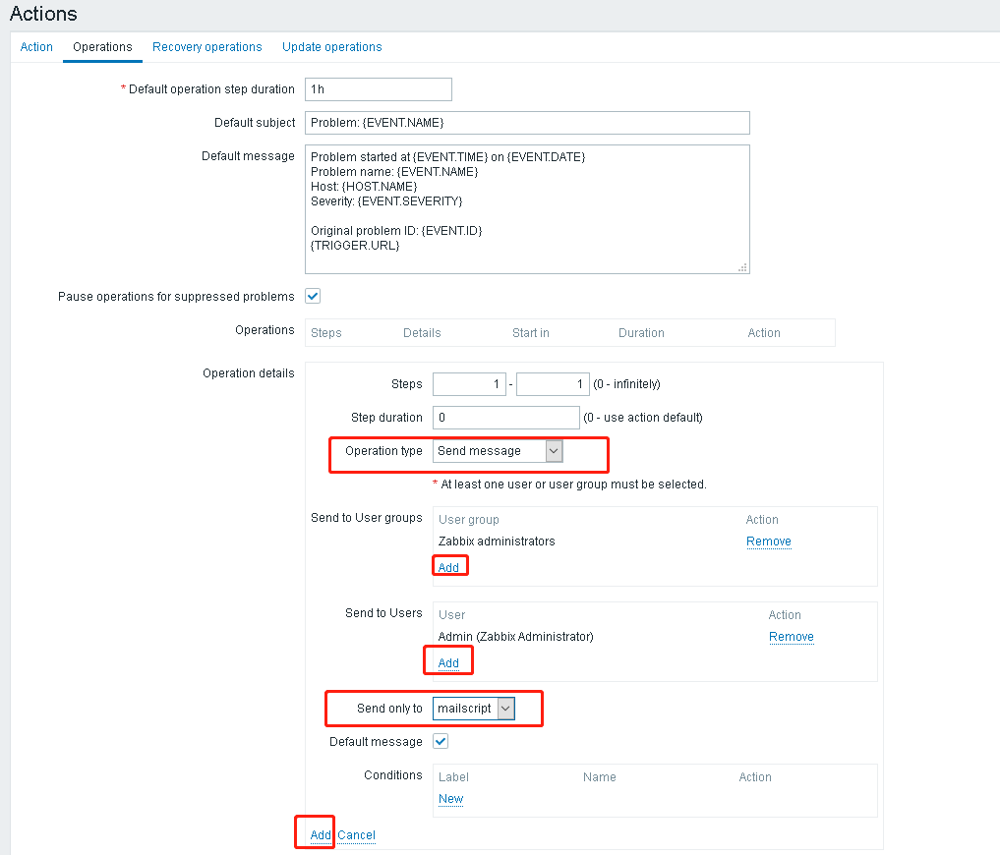
* 这里可以定义解决了问题的邮件内容
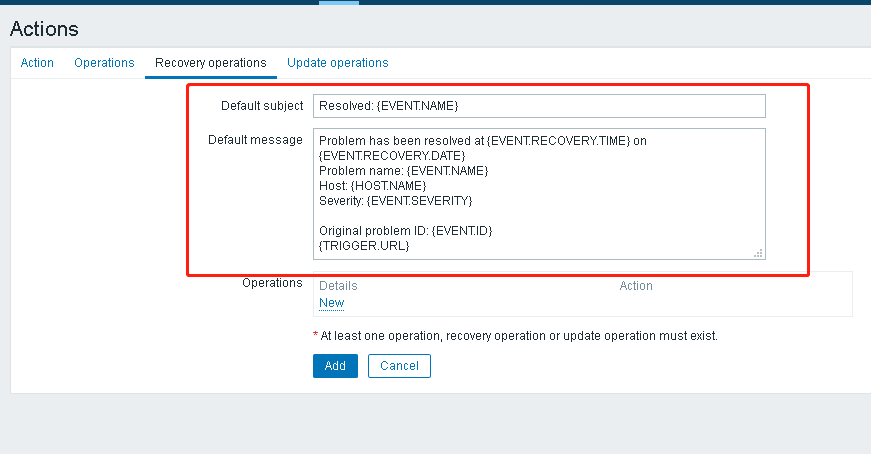
* 同样点new
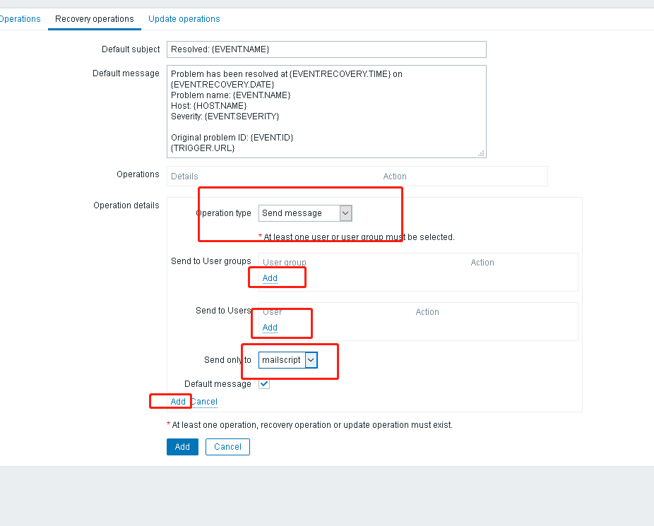
* 这里可以定义更新了报警的邮件内容
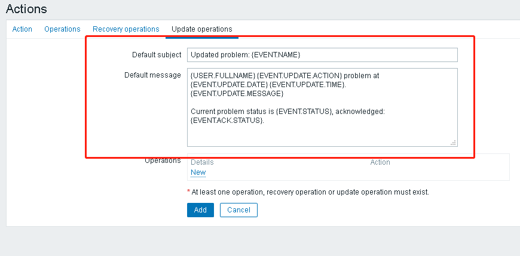
* 同样点new
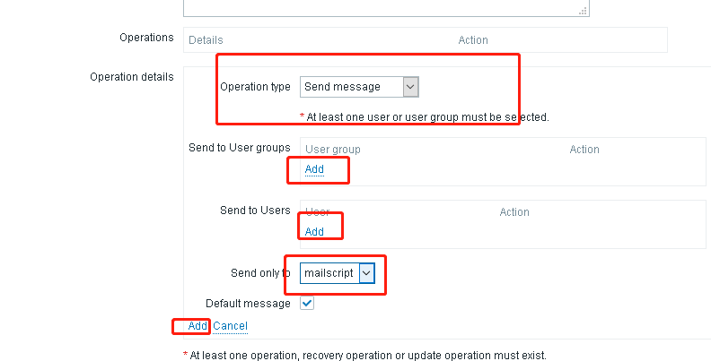

* 点击最下方的add，Action就配置完了
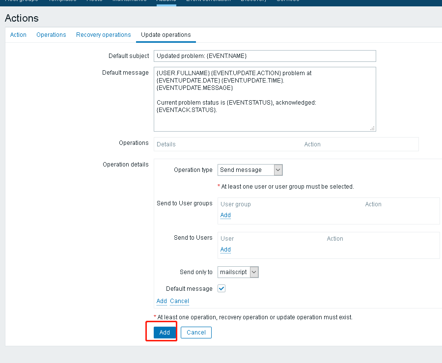
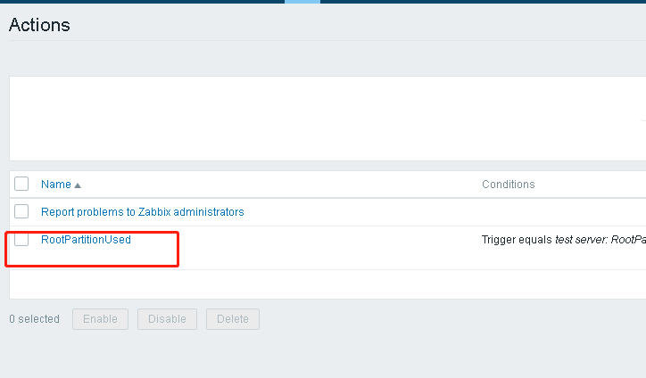
 
* 我们来测试一下结果，目前使用率为81%，我们可以看到下面的Trigger触发为<80
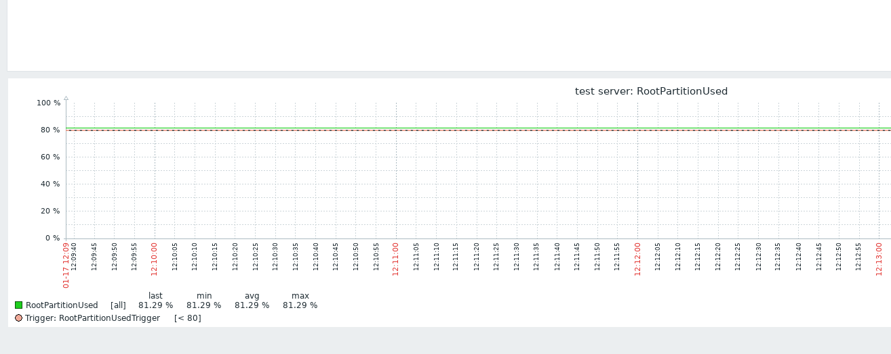

* 在监控的机器创建一个大文件夹，降低硬盘空闲率，
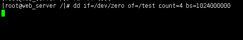
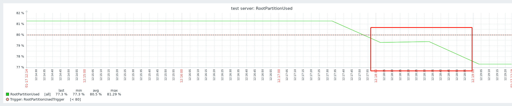

* 我们可以看到已经降低到小于80了，那么这个时候我们应该就可以收到报警邮件
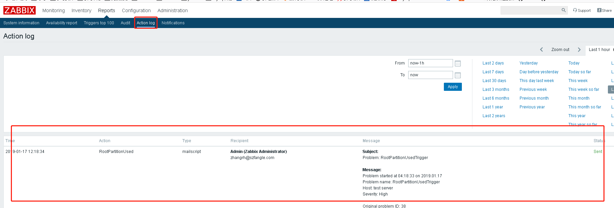
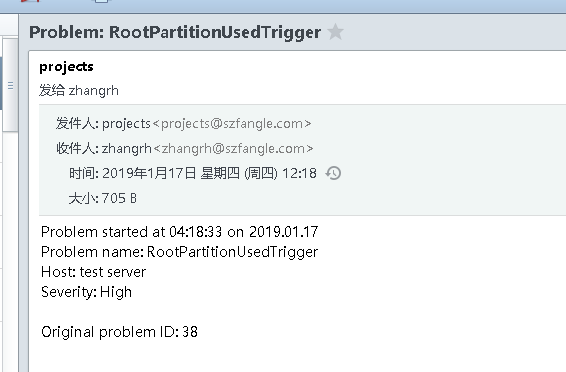

* 同样恢复的时候我们也可以收到邮件
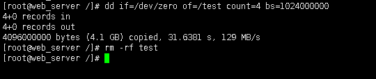
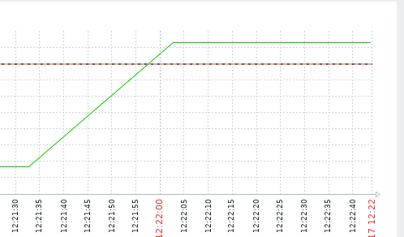
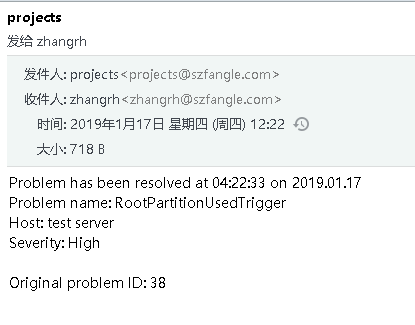

## 总结
* 到此我们的邮件报警功能已经设置完成并验证完了