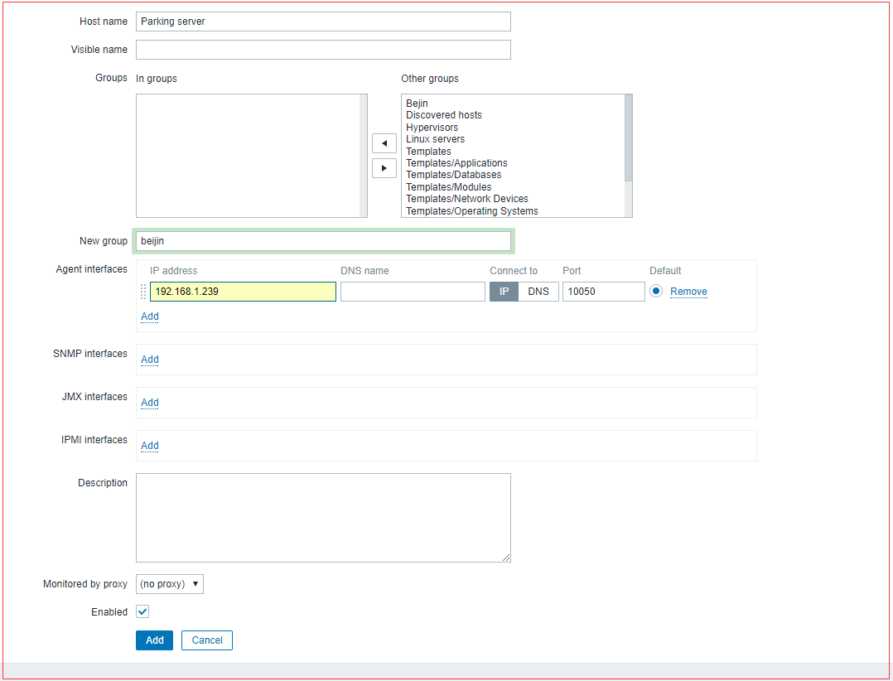

# 页面配置

## 创建一个HOST

* 点击``configuration``->``hosts``->``create hosts``开始创建host

* 如下图，填写``Host name``,``Agent interfaces``,``New group``(也可选择已有group，根据实际情况)



* 点击add添加；

## 监控memory

### 新建memory相关items


* ``configuration``->``hosts``选中列表中host的item列；
* 点击``create item``

## item keys


* ``vm.memory.size[total]`` 内存总总量
* ``vm.memory.size[free]``  内存能够立即被使用的
* ``vm.memory.size[available]`` 可用内存,定义见该[文章](https://www.zabbix.com/documentation/current/manual/appendix/items/vm.memory.size_params)
* ``system.cpu.num``  cpu数量
* ``system.cpu.load[,avg5]``  5分钟内的cpu平均负载；
* ``vfs.fs.size[/dev/sda1,free]`` 空闲磁盘；
* ``vfs.fs.size[/dev/sda1,total]`` 总磁盘；


> 更多参数参考[官网](https://www.zabbix.com/documentation/current/manual/config/items/itemtypes/zabbix_agent)：
> 如果要验证item keys的正确性，可以在agent的主机上运行命令，``zabbix_get -s 127.0.0.1 -k "vfs.fs.size[/,total]"`` (替换-k的值)


## zabbix-get

服务器端可以安装zabbix-get可以更好的调试程序。
```
rpm -ivh http://repo.zabbix.com/zabbix/4.0/rhel/7/x86_64/zabbix-get-4.0.3-1.el7.x86_64.rpm
yum install zabbix-get
zabbix_get -s 127.0.0.1 -k "vfs.fs.size[/,total]"
```

