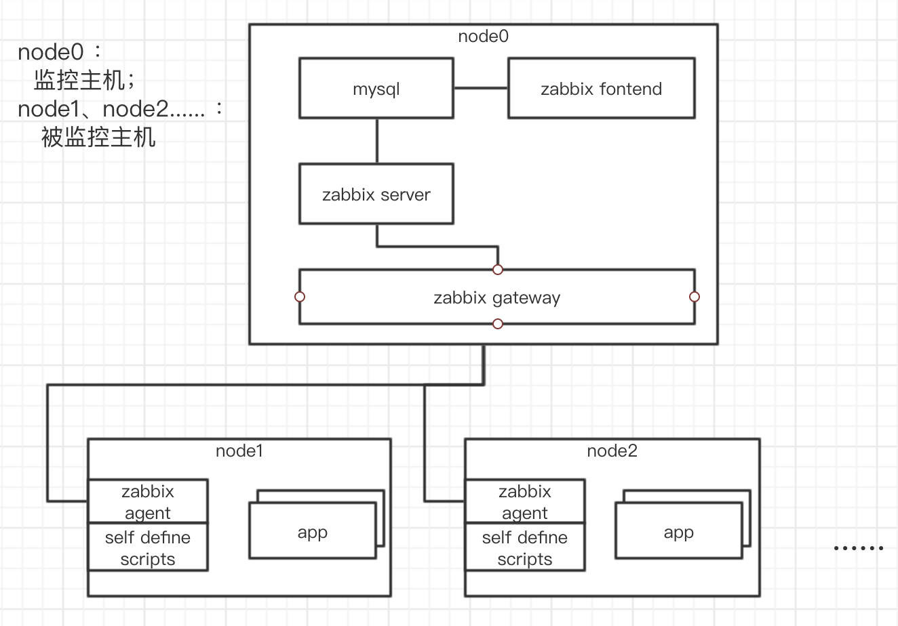

# 理论准备

zabbix是一款优秀的监控软件，其可用来监听CPU，连接数，数据库，以及JMX数据。

## 架构

其架构如上图所示：  
* 在我司的应用场景中，我们把node0部署在公司机房，node1、node2为各现场的生产服务器；
* zabbix server：zabbix服务器的核心逻辑处理；
* zabbix gateway：汇聚数据；
* zabbix fontend：展示ui显示；
* zabbix agent：收集采集目标主机数据的代理。

## 基本概念

* host group: 主机群，如我们某某现场由5台主机组成，那这个现场就是一个host group;
* host: 主机，具体的一台物理机或虚拟机；
* item: 监控项目，如内存、硬盘、负载等；
* Graph: 图，item数据绘制的一个图，包括折线图，柱状图；
* Trigger： 触发器，触发某一动作；
* Scream: 屏，一个展示界面，可配置显示graph、日志、url等数据；