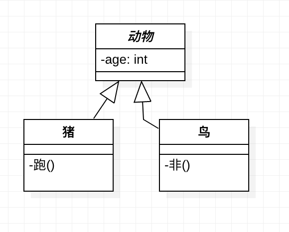
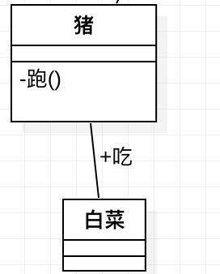
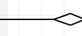
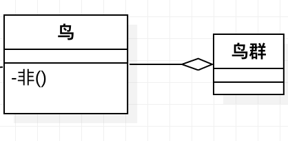
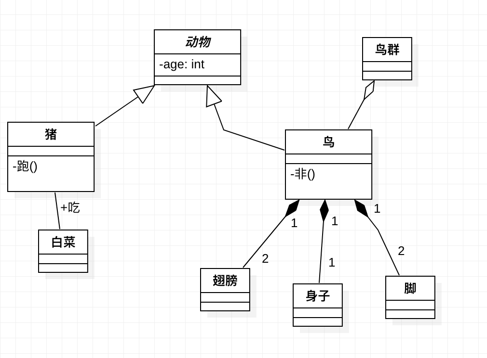
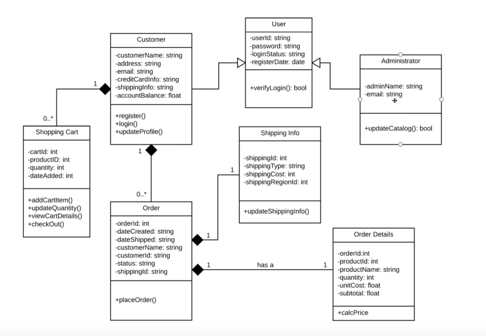
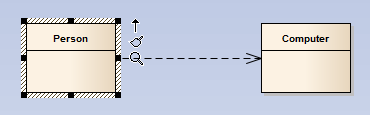
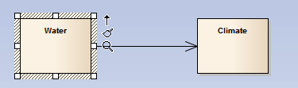
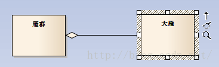
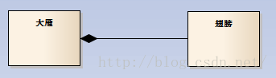

# 类图

## 基本概念

### 类图


在软件世界里类图用来抽象表示真实世界。  
类图通常由一个一个类以及类之间的联系组成；其中类又由类名称、类属性和类方法组成。

### 属性

属性是一个用来描述特定类的一段数据，也可以叫做变量；如：年龄。

属性的格式：``[可见性][名称]:[类型]``
* [可见性] 修饰该属性的可见性，后续详细说
* [名称]，该属性的名称
* [属性]，该属性的类型，如：字符串，数字。


### 方法

方法用来描述类的行为。如吃、跑；

方法的格式：``[可见性][名称](<变量>,<变量>,...):[返回值类型]``
> 经常为了是类图看起来更简便，我们会省略变量和返回值

### 可见性

* ``- private ``只有类可见
* ``+ public``其他类也可见
* ``# protected``本类以及本类的子类可见
* ``~ package/default``包内可见 (不常用)

## 关系

### 继承 inheritance(generalization)

* 继承，类可以通过继承来获得另外一个类的能力，比如**鸟**和**猪**都是**动物**，他们都能呼吸；
* 继承连线如下，其中无箭头的一方被称作为子类，箭头指向的一方被称为父类。


* 如： 


### 关联 (association)

* 关联用来表达两个类之间的关系，通常关联关系都有一个描述词， 关联关系用一根直线表示  


* 如：



### 聚合 (aggreation)

* 聚合关系用来描述整体和部分的关系，他是一种特殊的关联关系。在聚合关系中个体可以脱离整体存在；
* 和关联关系的区别： 聚合关系的两个类之间关系为整体和局部，不再同一个层次上；关联关系的两个类再同一个层次上；

* 聚合关系用下面的的箭头表示：   


* 如： 
  

### 组合 (Composition)

* 组合也是整体和部分的关系，不同的是，部分不能脱离整体存在；
* 和聚合关系的区别： 组合关系整体和局部强相关，整体没有了，局部也就没有任何意义；
* 组合与聚合的线相同，只是箭头为实心；  


* 如：  


## 完整例子

* 上面例子的完整展示



* 一个购物网站的例子：  




## 关系在代码中的体现

### 依赖关系(Dependency)



Person 和 Computer之间是没有关系的，但是由于偶尔的需要，Person需要使用Computer，这时Person就依赖于Computer.  
依赖关系是五种关系中耦合最小的一种关系。  
类A要完成某个功能必须引用类B，则类A依赖类B 

这种依赖关系有三种表现形式： 
* 调用静态方法。
```JAVA
class Person {
  public void Programing(){
    Computer.Programing();
  }
}
class Computer{
  void Programing(){}
}
```
* Computer类是Person类中某个方法的局部变量，则Person类可以调用它。代码如下：  
```JAVA
class Person {
  public void Programing(){
    Computer computer = new Computer();
  }
}
```

> 该情况持有Computer类的是一个方法，而不是对象
* Computer类作为Person类某个方法的参数或者返回值：  
```JAVA
class Person{
  public Computer Programing(Computer computer){
    return null; 
  }
}
```
> Computer类被Person类的一个方法所持有，生命周期随着方法执行结束而结束。

### 关联关系（Association）

 

* 代码：  
```JAVA
class Water{
  public Climate climate;
  public Watter(){}
}

class Climate{
  public Climate(){}
}
```
> 关联和依赖的区别：
> * 关联关系增加属性，依赖关系不增加属性；
> * 关联关系与类的生命周期相同，依赖关系声明周期值存在方法调用期间。

> 如上例子，关系中由Water指向Climate，所有Water中有一个Climate属性，如果是双向关联则在代码中的表现为两个类互相之间有一个对应的属性；


### 聚合(Aggreation)




```JAVA
Class GooseGroup
{
    public List<Goose> gooses；
    public GooseGroup(List<Goose> gs)
    {
        gooses=gs;
    }
}
```

> 如上所示，雁群包含大雁，但是如果雁群不存在了，大雁还可以单独存在。

### 组合(Composition)  



```java
Public class Goose {  
   public Wings wings;  
   public Goose() {  
       wings = new Wings();  
    }  
}  
```

> 如上所示，翅膀和大雁的生命周期相同，如果大雁没有了翅膀也就没有意义了。  

