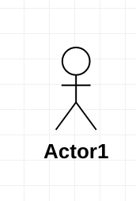
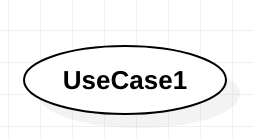
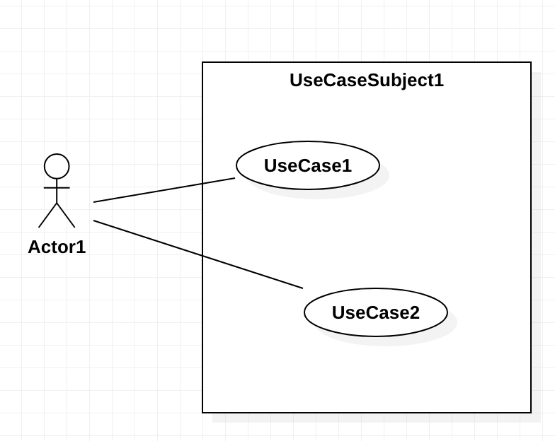
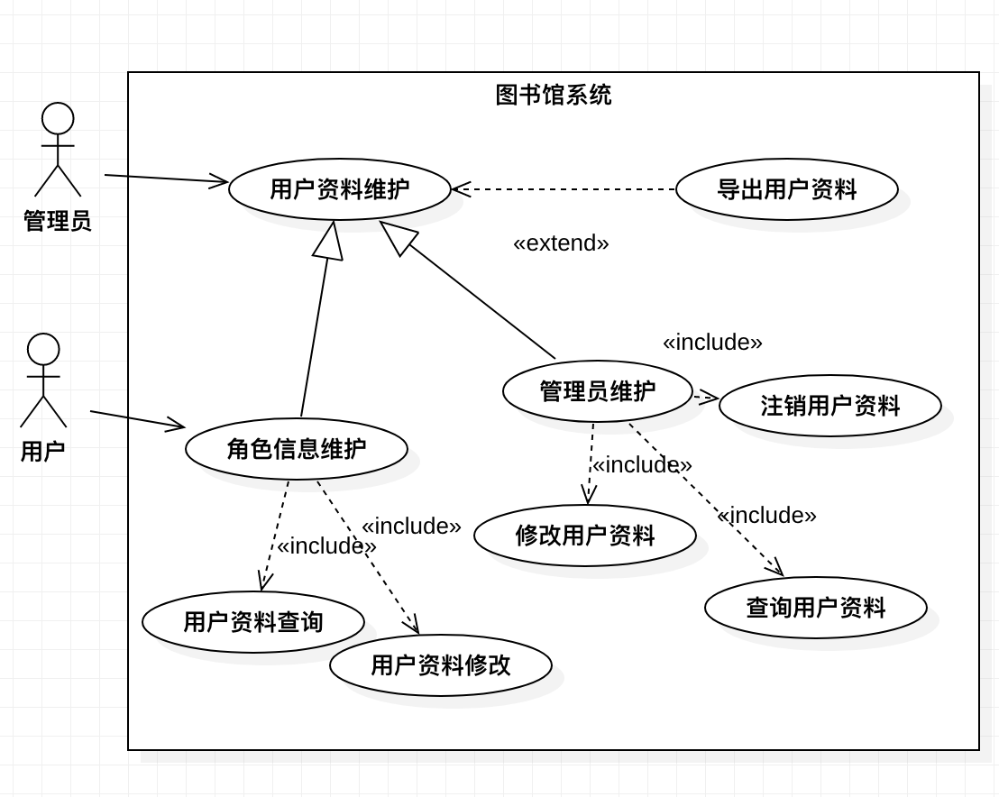

# 用例图

## 概念

### 基本概念

用例图主要用来描述用户、需求和系统的功能单元之间的关系，它展示了外部用户能观察到的用户功能。

### 元素

* 参与者，表示与系统进行交互的用户、组织或者是外部系统，使用如下符号表示；  

> 参与者分为主参与者或者辅助参与者，两者区别在于一个主动发起用例，一个被被动调用；
> 一个参与者可能在不同用例中担任不同的参与者角色；  
> 时间等特殊参与者，在建模的时候切勿忘记（某系统需要每天0点做某事）

* 用例，外部可见的系统功能，用下图表示；  
 

* 子系统，用来展示一部分功能，这部分功能紧密相连  

  

### 关系

用例图内的关系包括：关联、泛化、包含、扩展；

* 关联，参与者与用户之间的关系，指向消息接收方，图标如下：  

* 泛化，参与者与参与者之间的关系，也可能是用例与用例之间的关系，表示继承，箭头指向父亲节点，图标如下：  
 

* 包含，用例之间的关系，包含关系用来把一个较复杂用例所表示的功能分解成较小的步骤，箭头指向小步骤，图标如下；

* 扩展，用例之间的关系，表示功能的延伸，相当于为基础用例提供一个附加功能（如预览订单可以选择打印），图标如下：

## 完整用例图举例 

  

## 用例描述

||
|----|
|**用例名称:** 该用例的名称 |
|**用例编号:** 123 |
|**简要说明:**  该用例的一些简单介绍 |
|**前置条件:**  前置条件介绍 |
|**基本事件流:**  1.第一步 2.第二步 3.第三步 4.第四步 |
|**其他事件流:**  2.a.1.第一步 2.a.2.第二步 2.a.3.第三步 |
|**异常事件流:**  2.b.1.第一步 2.b.2.第二步 2.b.3.第三步 |
|**后置条件:**  后置条件介绍 |
|**注释:**  后置条件介绍 |

