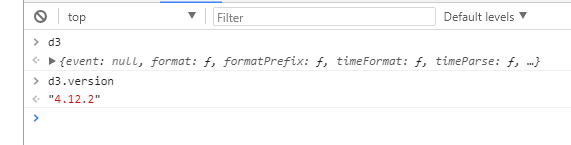

# d3 and DOM

## 简要介绍

官方网站： https://d3js.org/


D3的DOM操作如下：

* 使用d3.select 和d3.selectAll选择元素

* 设置属性,inner text 以及class属性

* 用d3选择器获取属性值

* chain d3方法。

* 传递回调函数到D3选择器方法

* 使用on方法添加event监听器

* 使用d3.event去访问时间对象内部的事件监听器

* d3添加删除dom元素


## 加入文件

```html
<!DOCTYPE html>
<html lang="en">
<head>
    <meta charset="UTF-8">
    <title>Title</title>
</head>
<body>

<script src="https://d3js.org/d3.v4.min.js"></script>
</body>
</html>
```

* 验证： 控制台输入d3验证是否加载成功，输入``d3.version``获取版本  




## 操作：

* 选择：
    * d3.select - 选择一个元素
    * d3.selectAll - 选择所有元素
    * 两个函数都接受有效的css选择器
    * d3.selectAll("li").nodes();   /*访问所有元素*/
    * d3.selectAll("li").node();   /*访问一个元素*/


 
*  设置属性
    * selection.style(propery[,newValue])
    * selection.attr(attribute[,newValue])
    * selection.text([newValue])
    * selection.html([newValue])
    * selction.classed(classlist[,shouldClassesBeSet]),eg: selection.classed("new-class",true)
    * 以上函数如果没有``newValue``则是一个getter

```js
d3.select("#page-title")
    .style("background-color","#00feab");
```

```js
d3.select("#page-title")
		.style("background-color","#000000")
  		.style("color","#ffffff")
		.attr("class","new-class")
		.text("D3 is cool!");
```
